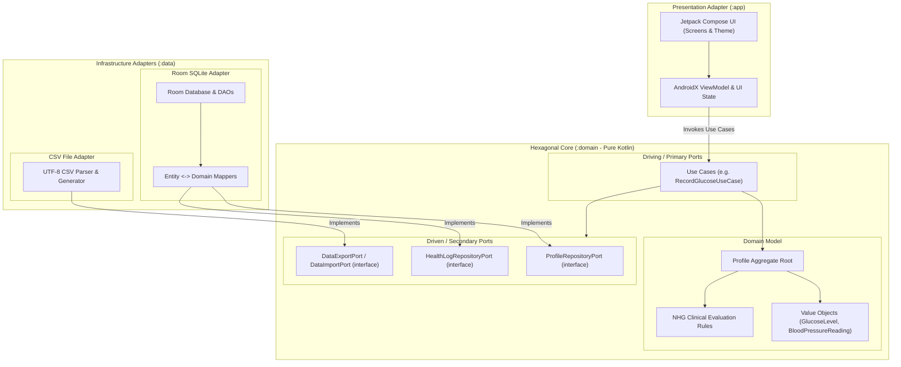

# Health Journal

An offline-first, privacy-focused Android health logging application built with Kotlin, Jetpack Compose, and Hexagonal Architecture (Ports and Adapters).

---

## Overview & Vision

**Health Journal** empowers individuals to track and understand their vital health metrics locally on their device, with zero reliance on cloud services or external servers. All evaluation logic adheres strictly to clinical standards, defaulting to the official guidelines of the **Dutch College of General Practitioners** (*Nederlands Huisartsen Genootschap* / NHG).

### Key Features
- **Body Weight & BMI:** Record body weight in kilograms, automatically deriving Body Mass Index (BMI) based on profile height, categorized according to NHG/WHO standards.
- **Blood Pressure (BP):** Record systolic and diastolic values in mmHg, automatically classified against Dutch NHG blood pressure standards (Optimal, Normal, High Normal, Hypertension Grades 1–3).
- **Blood Glucose:** Store blood glucose in canonical **mmol/L** (Dutch standard) with built-in converter support for **mg/dL**. Fasting and postprandial measurements are evaluated against clinical NHG target ranges (Hypoglycaemia, Normal, Impaired, Diabetes Range).
- **Activity Tracking:** Log GPS-tracked workout and physical activity intervals (start time, end time, distance in metres).
- **Data Portability:** Complete data ownership via standardized UTF-8 CSV import and export capabilities.
- **Privacy by Design:** 100% offline-first. Your health data stays on your device.

---

## Technical Architecture

The application enforces **Hexagonal Architecture** (Ports and Adapters) paired with **Domain-Driven Design (DDD)**.

### Core Architectural Directives
1. **Strict Isolation:** The `:domain` module is pure Kotlin. It has zero dependencies on `android.*`, `androidx.*`, or database persistence libraries.
2. **Dependency Rule:** All dependencies point inward toward `:domain`. Presentation (`:app`) and Infrastructure (`:data`) are outer adapters implementing or consuming domain ports.
3. **Dependency Minimization:** We strictly prioritize the native Android SDK, official AndroidX/Jetpack libraries, and official Kotlinx libraries over third-party dependencies. Any external library must be justified via an [Architecture Decision Record (ADR)]/health_journal/docs/adr).
4. **Offline-First:** Room SQLite serves as the local source of truth.

### Hexagonal Architecture & Boundary Flow

---

## Core Technologies

| Category | Technology | Rationale / Constraints |
|---|---|---|
| **Language** | Kotlin 2.x | Modern, concise, expressive, type-safe language. |
| **Domain Layer** | Pure Kotlin (JVM) | Completely isolated from Android SDK and UI frameworks. |
| **Presentation** | Jetpack Compose (BOM) | Declarative UI framework with reactive state management. |
| **Architecture** | AndroidX ViewModel & Flow | Reactive state holding aligned with lifecycle management. |
| **Persistence** | Jetpack Room SQLite | Type-safe, compile-time verified local database with Coroutines. |
| **Concurrency** | Kotlinx Coroutines & Flow | Asynchronous execution and reactive data streams. |
| **Serialization** | Kotlinx Serialization | Lightweight serialization for import/export routines. |
| **Tooling & CI** | GitHub CLI (`gh`) | Automated branch, PR, and release management. |

---

## Module Structure

| Module | Type | Responsibilities & Dependencies |
|---|---|---|
| [`:domain`]/health_journal/domain) | Pure Kotlin JVM Library | Contains Aggregate Roots (`Profile`), Entities, Value Objects (`GlucoseLevel`, `BloodPressureReading`, `ProfileId`), Use Cases, and Port Interfaces. **Zero Android/Jetpack dependencies.** |
| [`:data`]/health_journal/data) | Android Library | Infrastructure adapter implementing domain repository and data import/export ports using Room SQLite and CSV streams. Depends on `:domain`. |
| [`:app`]/health_journal/app) | Android Application | Presentation adapter containing Jetpack Compose UI screens, navigation, and ViewModels. Depends on `:domain` and runtime `:data`. |

---

## Supported Data Import & Export Formats

All data files must be encoded in **UTF-8**.

| Metric | Format | Headers | Example Row |
|---|---|---|---|
| **Weight & BMI** | CSV | `timestamp,weight_kg,bmi` | `2026-09-09T10:00:00Z,74.5,23.5` |
| **Blood Pressure** | CSV | `timestamp,systolic_mmhg,diastolic_mmhg,classification` | `2026-09-09T08:30:00Z,124,78,NORMAL` |
| **Blood Glucose** | CSV | `timestamp,glucose_mmol_l,context,classification` | `2026-09-09T07:15:00Z,5.4,FASTING,NORMAL` |
| **Activity Session** | CSV | `start_timestamp,end_timestamp,distance_m,duration_s` | `2026-09-09T18:00:00Z,2026-09-09T18:45:00Z,5200,2700` |

---

## Architecture Decision Records (ADRs)

Key architectural choices are preserved in [`docs/adr/`]/health_journal/docs/adr):
- [ADR 0001: Record Architecture Decisions]/health_journal/docs/adr/0001-record-architecture-decisions.md)

---

## Development Workflow & OpenSpec

This project uses [OpenSpec](https://openspec.dev/) to drive specification, design, and implementation workflows:
- **Active change:** [`openspec/changes/init-core-health-features/`]/health_journal/openspec/changes/init-core-health-features)
- **Workflows:**
  - `/opsx-propose`: Formulate new capabilities and specifications.
  - `/opsx-apply`: Implement verified changes in code.
  - `/opsx-archive`: Archive completed features into living specifications.
- **Git & GitHub:** Managed with the GitHub CLI (`gh`). Pull requests and reviews accompany each milestone.

---

## Roadmap

- [x] **Phase 0: Specifications & Architecture Governance** — OpenSpec change definition, initial ADR, living README, Hexagonal boundary definition.
- [ ] **Phase 1: Gradle Build & Pure Kotlin Domain Model** — Multi-module Gradle build, Value Objects (`ProfileId`, `GlucoseLevel`, `BloodPressureReading`), `Profile` Aggregate Root, and Dutch NHG evaluation rules.
- [ ] **Phase 2: Data Infrastructure Layer** — Room SQLite Database, DAOs, Entity-to-Domain mappers, and CSV parser/generator adapters.
- [ ] **Phase 3: Jetpack Compose Presentation Layer** — Material 3 UI screens, metric entry forms, NHG category feedback indicators, and trend visualizations.
