<div align="center">

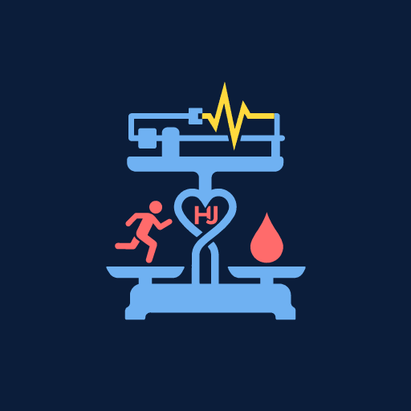

# Health Journal

**An offline-first, privacy-focused Android health journal.**

[](https://github.com/mannetje/health_journal/actions/workflows/android.yml)
[](https://github.com/mannetje/health_journal/releases/latest)

[Download](#-download-apk) · [Developer docs](docs/dev/README.md) · [Contributing](CONTRIBUTING.md) · [Architecture decisions](docs/adr/) · [Changelog](CHANGELOG.md)

</div>

An offline-first, privacy-focused Android health logging application built with Kotlin, Jetpack Compose, and Hexagonal Architecture (Ports and Adapters).

> **Want to build on it or contribute?** Start with the [Developer Docs](docs/dev/README.md): getting started, an architecture tour and how-to guides. See also [CONTRIBUTING.md](CONTRIBUTING.md).

---

## 📥 Download APK

You can download the ready-to-install Android APK directly from GitHub:

👉 **[Download Latest APK (v1.5.2)](https://github.com/mannetje/health_journal/releases/latest)**  
See the [CHANGELOG](CHANGELOG.md) for what changed in each release.

---

## Screenshots

**Light theme**

| Log | History | Profile |
|---|---|---|
| 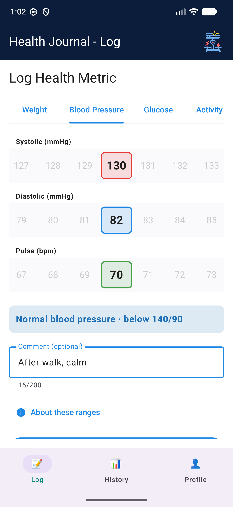 | 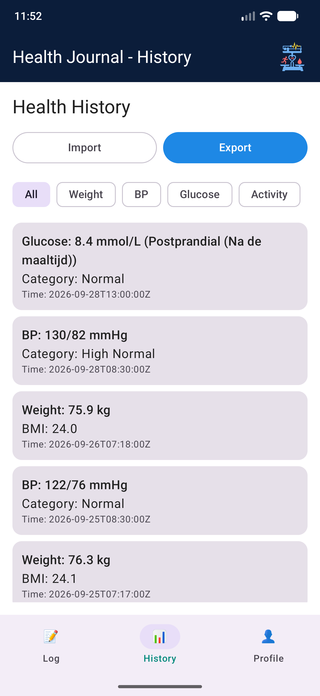 | 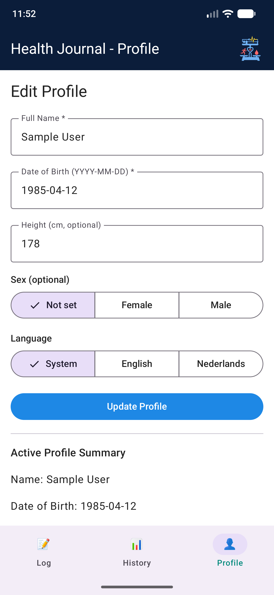 |

| Weight trend | Blood pressure trend | Glucose trend |
|---|---|---|
| 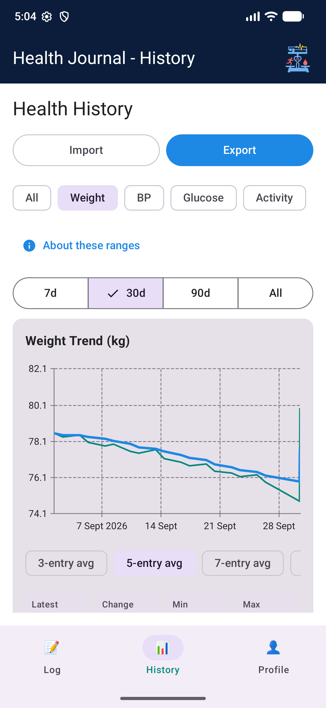 | 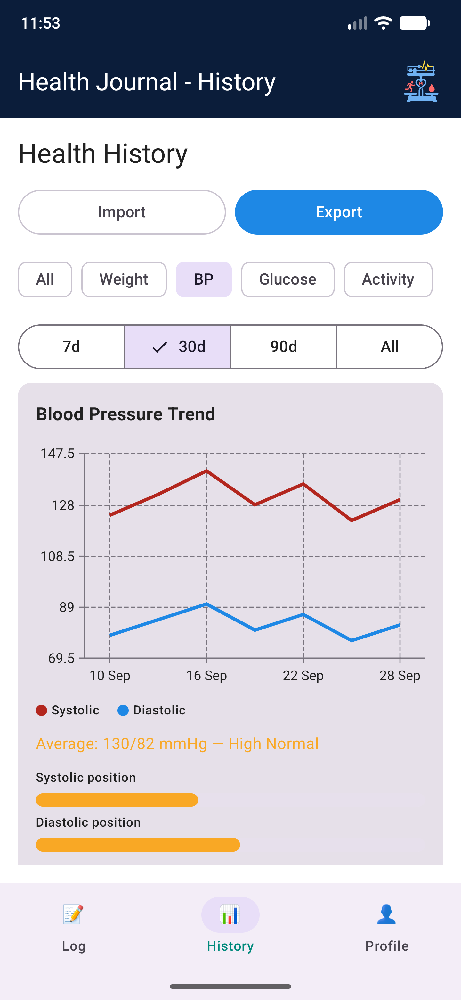 | 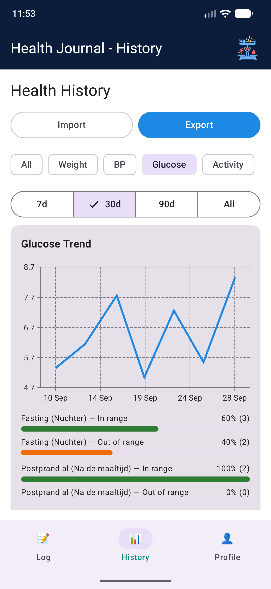 |

**Dark theme**

| Log | History | Profile |
|---|---|---|
| 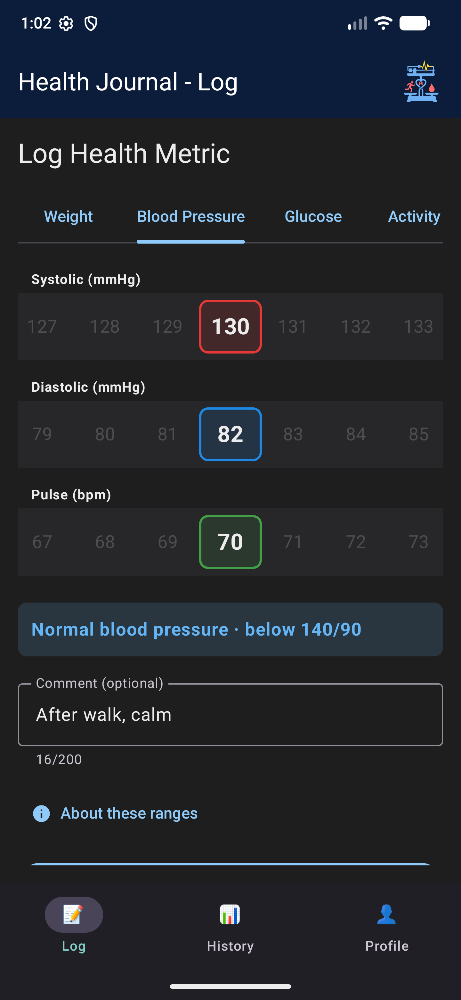 | 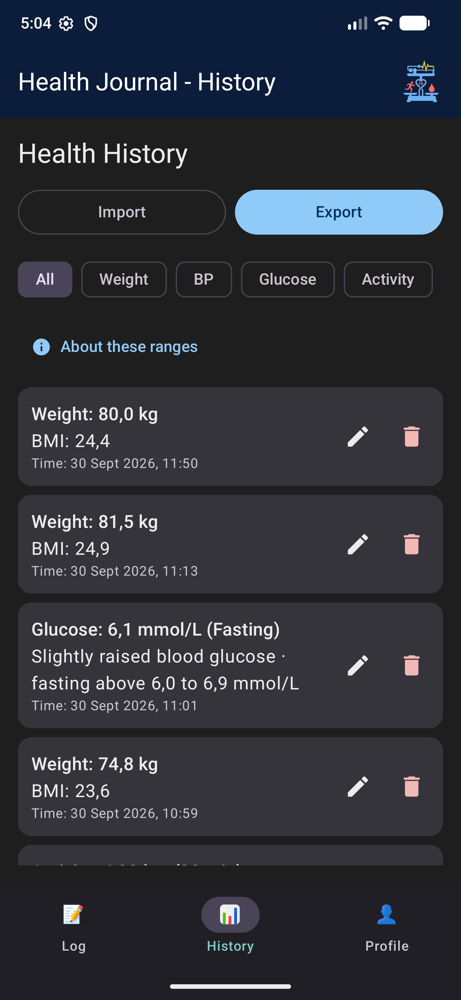 | 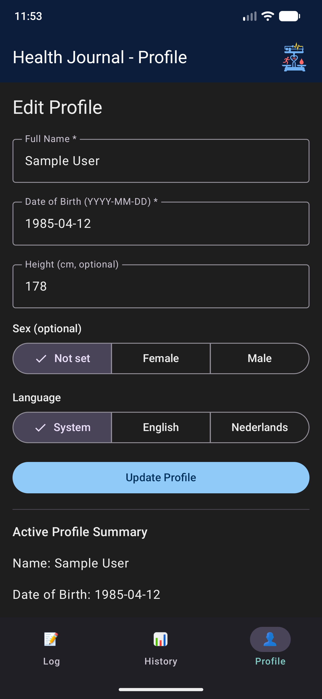 |

| Weight trend | Blood pressure trend | Glucose trend |
|---|---|---|
| 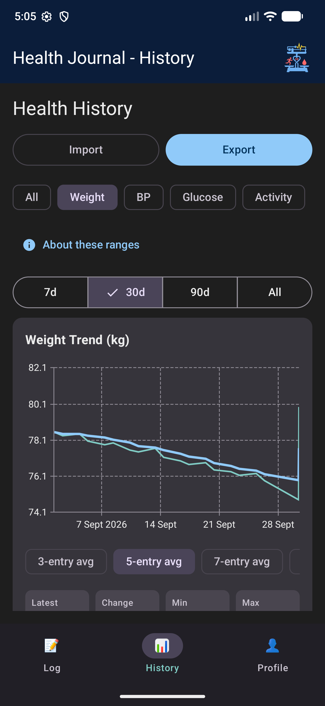 | 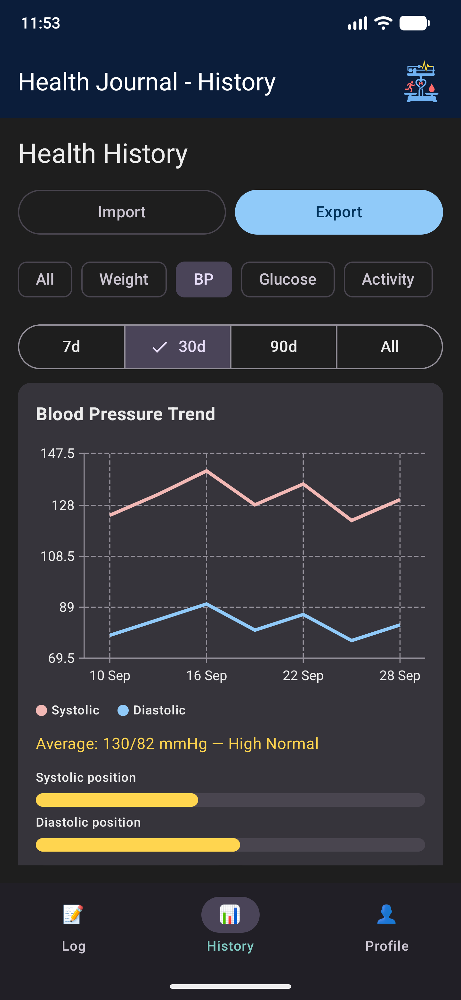 | 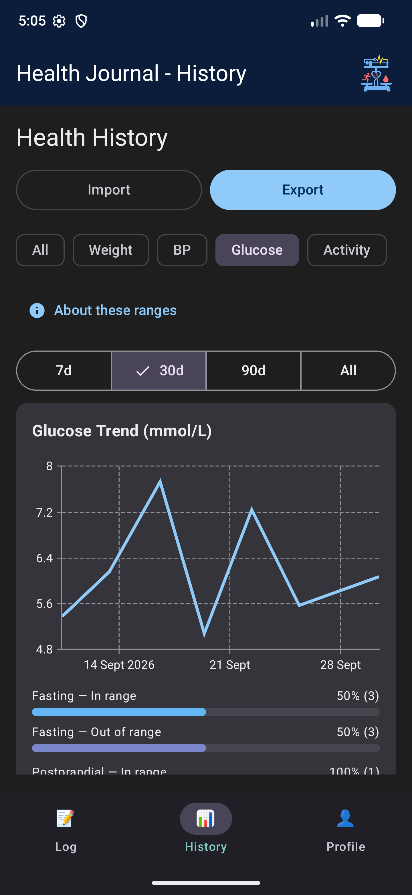 |

> The screenshots use synthetic sample data. The top bar uses the brand navy with the Health Journal logo in both themes ([ADR 0011](docs/adr/0011-app-icon-and-adaptive-layers.md)).

**App icon** in the launcher, light and dark mode (navy adaptive icon, with a themed monochrome variant on Android 13+, see [ADR 0011](docs/adr/0011-app-icon-and-adaptive-layers.md)):

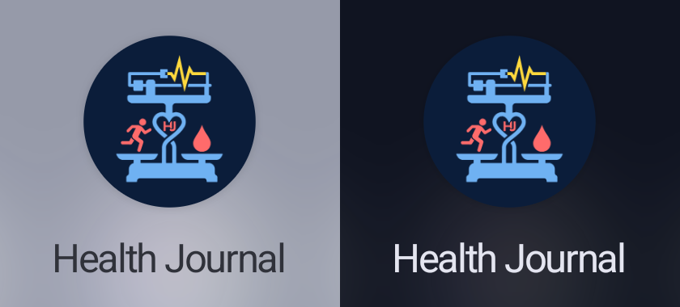

---

## Overview & Vision

**Health Journal** empowers individuals to track and understand their vital health metrics locally on their device, with zero reliance on cloud services or external servers. All evaluation logic adheres strictly to clinical standards, defaulting to the official guidelines of the **Dutch College of General Practitioners** (*Nederlands Huisartsen Genootschap* / NHG).

### Key Features
- **Body Weight & BMI:** Record body weight in kilograms, automatically deriving Body Mass Index (BMI) based on profile height, categorized according to NHG/WHO standards.
- **Optional comments:** every entry type (weight, blood pressure, glucose, waist, activity) can carry a short single-line note of up to 200 characters. Add it while logging or in the edit dialog; History shows it under the entry (two lines, then an ellipsis). Comments are stored in the same database and included in CSV export and import ([ADR 0019](docs/adr/0019-entry-comments.md)).
- **Waist Circumference (optional):** Record waist circumference in centimetres; categorized against Voedingscentrum's sex-specific healthy-range thresholds when Profile sex is set. It is recorded on its own Waist tab (never part of the weight entry) and has its own History filter, edit, delete, CSV export and import. Labels use the authority wording (Healthy, Increased risk, High risk) with the range for the profile's sex.
- **Blood Pressure (BP):** Record systolic and diastolic values in mmHg, with an optional pulse (30 to 250 bpm), automatically shown against three bands from the Dutch NHG standard: Normal (below 140/90), High (from 140/90) and Seriously raised (from 180/110). Labels name the band with its range and never a condition; an "About these ranges" note links the sources. Older entries keep working: the six previous names are read as the new bands.
- **Smart input pickers:** weight and waist use a horizontal ruler picker, and blood pressure and pulse use three stacked scrolling rows. The starting value comes from a fallback chain: your latest entry, then a value derived from your profile (for example height for weight), then a standard default ([ADR 0018](docs/adr/0018-smart-input-pickers.md)). Each entry saves one metric; waist has its own tab.
- **Blood Glucose:** Store blood glucose in canonical **mmol/L** (Dutch standard) and show it as **mmol/L** or **mg/dL**. Fasting and postprandial measurements are evaluated against clinical NHG target ranges and shown as "name · range" (Low, Normal, Slightly raised, High blood glucose) with only the range for the entry's context.
- **Activity Tracking:** Manually log workout and physical activity sessions from the Log screen (duration + distance), or bulk-import sessions; each session records start time, end time, and distance in metres.
- **Profile Sex Field (optional):** Selectable male/female on the Profile screen. Purely demographic — has no effect on BMI, blood pressure, or glucose classification (Dutch NHG guidelines do not differentiate these by sex).
- **Data Portability:** Complete data ownership via standardized UTF-8 CSV import and export capabilities. Import accepts a file chosen with the system file picker or pasted CSV text.
- **Privacy by Design:** 100% offline-first. Your health data stays on your device.
- **Light & Dark Theme:** Follows the device light/dark setting by default, and can be set to Light or Dark in Profile ([ADR 0017](docs/adr/0017-in-app-theme-choice.md)), with a brand-navy top bar and logo in both themes; range colors are a neutral blue-grey ramp (a darker step is a higher band, never a warning), with lighter variants in dark mode.
- **Dutch/English Localization:** UI text follows the device's system language by default (English/Dutch), with a manual override selector (System/English/Dutch) on the Profile screen. Layouts are checked in Dutch so labels stay on one line ([ADR 0010](docs/adr/0010-responsive-dutch-ui-layout.md)); dialogs and pickers follow the app language too. A separate *Regional formats* setting (System / Netherlands / US) controls date and number formats independently of the language, so English text with Dutch dates works ([ADR 0013](docs/adr/0013-activity-base-context-for-app-language.md)). The Profile date of birth is chosen with a Material date picker that opens in text-entry mode.
- **Health Trend Charts:** Weight, Blood Pressure, and Glucose History filters show a pannable/pinch-zoomable trend chart (7/30/90-day/all-time range, counted back from the newest entry so imported historical data still shows). The time axis follows the zoom level: years, months, weeks or days, with labels on calendar boundaries, a moving average for weight, NHG category gauges and distribution for blood pressure, and Time-in-Range breakdowns for glucose.
- **Units:** data is always stored in metric (kg, cm, mmol/L, meters). What you see and type is a separate Profile setting: Metric or Imperial (lb, mi, ft/in) and mmol/L or mg/dL, defaulting from the region (US and UK imperial, mg/dL in the US, Germany, France and others). Every input shows its unit, and History, charts and statistics follow it ([ADR 0014](docs/adr/0014-units-presentation.md)). CSV files stay metric.
- **Localized messages and profile edits:** success and error banners follow the app language (English/Dutch) because ViewModels pass resource ids instead of text ([ADR 0015](docs/adr/0015-localized-viewmodel-messages.md)). *Update Profile* edits the existing profile in place instead of adding another ([ADR 0016](docs/adr/0016-profile-update-edits-active-profile.md)).
- **Edit and Delete Entries:** every History entry has an Edit and a Delete icon button (48 dp targets, localized TalkBack descriptions; no swipe gestures). Edit opens a pre-filled dialog to change the values and the date/time (activities keep their start time); delete asks for confirmation first and is permanent. The list, trend charts and statistics refresh immediately ([ADR 0012](docs/adr/0012-edit-and-delete-entries.md)).
- **History Filters:** All, Weight, BP, Glucose, Waist, and Activity. "All" shows weight, blood pressure, glucose, waist and activity entries interleaved in one chronological list (newest first); the single-metric filters show the trend chart plus that metric's entries.

## Technical Architecture

The application enforces **Hexagonal Architecture** (Ports and Adapters) paired with **Domain-Driven Design (DDD)**.

### Core Architectural Directives
1. **Strict Isolation:** The `:domain` module is pure Kotlin. It has zero dependencies on `android.*`, `androidx.*`, or database persistence libraries.
2. **Dependency Rule:** All dependencies point inward toward `:domain`. Presentation (`:app`) and Infrastructure (`:data`) are outer adapters implementing or consuming domain ports.
3. **Dependency Minimization:** We strictly prioritize the native Android SDK, official AndroidX/Jetpack libraries, and official Kotlinx libraries over third-party dependencies. Any external library must be justified via an [Architecture Decision Record (ADR)](docs/adr/).
4. **Offline-First:** Room SQLite serves as the local source of truth.

### Hexagonal Architecture & Boundary Flow

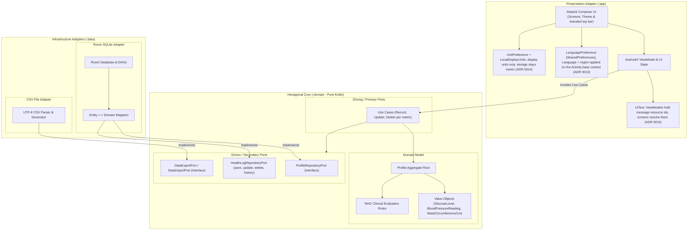
```mermaid
flowchart TD
    subgraph Presentation["Presentation Adapter (:app)"]
        UI["Jetpack Compose UI (Screens, Theme & branded top bar)"]
        VM["AndroidX ViewModel & UI State"]
        LANG["LanguagePreference (SharedPreferences), Language + region applied on the Activity base context (ADR 0013)"]
        UNITS["UnitPreference + LocalDisplayUnits, display units only, storage stays metric (ADR 0014)"]
        UITEXT["UiText: ViewModels hold message resource ids, screens resolve them (ADR 0015)"]
        UI --> VM
        UI --> LANG
        UI --> UNITS
        VM --> UITEXT
    end

    subgraph Domain["Hexagonal Core (:domain - Pure Kotlin)"]
        subgraph PrimaryPorts["Driving / Primary Ports"]
            UC["Use Cases (Record, Update, Delete per metric)"]
        end

        subgraph DomainModel["Domain Model"]
            AR["Profile Aggregate Root"]
            VO["Value Objects (GlucoseLevel, BloodPressureReading, WaistCircumferenceCm)"]
            NHG["NHG Clinical Evaluation Rules"]
            AR --> VO
            AR --> NHG
        end

        subgraph SecondaryPorts["Driven / Secondary Ports"]
            PRP["ProfileRepositoryPort (interface)"]
            HLP["HealthLogRepositoryPort (save, update, delete, history)"]
            DEP["DataExportPort / DataImportPort (interface)"]
        end

        UC --> AR
        UC --> SecondaryPorts
    end

    subgraph Infrastructure["Infrastructure Adapters (:data)"]
        subgraph Persistence["Room SQLite Adapter"]
            DB["Room Database & DAOs"]
            Mappers["Entity <-> Domain Mappers"]
            DB --> Mappers
        end

        subgraph CSV["CSV File Adapter"]
            Parser["UTF-8 CSV Parser & Generator"]
        end
    end

    VM -->|"Invokes Use Cases"| UC
    Mappers -->|"Implements"| PRP
    Mappers -->|"Implements"| HLP
    Parser -->|"Implements"| DEP
```

---

## Installation & Sideloading

### Method 1: Download from GitHub Releases (Easiest)

1. Open **[GitHub Releases](https://github.com/mannetje/health_journal/releases/latest)** on your Android device.
2. Download `health-journal-v1.5.2-debug.apk`.
3. Tap the downloaded file in your browser/file manager.
4. When prompted with *"Install unknown apps"*, allow permission and tap **Install**.

> **Updating:** builds from v1.4.4 onward share one fixed signing key ([ADR 0008](docs/adr/0008-fixed-debug-signing-key.md)) and install over the previous version. If your installed copy is v1.4.3 or older, Android will report a signature conflict once: export your data as CSV (History → Export), uninstall, install the new APK, then import the CSV again.

---

### Method 2: Sideload via ADB

If you build locally or have the Android SDK:

```bash
# Build the APK locally
./gradlew assembleDebug

# Install to connected device or emulator
adb install -r app/build/outputs/apk/debug/app-debug.apk
```

### Release & Signing Flow

Pushing a `vX.Y.Z` tag builds and publishes the APK. Every build, local or CI, is signed with the committed debug key so that updates install in place ([ADR 0008](docs/adr/0008-fixed-debug-signing-key.md)).

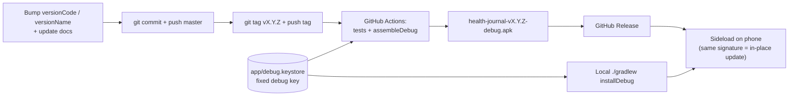
```mermaid
flowchart LR
    Dev["Bump versionCode / versionName<br/>+ update docs"] --> Commit["git commit + push master"]
    Commit --> Tag["git tag vX.Y.Z + push tag"]
    Tag --> CI["GitHub Actions:<br/>tests + assembleDebug"]
    KS[("app/debug.keystore<br/>fixed debug key")] --> CI
    KS --> Local["Local ./gradlew installDebug"]
    CI --> APK["health-journal-vX.Y.Z-debug.apk"]
    APK --> Rel["GitHub Release"]
    Rel --> Phone["Sideload on phone<br/>(same signature = in-place update)"]
    Local --> Phone
```

---

## Core Technologies

| Category | Technology | Rationale / Constraints |
|---|---|---|
| **Language** | Kotlin 2.3 (KSP 2.3, Room 2.8) | Modern, concise, expressive, type-safe language. |
| **Domain Layer** | Pure Kotlin (JVM) | Completely isolated from Android SDK and UI frameworks. |
| **Presentation** | Jetpack Compose (BOM) | Declarative UI framework with reactive state management. |
| **Architecture** | AndroidX ViewModel & Flow | Reactive state holding aligned with lifecycle management. |
| **Persistence** | Jetpack Room SQLite | Type-safe, compile-time verified local database with Coroutines. |
| **Concurrency** | Kotlinx Coroutines & Flow | Asynchronous execution and reactive data streams. |
| **CI/CD** | GitHub Actions | Automated test verification and APK artifact compilation. |
| **Tooling & Release** | GitHub CLI (`gh`) | Automated branch, PR, and GitHub Release asset distribution. |

---

## Module Structure

| Module | Type | Responsibilities & Dependencies |
|---|---|---|
| [`:domain`](domain/) | Pure Kotlin JVM Library | Contains Aggregate Roots (`Profile`), Entities, Value Objects (`GlucoseLevel`, `BloodPressureReading`, `WaistCircumferenceCm`, `ProfileId`), Use Cases, and Port Interfaces. **Zero Android/Jetpack dependencies.** |
| [`:data`](data/) | Android Library | Infrastructure adapter implementing domain repository and data import/export ports using Room SQLite and CSV streams. Depends on `:domain`. |
| [`:app`](app/) | Android Application | Presentation adapter containing Jetpack Compose UI screens, navigation, and ViewModels. Depends on `:domain` and runtime `:data`. |

---

## Supported Data Import & Export Formats

All data files must be encoded in **UTF-8**.

| Metric | Format | Headers | Example Row |
|---|---|---|---|
| **Weight & BMI** | CSV | `timestamp,weight_kg,bmi,comment` | `2026-09-09T10:00:00Z,74.5,23.5,After breakfast` |
| **Blood Pressure** | CSV | `timestamp,systolic_mmhg,diastolic_mmhg,pulse_bpm,classification,comment` | `2026-09-09T08:30:00Z,124,78,68,NORMAL,` |
| **Blood Glucose** | CSV | `timestamp,glucose_mmol_l,context,classification,comment` | `2026-09-09T07:15:00Z,5.4,FASTING,NORMAL,"Felt dizzy, rested"` |
| **Waist Circumference** | CSV | `timestamp,waist_cm,classification,comment` | `2026-09-09T08:00:00Z,86.5,INCREASED_RISK,` |
| **Activity Session** | CSV | `start_timestamp,end_timestamp,distance_m,duration_s,comment` | `2026-09-09T18:00:00Z,2026-09-09T18:45:00Z,5200,2700,Evening walk` |
| **Weight (Libra)** | Libra CSV (`net.cachapa.libra`) | `#Units: kg\|lbs`, `#date;weight;...` (semicolon-delimited) | `2026-09-09T08:00:00.000Z;74.5;;;` |

> **Older blood pressure files** without the `pulse_bpm` column still import (the pulse stays empty). The classification column is always recomputed on import.

> **Comments:** every file ends with an optional `comment` column (single line, at most 200 characters). Cells with a comma or a quote are wrapped in double quotes (RFC 4180). Older files without the column still import. In the standard CSV an over-long comment skips that row; the Libra import reads its `comments` column and cuts a longer comment to its first 200 characters.

> **Libra auto-detection:** Pasting a Libra export into the Weight import or selecting "Libra (CSV)" in the import dialog will both work. Unit conversion from lbs to kg (factor: 1 lb = 0.45359237 kg) is applied automatically when `#Units: lbs` is present.

---

## Developer Documentation

New here? The [developer docs](docs/dev/README.md) explain how the code and the architecture fit together (with a walk-through of one entry from screen to database) and include how-to guides. Contributions are welcome: see [CONTRIBUTING.md](CONTRIBUTING.md).

---

## Architecture Decision Records (ADRs)

Key architectural choices are preserved in [`docs/adr/`](docs/adr/):
- [ADR 0001: Record Architecture Decisions](docs/adr/0001-record-architecture-decisions.md)
- [ADR 0002: Hexagonal Architecture (Ports and Adapters)](docs/adr/0002-hexagonal-architecture.md)
- [ADR 0003: Dependency Minimization Policy](docs/adr/0003-dependency-minimization.md)
- [ADR 0004: Room SQLite for Offline-First Persistence](docs/adr/0004-room-for-offline-first-persistence.md)
- [ADR 0005: Dutch NHG Clinical Guidelines](docs/adr/0005-dutch-nhg-guidelines.md)
- [ADR 0006: Health Trend Visualizations](docs/adr/0006-health-trend-visualizations.md)
- [ADR 0007: Build Toolchain Upgrade (Kotlin 2.3.0, KSP 2.3.0, Room 2.8.5)](docs/adr/0007-build-toolchain-upgrade.md)
- [ADR 0008: Fixed Debug Signing Key for Sideloaded APKs](docs/adr/0008-fixed-debug-signing-key.md)
- [ADR 0009: Localized Context and the Activity Result Registry](docs/adr/0009-localized-context-activity-result-registry.md)
- [ADR 0010: Responsive Layout and Dutch UI Wording](docs/adr/0010-responsive-dutch-ui-layout.md)
- [ADR 0011: App Icon, Dark-Tile Adaptive Icon and Branded Top Bar](docs/adr/0011-app-icon-and-adaptive-layers.md)
- [ADR 0012: Edit and Delete Entries](docs/adr/0012-edit-and-delete-entries.md)
- [ADR 0013: Apply the App Language and Region on the Activity Base Context](docs/adr/0013-activity-base-context-for-app-language.md)
- [ADR 0014: Units: Metric Storage, Locale-Aware Presentation](docs/adr/0014-units-presentation.md)
- [ADR 0015: Localized ViewModel Messages (UiText)](docs/adr/0015-localized-viewmodel-messages.md)
- [ADR 0016: Updating the Profile Edits the Active Profile](docs/adr/0016-profile-update-edits-active-profile.md)
- [ADR 0017: In-App Theme Choice (System, Light, Dark)](docs/adr/0017-in-app-theme-choice.md)
- [ADR 0018: Smart Input Pickers, Pulse and Standalone Waist](docs/adr/0018-smart-input-pickers.md)
- [ADR 0019: Optional Comment on Every Entry](docs/adr/0019-entry-comments.md)

---

## Development Workflow & OpenSpec

This project uses [OpenSpec](https://openspec.dev/) to drive specification, design, and implementation workflows:
- **Specs:** [`openspec/specs/`](openspec/specs/README.md) hold every business rule in platform-neutral form (enough to rebuild the app on another platform); Android-only choices are in [`platform-android`](openspec/specs/platform-android/spec.md).
- **Changes:** proposals and deltas live in [`openspec/changes/`](openspec/changes/).
- **Workflows:**
  - `/opsx-propose`: Formulate new capabilities and specifications.
  - `/opsx-apply`: Implement verified changes in code.
  - `/opsx-sync`: Synchronize delta specifications with main capability specs.
  - `/opsx-archive`: Archive completed features into living specifications.
- **Git & GitHub:** Managed with the GitHub CLI (`gh`). Pull requests and reviews accompany each milestone.

---

## Roadmap

- [x] **Phase 0: Specifications & Architecture Governance** — OpenSpec change definition, initial ADR, living README, Hexagonal boundary definition.
- [x] **Phase 1: Gradle Build & Pure Kotlin Domain Model** — Multi-module Gradle build, Value Objects (`ProfileId`, `GlucoseLevel`, `BloodPressureReading`), `Profile` Aggregate Root, and Dutch NHG evaluation rules.
- [x] **Phase 2: Data Infrastructure Layer** — Room SQLite Database, DAOs, Entity-to-Domain mappers, and CSV parser/generator adapters.
- [x] **Phase 3: Jetpack Compose Presentation Layer** — Material 3 UI screens, metric entry forms, and NHG category feedback indicators.
- [x] **Phase 4: Trends, Theming, Localization & New Metrics** (implemented — see the linked OpenSpec change for each):
  - [x] [Per-metric trend charts](openspec/changes/archive/2026-09-28-add-health-trend-visualizations/proposal.md) — Weight/BP/Glucose graphs on the History screen, shown when a single metric filter is selected.
  - [x] [Dark theme](openspec/changes/archive/2026-09-28-add-dark-theme/proposal.md) — full light/dark support, following the system setting by default with a System, Light or Dark choice in Profile ([ADR 0017](docs/adr/0017-in-app-theme-choice.md)).
  - [x] [Dutch/English localization](openspec/changes/archive/2026-09-28-add-localization/proposal.md) — system-language-following UI text, overridable from Profile settings.
  - [x] [Optional Profile sex field](openspec/changes/archive/2026-09-28-add-profile-sex-field/proposal.md) — selectable male/female, not required, no effect on existing BMI/BP/glucose calculations.
  - [x] [Edit and delete entries](openspec/changes/archive/2026-09-30-feature-edit-delete-entries/proposal.md) — Edit/Delete icon buttons on History entries, pre-filled edit dialog, delete confirmation (implemented; pending emulator verification).
  - [x] [Optional waist circumference tracking](openspec/changes/archive/2026-10-05-add-waist-circumference-tracking/proposal.md) — sex-specific Voedingscentrum thresholds; low-priority/optional.
  - [x] [Smart Pre-fill and Scrolling Number Pickers](openspec/changes/archive/2026-10-05-feature-smart-input-pickers/proposal.md) — canvas ruler pickers, stacked BP/pulse scrolling rows, and smart pre-fill fallback chain.
  - [x] [Optional comments on all entries](openspec/changes/archive/2026-10-06-add-entry-comments/proposal.md) — single-line note (max 200 characters) on every entry type, shown in History, in CSV and in the Libra import (1.5.1).
- [ ] **Phase 5: Medication management (💊 pillbox)** (proposed as four OpenSpec changes). A personal reminder and logging tool, never a medical device, with no advice and no medicine names built in. The pillbox is a separate screen opened from a 💊 button in the top bar, not a fourth tab. The neutral wording of the range labels shipped in 1.5.0.
  - [ ] [Phase 5a: Medication management](openspec/changes/add-medication-management/proposal.md): medications (any form: tablets, liquids, sprays, injectables; custom doses and Dutch-standard units), schedule versions, the pillbox day view with grouped time slots and "Taken all", the intake log, CSV export and import, English and Dutch. Database version 6. Records the privacy and compliance decisions (ADR 0020, 0021).
  - [ ] [Phase 5b: Reminders](openspec/changes/add-medication-reminders/proposal.md): one notification per time slot with Taken all and Snooze actions, neutral text, permission flow (ADR 0022). Depends on 5a.
  - [ ] [Phase 5c: Adherence](openspec/changes/add-medication-adherence/proposal.md): percentages for 7, 30 and 90 days, streak and missed list as a view in the pillbox. Depends on 5a. The overlay on the trend charts is deferred.
  - [ ] [Phase 5d: Database encryption and app lock](openspec/changes/add-database-encryption-and-lock/proposal.md): encrypted database, opt-in lock with the device credential, secure screen, backup rules (ADR 0023). Independent of 5a to 5c.
  - Deferred: a licence file and a legal review of the compliance wording.
