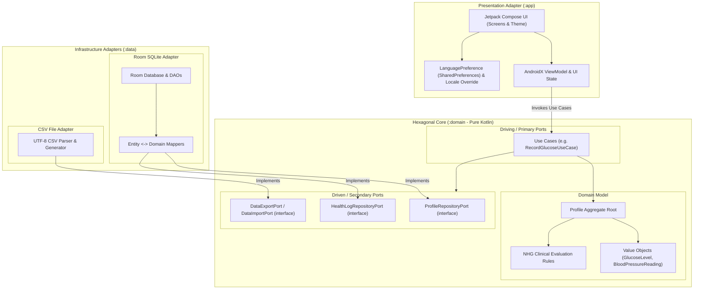

# Health Journal

[](https://github.com/mannetje/health_journal/actions/workflows/android.yml)
[](https://github.com/mannetje/health_journal/releases/latest)

An offline-first, privacy-focused Android health logging application built with Kotlin, Jetpack Compose, and Hexagonal Architecture (Ports and Adapters).

---

## 📥 Download APK

You can download the ready-to-install Android APK directly from GitHub:

👉 **[Download Latest APK (v1.4.0)](https://github.com/mannetje/health_journal/releases/latest)**

---

## Overview & Vision

**Health Journal** empowers individuals to track and understand their vital health metrics locally on their device, with zero reliance on cloud services or external servers. All evaluation logic adheres strictly to clinical standards, defaulting to the official guidelines of the **Dutch College of General Practitioners** (*Nederlands Huisartsen Genootschap* / NHG).

### Key Features
- **Body Weight & BMI:** Record body weight in kilograms, automatically deriving Body Mass Index (BMI) based on profile height, categorized according to NHG/WHO standards.
- **Blood Pressure (BP):** Record systolic and diastolic values in mmHg, automatically classified against Dutch NHG blood pressure standards (Optimal, Normal, High Normal, Hypertension Grades 1–3).
- **Blood Glucose:** Store blood glucose in canonical **mmol/L** (Dutch standard) with built-in converter support for **mg/dL**. Fasting and postprandial measurements are evaluated against clinical NHG target ranges (Hypoglycaemia, Normal, Impaired, Diabetes Range).
- **Activity Tracking:** Manually log workout and physical activity sessions from the Log screen (duration + distance), or bulk-import sessions; each session records start time, end time, and distance in metres.
- **Profile Sex Field (optional):** Selectable male/female on the Profile screen. Purely demographic — has no effect on BMI, blood pressure, or glucose classification (Dutch NHG guidelines do not differentiate these by sex).
- **Data Portability:** Complete data ownership via standardized UTF-8 CSV import and export capabilities.
- **Privacy by Design:** 100% offline-first. Your health data stays on your device.
- **Light & Dark Theme:** Automatically follows the device's system light/dark setting; NHG category colors (green/yellow/orange/red) keep the same meaning in both themes.
- **Dutch/English Localization:** UI text follows the device's system language by default (English/Dutch), with a manual override selector (System/English/Dutch) on the Profile screen.
- **Health Trend Charts:** Weight, Blood Pressure, and Glucose History filters show a pannable/pinch-zoomable trend chart (7/30/90-day/all-time range), a moving average for weight, NHG category gauges and distribution for blood pressure, and Time-in-Range breakdowns for glucose.

---

## Technical Architecture

The application enforces **Hexagonal Architecture** (Ports and Adapters) paired with **Domain-Driven Design (DDD)**.

### Core Architectural Directives
1. **Strict Isolation:** The `:domain` module is pure Kotlin. It has zero dependencies on `android.*`, `androidx.*`, or database persistence libraries.
2. **Dependency Rule:** All dependencies point inward toward `:domain`. Presentation (`:app`) and Infrastructure (`:data`) are outer adapters implementing or consuming domain ports.
3. **Dependency Minimization:** We strictly prioritize the native Android SDK, official AndroidX/Jetpack libraries, and official Kotlinx libraries over third-party dependencies. Any external library must be justified via an [Architecture Decision Record (ADR)](docs/adr/).
4. **Offline-First:** Room SQLite serves as the local source of truth.

### Hexagonal Architecture & Boundary Flow


```mermaid
flowchart TD
    subgraph Presentation["Presentation Adapter (:app)"]
        UI["Jetpack Compose UI (Screens & Theme)"]
        VM["AndroidX ViewModel & UI State"]
        LANG["LanguagePreference (SharedPreferences) & Locale Override"]
        UI --> VM
        UI --> LANG
    end

    subgraph Domain["Hexagonal Core (:domain - Pure Kotlin)"]
        subgraph PrimaryPorts["Driving / Primary Ports"]
            UC["Use Cases (e.g. RecordGlucoseUseCase)"]
        end

        subgraph DomainModel["Domain Model"]
            AR["Profile Aggregate Root"]
            VO["Value Objects (GlucoseLevel, BloodPressureReading)"]
            NHG["NHG Clinical Evaluation Rules"]
            AR --> VO
            AR --> NHG
        end

        subgraph SecondaryPorts["Driven / Secondary Ports"]
            PRP["ProfileRepositoryPort (interface)"]
            HLP["HealthLogRepositoryPort (interface)"]
            DEP["DataExportPort / DataImportPort (interface)"]
        end

        UC --> AR
        UC --> SecondaryPorts
    end

    subgraph Infrastructure["Infrastructure Adapters (:data)"]
        subgraph Persistence["Room SQLite Adapter"]
            DB["Room Database & DAOs"]
            Mappers["Entity <-> Domain Mappers"]
            DB --> Mappers
        end

        subgraph CSV["CSV File Adapter"]
            Parser["UTF-8 CSV Parser & Generator"]
        end
    end

    VM -->|"Invokes Use Cases"| UC
    Mappers -->|"Implements"| PRP
    Mappers -->|"Implements"| HLP
    Parser -->|"Implements"| DEP
```

---

## Installation & Sideloading

### Method 1: Download from GitHub Releases (Easiest)

1. Open **[GitHub Releases](https://github.com/mannetje/health_journal/releases/latest)** on your Android device.
2. Download `health-journal-v1.4.0-debug.apk`.
3. Tap the downloaded file in your browser/file manager.
4. When prompted with *"Install unknown apps"*, allow permission and tap **Install**.

---

### Method 2: Sideload via ADB

If you build locally or have the Android SDK:

```bash
# Build the APK locally
./gradlew assembleDebug

# Install to connected device or emulator
adb install -r app/build/outputs/apk/debug/app-debug.apk
```

---

## Core Technologies

| Category | Technology | Rationale / Constraints |
|---|---|---|
| **Language** | Kotlin 2.x | Modern, concise, expressive, type-safe language. |
| **Domain Layer** | Pure Kotlin (JVM) | Completely isolated from Android SDK and UI frameworks. |
| **Presentation** | Jetpack Compose (BOM) | Declarative UI framework with reactive state management. |
| **Architecture** | AndroidX ViewModel & Flow | Reactive state holding aligned with lifecycle management. |
| **Persistence** | Jetpack Room SQLite | Type-safe, compile-time verified local database with Coroutines. |
| **Concurrency** | Kotlinx Coroutines & Flow | Asynchronous execution and reactive data streams. |
| **CI/CD** | GitHub Actions | Automated test verification and APK artifact compilation. |
| **Tooling & Release** | GitHub CLI (`gh`) | Automated branch, PR, and GitHub Release asset distribution. |

---

## Module Structure

| Module | Type | Responsibilities & Dependencies |
|---|---|---|
| [`:domain`](domain/) | Pure Kotlin JVM Library | Contains Aggregate Roots (`Profile`), Entities, Value Objects (`GlucoseLevel`, `BloodPressureReading`, `ProfileId`), Use Cases, and Port Interfaces. **Zero Android/Jetpack dependencies.** |
| [`:data`](data/) | Android Library | Infrastructure adapter implementing domain repository and data import/export ports using Room SQLite and CSV streams. Depends on `:domain`. |
| [`:app`](app/) | Android Application | Presentation adapter containing Jetpack Compose UI screens, navigation, and ViewModels. Depends on `:domain` and runtime `:data`. |

---

## Supported Data Import & Export Formats

All data files must be encoded in **UTF-8**.

| Metric | Format | Headers | Example Row |
|---|---|---|---|
| **Weight & BMI** | CSV | `timestamp,weight_kg,bmi` | `2026-09-09T10:00:00Z,74.5,23.5` |
| **Blood Pressure** | CSV | `timestamp,systolic_mmhg,diastolic_mmhg,classification` | `2026-09-09T08:30:00Z,124,78,NORMAL` |
| **Blood Glucose** | CSV | `timestamp,glucose_mmol_l,context,classification` | `2026-09-09T07:15:00Z,5.4,FASTING,NORMAL` |
| **Activity Session** | CSV | `start_timestamp,end_timestamp,distance_m,duration_s` | `2026-09-09T18:00:00Z,2026-09-09T18:45:00Z,5200,2700` |
| **Weight (Libra)** | Libra CSV (`net.cachapa.libra`) | `#Units: kg\|lbs`, `#date;weight;...` (semicolon-delimited) | `2026-09-09T08:00:00.000Z;74.5;;;` |

> **Libra auto-detection:** Pasting a Libra export into the Weight import or selecting "Libra (CSV)" in the import dialog will both work. Unit conversion from lbs to kg (factor: 1 lb = 0.45359237 kg) is applied automatically when `#Units: lbs` is present.

---

## Architecture Decision Records (ADRs)

Key architectural choices are preserved in [`docs/adr/`](docs/adr/):
- [ADR 0001: Record Architecture Decisions](docs/adr/0001-record-architecture-decisions.md)
- [ADR 0002: Hexagonal Architecture (Ports and Adapters)](docs/adr/0002-hexagonal-architecture.md)
- [ADR 0003: Dependency Minimization Policy](docs/adr/0003-dependency-minimization.md)
- [ADR 0004: Room SQLite for Offline-First Persistence](docs/adr/0004-room-for-offline-first-persistence.md)
- [ADR 0005: Dutch NHG Clinical Guidelines](docs/adr/0005-dutch-nhg-guidelines.md)
- [ADR 0006: Health Trend Visualizations](docs/adr/0006-health-trend-visualizations.md)

---

## Development Workflow & OpenSpec

This project uses [OpenSpec](https://openspec.dev/) to drive specification, design, and implementation workflows:
- **Active change:** [`openspec/changes/init-core-health-features/`](openspec/changes/init-core-health-features/)
- **Workflows:**
  - `/opsx-propose`: Formulate new capabilities and specifications.
  - `/opsx-apply`: Implement verified changes in code.
  - `/opsx-sync`: Synchronize delta specifications with main capability specs.
  - `/opsx-archive`: Archive completed features into living specifications.
- **Git & GitHub:** Managed with the GitHub CLI (`gh`). Pull requests and reviews accompany each milestone.

---

## Roadmap

- [x] **Phase 0: Specifications & Architecture Governance** — OpenSpec change definition, initial ADR, living README, Hexagonal boundary definition.
- [x] **Phase 1: Gradle Build & Pure Kotlin Domain Model** — Multi-module Gradle build, Value Objects (`ProfileId`, `GlucoseLevel`, `BloodPressureReading`), `Profile` Aggregate Root, and Dutch NHG evaluation rules.
- [x] **Phase 2: Data Infrastructure Layer** — Room SQLite Database, DAOs, Entity-to-Domain mappers, and CSV parser/generator adapters.
- [x] **Phase 3: Jetpack Compose Presentation Layer** — Material 3 UI screens, metric entry forms, and NHG category feedback indicators.
- [ ] **Phase 4: Trends, Theming, Localization & New Metrics** (proposed, not yet implemented — see linked OpenSpec change for each):
  - [x] [Per-metric trend charts](openspec/changes/add-health-trend-visualizations/proposal.md) — Weight/BP/Glucose graphs on the History screen, shown when a single metric filter is selected.
  - [x] [Dark theme](openspec/changes/add-dark-theme/proposal.md) — full light/dark support following the system setting.
  - [x] [Dutch/English localization](openspec/changes/add-localization/proposal.md) — system-language-following UI text, overridable from Profile settings.
  - [x] [Optional Profile sex field](openspec/changes/add-profile-sex-field/proposal.md) — selectable male/female, not required, no effect on existing BMI/BP/glucose calculations.
  - [ ] [Optional waist circumference tracking](openspec/changes/add-waist-circumference-tracking/proposal.md) — sex-specific Voedingscentrum thresholds; low-priority/optional.
