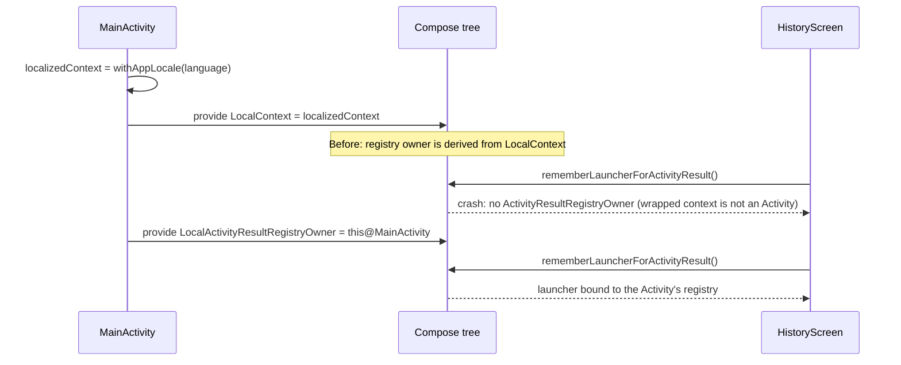

# 9. Localized Context and the Activity Result Registry

- **Date:** 2026-09-29
- **Status:** Accepted
- **Deciders:** Architecture Team, AI Coding Assistant

## Context

The in-app language override (System / English / Dutch, see the [localization proposal](../../openspec/changes/add-localization/proposal.md)) is applied in `MainActivity` by wrapping the Activity in a locale-configured context (`Context.withAppLocale()` → `createConfigurationContext`) and providing it to Compose as `LocalContext`.

Version 1.4.3 added a system file picker for CSV import (`rememberLauncherForActivityResult(ActivityResultContracts.OpenDocument())`). On a real Pixel, opening the **History** screen crashed with `No ActivityResultRegistryOwner was provided via LocalActivityResultRegistryOwner`. It reproduced only when the app language was overridden and so used the wrapped context; on the emulator with the *System* language `withAppLocale()` returns the Activity itself, which hid the bug. The trigger looked unrelated (Log → Weight → Glucose → Weight → History) because History is only composed after the user navigates there.

`LocalActivityResultRegistryOwner` resolves its default by walking the `LocalContext` chain to find a `ComponentActivity`. The context returned by `createConfigurationContext` is a plain `ContextWrapper` without an Activity in its chain, so the lookup fails.



## Decision

Keep the localized `LocalContext`, and additionally provide the Activity as the registry owner:

```kotlin
CompositionLocalProvider(
    LocalContext provides localizedContext,
    LocalActivityResultRegistryOwner provides this@MainActivity
) { ... }
```

Any other composition local that is resolved through the `LocalContext` chain to an Activity must be checked the same way when new features use it.

## Consequences

### Positive
- The CSV file picker, and any future `rememberLauncherForActivityResult` use, works in every language mode.
- The fix is one line at the single place where the context is wrapped.

### Negative / Trade-offs
- Overriding `LocalContext` silently breaks Activity-dependent locals. Testing must include the **Dutch** and **English** overrides, not only *System default*, on a device or emulator.
- An alternative, `AppCompatDelegate.setApplicationLocales`, would avoid the wrapped context entirely but needs `androidx.appcompat`, which conflicts with [ADR 0003 (Dependency Minimization)](0003-dependency-minimization.md).
