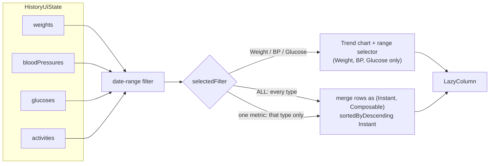

# 10. Responsive Layout and Dutch UI Wording

- **Date:** 2026-09-29
- **Status:** Accepted
- **Deciders:** Architecture Team, AI Coding Assistant

## Context

Dutch strings are typically 30–50 % longer than their English counterparts and compound words (*Systeeminstelling*, *Gezondheidsgeschiedenis*, *Bloeddruk*) cannot wrap gracefully. On a phone-width screen this produced misaligned UI in the Dutch locale: the Log tabs wrapped mid-word ("Bloeddru" / "k"), the Profile language selector wrapped inside its third of the row, and the History title pushed the Import/Export buttons out of alignment. Separately, the History **All** filter listed only weight entries, and there was no way to see activity entries.

## Decision

**Layout rules for localized UI**
- Tab rows use `PrimaryScrollableTabRow` with `maxLines = 1, softWrap = false` labels, so every label stays on one line and the row scrolls if it cannot fit.
- Segmented buttons and other equal-width controls use short labels, with `maxLines = 1`. "System default" / "Systeeminstelling" became **System** / **Systeem**.
- Chip rows scroll horizontally (`horizontalScroll`) instead of wrapping.
- Screen titles get their own line; action buttons sit below in an equal-weight `Row`. The History **Importeren / Exporteren** buttons are now two equal-width buttons under the title.

**Dutch wording**
- Shorter, more natural terms: **Loggen** (Log tab), **Opslaan** (save), **Historie** (History tab, "Health Journal - Historie") and **Gezondheidshistorie** (History title) instead of *Geschiedenis*. *Historie* is standard Dutch for *geschiedenis*. The Log title stays **Gezondheidswaarde loggen**.

**History screen data model**
- The **All** filter merges weight, blood pressure, glucose and activity into one list sorted by timestamp, newest first. A new **Activity** chip shows activity sessions alone. Single-metric filters keep the trend chart above their entries ([ADR 0006](0006-health-trend-visualizations.md)).

## Consequences

### Positive
- The Dutch UI no longer breaks alignment on narrow phones.
- Users see everything they logged in one place, including glucose and activity.
- The non-deprecated `PrimaryScrollableTabRow` closes the deprecation warning deferred in [ADR 0007](0007-build-toolchain-upgrade.md).

### Negative / Trade-offs
- `softWrap = false` truncates instead of wrapping if a future translation is much longer, so new strings must be checked in the Dutch locale on a ~360 dp wide device.
- Text the ViewModels produce (success and error banners) must also be translated: it is passed as a resource id and resolved on the screen, see [ADR 0015](0015-localized-viewmodel-messages.md). A label that repeats its translation in brackets ("Fasting (Nuchter)") is a defect in either language.
- The merged **All** list builds row lambdas per entry; for very large histories a per-type paging strategy may be needed.
