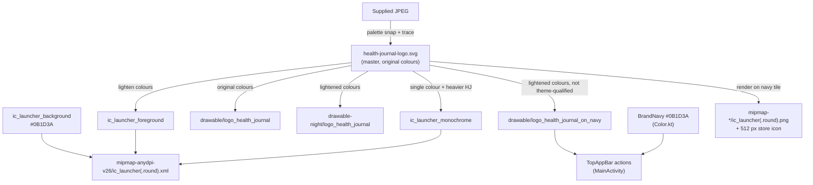

# 11. App Icon: Dark-Tile Adaptive Icon, Per-Theme Logo and Branded Top Bar

- **Date:** 2026-09-29
- **Status:** Accepted
- **Deciders:** Architecture Team, AI Coding Assistant

## Context

The manifest pointed at the platform placeholder `sym_def_app_icon`. A logo was supplied as a JPEG: a blue balance scale with a yellow pulse line, a red runner, blood drop and "HJ" monogram. On a white tile the yellow pulse line has a contrast of only about 1.5:1, and a launcher cannot switch icons by theme (a `-night` mipmap is not reliably honoured, and `activity-alias` switching is fragile).

## Decision

- **One master vector:** `design/app-icon/health-journal-logo.svg` (traced from the JPEG, transparent background, 8 flat-colour paths). Every other asset is derived from it.
- **Adaptive icon (dark-tile look):** solid navy background `#0B1D3A`, with the logo recoloured for contrast (blue `#6FB1F2`, yellow `#FFD93D`, coral `#FF6B6B`; all above 4.5:1 on the navy). The logo is centred at 57 dp of the 108 dp canvas, inside the 66 dp safe zone.
- **Monochrome layer** for Android 13+ themed icons: one colour on a transparent background, with a heavier stroke on the "HJ" so it survives at small size.
- **Legacy PNGs** (48–192 px) and a 512 px full-bleed store icon are rendered from the same paths. The project's `minSdk` is 26, so the PNGs are a safety net only.
- **In-app logo per theme:** `drawable/logo_health_journal.xml` (original colours, for the light theme) and `drawable-night/logo_health_journal.xml` (lightened colours). Compose theming already follows the system setting (`isSystemInDarkTheme`), so the resource qualifier matches it.
- **Branded top bar:** the top app bar in `MainActivity` shows the logo at the right end (40 dp tall) on all three screens. The theme blue (`#1E88E5` light, `#90CAF9` dark) is a poor backdrop for the logo: `#0560AF` on `#1E88E5` is nearly invisible and the yellow pulse line disappears on either. The bar is therefore the brand navy (`BrandNavy = #0B1D3A`, the icon tile colour) in **both** themes, with white title text, and shows `drawable/logo_health_journal_on_navy.xml`, the lightened-colour logo. That variant is not theme-qualified, because the bar does not change with the theme. The bottom navigation, buttons and accents keep the Material theme colours.

## Consequences

### Positive
- The icon stays legible in light and dark modes, and on light and dark wallpapers.
- Themed icons work on Android 13+, and the in-app logo follows the theme.
- The logo in the top bar is always legible, and the bar matches the launcher icon.

### Negative / Trade-offs
- The launcher icon does not match the original artwork colours (the light-tile version).
- Two colour variants of the logo exist. Both are generated from the master by colour mapping and must be regenerated when the master changes.
- The top bar no longer uses the Material primary colour, so it is the one surface that ignores the theme's blue. In light mode it is a dark band above a light screen.
- `logo_health_journal` (per-theme) is not used by any screen yet; the top bar uses the `_on_navy` variant.
- The trace is an approximation of the JPEG. A hand-made vector from the designer would be sharper.
