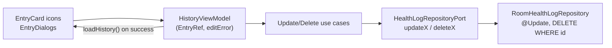

# 12. Edit and Delete Entries (Update/Delete CRUD)

- **Date:** 2026-09-30
- **Status:** Accepted
- **Deciders:** Architecture Team, AI Coding Assistant

## Context

Entries could only be created (Log screen) or bulk-imported (CSV). A mistyped weight, a wrong glucose context or a duplicated import row could not be corrected or removed, and with 1000+ imported entries there was no way to clean up. The OpenSpec change is in `openspec/changes/archive/2026-09-30-feature-edit-delete-entries/`.

## Decision

- **Domain:** `HealthLogRepositoryPort` gains `updateX(entry): Boolean` and `deleteX(id: MeasurementId): Boolean` for Weight, Blood Pressure, Glucose and Activity. `false` means the id does not exist. New use cases `UpdateXUseCase` and `DeleteXUseCase` re-validate through the existing value objects and recompute derived data (BMI for weight, NHG categories for blood pressure and glucose). An update keeps the entry's id and profile. Updates return `null` for an unknown id.
- **Explicit update instead of `insert(REPLACE)`:** the existing insert already replaces on the primary key, but an edit of a missing id would silently create a new row. Room `@Update` returns the affected row count, so a missing id is an error. No schema change: the database stays at version 2 and needs no migration.
- **State:** `HistoryViewModel` exposes `startEdit`/`cancelEdit`, `requestDelete`/`cancelDelete`/`confirmDelete` and `updateX`. Which entry is being edited or deleted (`EntryRef`) lives in `HistoryUiState`, so dialogs survive rotation. After a successful update or delete the view model calls `loadHistory()`, which is how the list, trend charts and stat chips refresh (the screen does not observe Room flows). A failed update keeps the dialog open and sets `editError`.
- **Icon buttons, no swipe:** each History entry card has an Edit and a Delete `IconButton`. Swipe-to-delete is easy to trigger while scrolling a long list and is not discoverable. Following Android/Material guidelines: `IconButton` gives the 48 dp minimum touch target, the icons are the standard `Icons.Filled.Edit` and `Icons.Filled.Delete`, and both have localized (English/Dutch) content descriptions for TalkBack. The delete icon uses the error colour.
- **Confirmation only, no undo:** delete opens a localized `AlertDialog` whose confirm button uses the error colour. There is no undo Snackbar or trash; deletion is permanent, which the dialog text says.
- **Edit dialog:** an `AlertDialog` pre-filled with the entry's values, using the same labels and string resources as the Log screen, plus a Material date and time picker for the timestamp. It accepts a decimal comma (Dutch keyboards). Activities keep their start time; duration edits the end time, distance is edited in km like the Log screen.
- **Trend anchoring:** trend windows are anchored to the newest entry ([ADR 0006](0006-health-trend-visualizations.md)), so deleting the newest entry moves the window back. This is the expected behaviour.

## Consequences

- Positive: mistakes and duplicate imports can be fixed; the domain stays free of Android types; no migration.
- Negative: deleting is permanent. The confirmation dialog is the only safeguard; a CSV export beforehand is the user's backup.
- The edit dialog has its own input state and validation instead of sharing composables with the Log screen. The Log fields are bound to `LoggingViewModel` state (live BMI/NHG previews), so extracting them would have meant restructuring the Log screen; the two share labels and ranges, not code.
