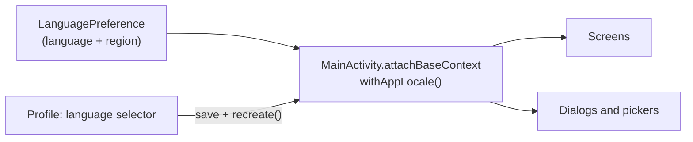

# 13. Apply the App Language and Region on the Activity Base Context

- **Date:** 2026-09-30
- **Status:** Accepted (supersedes the `LocalContext` override of [ADR 0009](0009-localized-context-activity-result-registry.md))
- **Deciders:** Architecture Team, AI Coding Assistant

## Context

ADR 0009 applied the in-app language (System / English / Dutch) by providing a locale-configured context as `LocalContext` at the top of the composition. Compose windows that create their own root composition (`AlertDialog`, `DatePickerDialog`, popups) re-provide `LocalContext` from the window's own context, so the override is lost inside them. With the app set to Dutch and an English system language, the screen was Dutch while every dialog (delete confirmation, edit dialog, date pickers, the new date-of-birth picker) fell back to English.

## Decision

- `MainActivity.attachBaseContext` wraps the base context with `withAppLocale(LanguagePreference.language)`. The Activity, its resources and every window it opens (dialogs, pickers) resolve strings in the chosen language.
- The `LocalContext` override and the `LocalActivityResultRegistryOwner` workaround from ADR 0009 are removed: the context is a real Activity again, so activity-result launchers work by default.
- **Region is independent of language.** A second preference, *Regional formats* (System / Netherlands / US), drives date, time and number formats. `resolveAppLocale(language, region, system)` builds the locale from the chosen language and region, and any part left on System comes from the device. A device set to English (Netherlands) therefore keeps Dutch formats when the app language is forced to English; forcing the language must not drop the device region (a bare `en` locale would have switched dates to US style).
- `withAppLocale` also sets the process default locale, so `java.time` and `String.format` (used by the charts and pickers) follow the same region. When both settings are System it resets the default to the device locale, because the default survives `recreate()`.
- History cards show the stored UTC instant as a localized date and time in the device time zone (`Instant.formatLocal()`) instead of a raw ISO string.
- Changing the language or region on the Profile screen stores the preference and calls `recreate()`. The selected tab is kept with `rememberSaveable`, and the ViewModels survive the recreation.

## Consequences

- Positive: dialogs and pickers follow the app language; no composition-local workarounds.
- Negative: switching language or region recreates the Activity (a brief redraw). The region list is short (Netherlands, US); more can be added to `AppRegion`. Units are not part of this: see [ADR 0014](0014-units-presentation.md) for the separate units setting, whose default follows the region chosen here.
- Testing must include the Dutch and English overrides on a device or emulator, and check dialogs as well as screens.
