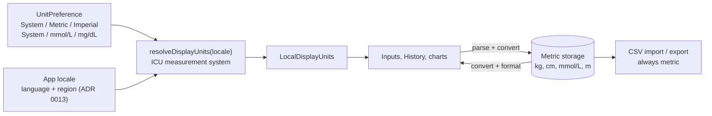

# 14. Units: Metric Storage, Locale-Aware Presentation

- **Date:** 2026-09-30
- **Status:** Accepted
- **Deciders:** Architecture Team, AI Coding Assistant

## Context

The app stored and showed metric values only (kg, cm, mmol/L, meters). Users in other regions expect pounds, feet and inches, miles, or mg/dL. Language and region were already separated ([ADR 0013](0013-activity-base-context-for-app-language.md)); units are a third concern that must not leak into the data.

## Decision

**Storage never changes.** The database, the domain model and the CSV import/export always use metric: weight in kg, height in cm, glucose in mmol/L, activity distance in meters, blood pressure in mmHg. Room stays at version 2 (no migration), and CSV files stay portable between users and devices whatever units they display.

**Presentation is a separate, per-user setting.**

- Profile has two selectors: *Units* (System / Metric / Imperial) and *Glucose unit* (System / mmol/L / mg/dL). The Log screen keeps its glucose chips as a shortcut that writes the same setting.
- Imperial shows weight in lb, distance in mi, and height as feet and inches. Metric shows kg, km and cm. Activity distance is entered in **km or mi**, not meters, because that is how people talk about a run or a walk.
- Every input label carries its unit, for example "Weight (lb)" or "Distance (mi)", and History cards, chart titles and stat chips show the unit next to each value.
- Trend charts convert their points before plotting, so axes, moving averages, latest, change, min, max and average all follow the chosen unit.

**The default follows the region ("System").** `resolveDisplayUnits(choice, glucoseChoice, Locale.getDefault())` runs against the app locale, which already reflects the Regional formats setting. An English device set to Netherlands is therefore metric.

- Measurement system: ICU `LocaleData.getMeasurementSystem` (API 28+). It reports imperial (US customary or UK) for US and GB, and SI for all other regions. On API 26 and 27, which lack it, a fixed set of countries (US, LR, MM, GB) gives the same answer.
- Glucose is not a measurement-system question: it is a clinical reporting convention. mg/dL is the default in a set of regions (US, JP, DE, FR, ES, IT, AT, BE, PT, GR, IN, BR, AR, CL, CO, MX, EG, IL, SA, KR, TW, TR); every other region, including NL, UK and CA, uses mmol/L.
- Any region the app does not know about lands on metric and mmol/L, and the user can override it in Profile.

**Rounding never rewrites data.** Edit dialogs fill each field with the stored value converted and rounded for display. A field left untouched saves the original stored value, so opening and saving an entry in another unit does not change it. Typed values are converted to metric and rounded to the stored precision (weight to 2 decimals, glucose to 2 decimals). The height fields (ft and in) rewrite the stored cm only when the user edits them.

## Consequences

- Positive: one place converts (`UnitConversion` in the domain), tested for round trips; the data and CSV files are unaffected by presentation; regions we did not think of degrade to the metric defaults.
- Negative: displayed values are rounded (a stored 74.84 kg shows as 165.0 lb); entering the same displayed value again does not necessarily reproduce the stored number, which the untouched-field rule handles for edits only. Changing a unit does not recreate the Activity: the units are a composition local, so screens recompose immediately.
- Blood pressure stays mmHg everywhere; other units (kPa) are out of scope.
- Testing must cover imperial and mg/dL logging, the edit round trip, the charts, and English and Dutch labels on a device or emulator.
- The height fields (ft and in) only make sense if saving the profile really updates it; that was broken independently of units and is fixed in [ADR 0016](0016-profile-update-edits-active-profile.md). Banner and error text follows the app language through [ADR 0015](0015-localized-viewmodel-messages.md), so messages that name a unit ("Please enter a valid weight in lb") are formatted from a resource.
