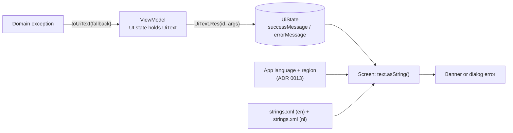

# 15. Localized ViewModel Messages (UiText)

- **Date:** 2026-09-30
- **Status:** Accepted
- **Deciders:** Architecture Team, AI Coding Assistant

## Context

The screens were localized, but the banners were not. ViewModels built their success and error messages as English string literals ("Activity session recorded!", "Export failed: ...") and put them in the UI state, so a Dutch UI showed English banners. Two ViewModels also kept a copy of the translation in state, which would go stale if the language changed while the message was visible. The same class of mistake had already produced "Fasting (Nuchter)" and "Postprandial (Na de maaltijd)" in the English UI ([ADR 0010](0010-responsive-dutch-ui-layout.md)).

## Decision

**A ViewModel never holds translated text. It holds a description of the message, and the screen resolves it against the current locale.**

- `UiText` (in `ui/common`) is a small sealed interface:
  - `UiText.Res(id, args)` is a string resource id with format arguments. An argument may itself be a `UiText`, so a message can embed another localized message.
  - `UiText.Plain(value)` is final text that already exists, such as the message of an exception raised by the domain layer.
- `UiText.asString()` is a composable that calls `stringResource`. Every banner and dialog error calls it, so the text follows the app language and region ([ADR 0013](0013-activity-base-context-for-app-language.md)) and never needs the ViewModel to know a `Context`.
- Input validation in `LoggingViewModel` throws `UiTextException(UiText)` instead of `IllegalArgumentException("English text")`. `Throwable.toUiText(fallbackRes)` turns any caught exception into the right `UiText`: the carried text, else the exception message, else the fallback resource.
- Both `values/strings.xml` and `values-nl/strings.xml` get every message. The Dutch text uses the same terms as the rest of the Dutch UI ([ADR 0010](0010-responsive-dutch-ui-layout.md)).

| Message source | Represented as | Resolved by |
|---|---|---|
| Success and info banners (saved, exported, imported) | `UiText.Res` | `asString()` on the screen |
| Validation errors (missing or invalid input, with unit) | `UiTextException` carrying `UiText.Res` | `toUiText()`, then `asString()` |
| Failures with a technical reason (export, import, delete) | `UiText.Res` with the reason as argument | `asString()` |
| Message of a domain exception (for example a value out of range) | `UiText.Plain` | `asString()` (shown as is) |
| No message available | `UiText.Res` fallback | `toUiText(fallbackRes)` |

## Consequences

- Positive: banners follow the app language, including when it changes; ViewModels stay free of `Context` and remain unit-testable on the JVM; tests assert the resource id, not a translated string, so a wording change never breaks a test.
- Negative: a new message needs a resource in two files, and a message from the domain layer (`Plain`) is still whatever language the domain wrote it in (English). Domain error messages are technical and rare in the UI; a user-facing rule that can fail should get its own resource.
- Review rule: a string literal shown to the user must not appear in a ViewModel. Check both languages on the device for every new message.
