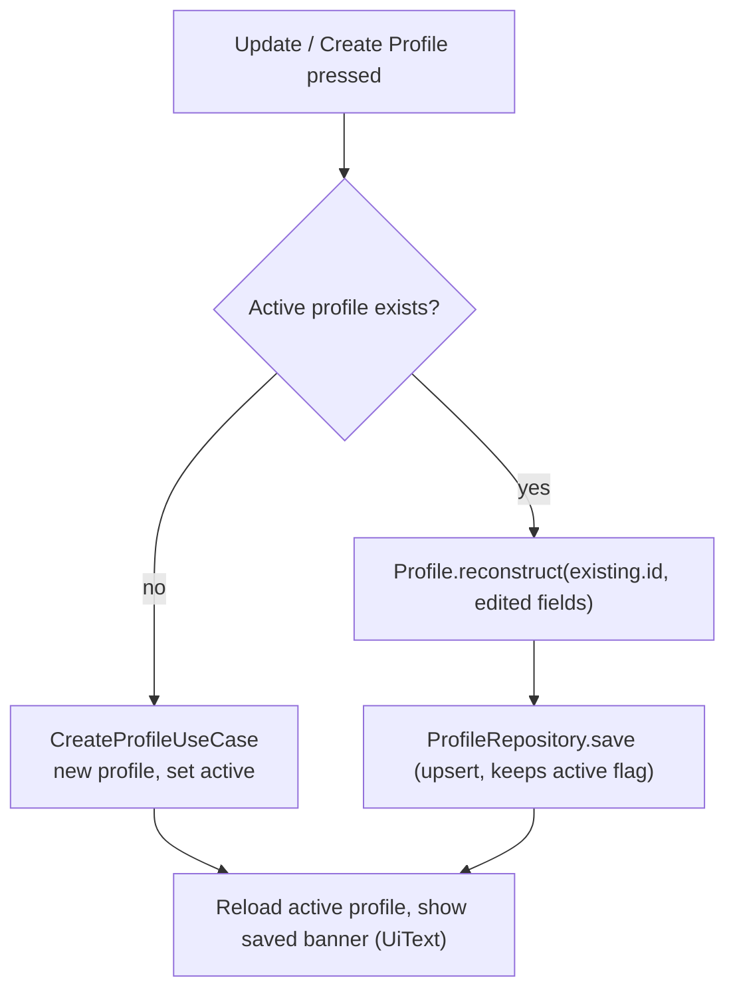

# 16. Updating the Profile Edits the Active Profile

- **Date:** 2026-09-30
- **Status:** Accepted
- **Deciders:** Architecture Team, AI Coding Assistant

## Context

The Profile screen shows *Update Profile* once a profile exists, but the button called `CreateProfileUseCase` every time. That use case always builds a new profile with a new id and only makes it active when there is no active profile. An edit therefore added a second profile and the first one stayed active, so name, date of birth, height and sex edits were silently lost. It showed up while testing units: 5 ft 11 in was converted to 180 cm and saved, but the summary kept showing the original 178 cm. The problem is older than units; height was simply the first field checked after several saves.

## Decision

- `ProfileViewModel.saveProfile` first asks the repository for the active profile. If one exists, it saves `Profile.reconstruct(existing.id, ...)` with the edited fields; only when there is none does it call `CreateProfileUseCase`.
- `RoomProfileRepository.save` is already an upsert that keeps the existing active flag, so an edit keeps the same id, the same active profile and all logged entries (entries reference the profile id).
- Validation is unchanged: the `Profile` constructor and `HeightCm` still reject a blank name, a date of birth outside the allowed range and a height outside 50 to 300 cm. A rejected edit shows the error and stores nothing.

| Situation | Before | After |
|---|---|---|
| First save, no profile | New profile, made active | Same |
| Save again with changes | Second profile added, first stays active, changes lost | Active profile updated in place, same id |
| Entries logged earlier | Linked to the first profile only | Still linked; nothing is orphaned |
| Invalid values | Error, nothing stored | Same |

## Consequences

- Positive: the summary and the form always agree, and an edit never changes which profile owns the logged entries.
- Negative: installs that already pressed Update before this fix hold extra, unused profile rows. They are harmless (the first profile stays active, entries stay attached to it) and are not deleted automatically, because removing user data needs the user's say. The edited values simply have to be entered once more.
- A future multi-profile feature needs an explicit *add profile* action; the update button must never create one.
