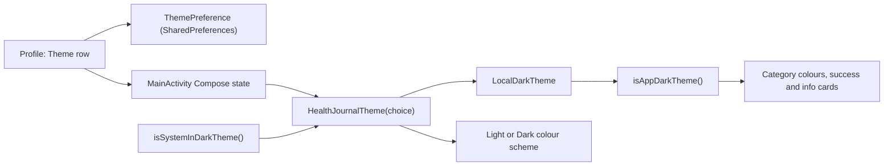

# 17. In-App Theme Choice (System, Light, Dark)

- **Date:** 2026-10-06
- **Status:** Accepted
- **Deciders:** Architecture Team, AI Coding Assistant

## Context

The dark theme shipped following only the device setting. Users want to pick light or dark inside the app regardless of the device, like they can already pick language and units on the Profile screen. Several colour helpers (range category colours, success and info cards) called `isSystemInDarkTheme()` directly, so a choice made only at the `MaterialTheme` level would have left those colours on the system theme and produced a mixed screen.

## Decision

- A `ThemeChoice` enum (`SYSTEM`, `LIGHT`, `DARK`) is stored in `ThemePreference` (SharedPreferences `theme_prefs`), the same pattern as `UnitPreference`. Anything unknown reads as `SYSTEM`.
- `HealthJournalTheme(choice)` resolves the choice with `ThemeChoice.isDark(systemDark)` and provides the result through the `LocalDarkTheme` composition local, then picks the colour scheme.
- Composables that need to know whether the dark palette is active call `isAppDarkTheme()` (in `ui/theme/Theme.kt`) and **never** `isSystemInDarkTheme()`. The one exception is `HealthJournalTheme` itself, which reads the system value to resolve `SYSTEM`.
- `MainActivity` keeps the choice in Compose state, so a change applies immediately with no `recreate()`, unlike language and region, which need an activity restart.
- The Profile screen shows System, Light and Dark as a segmented button row in English and Dutch.

## Consequences

- Positive: one source of truth for dark or light, so every colour agrees with the chosen theme; no activity restart.
- Negative: new code that calls `isSystemInDarkTheme()` directly would silently ignore the choice. The rule is written down in the developer conventions.
- The status bar and navigation bar icon colours are not changed by this decision; the top bar is brand navy in both themes.
