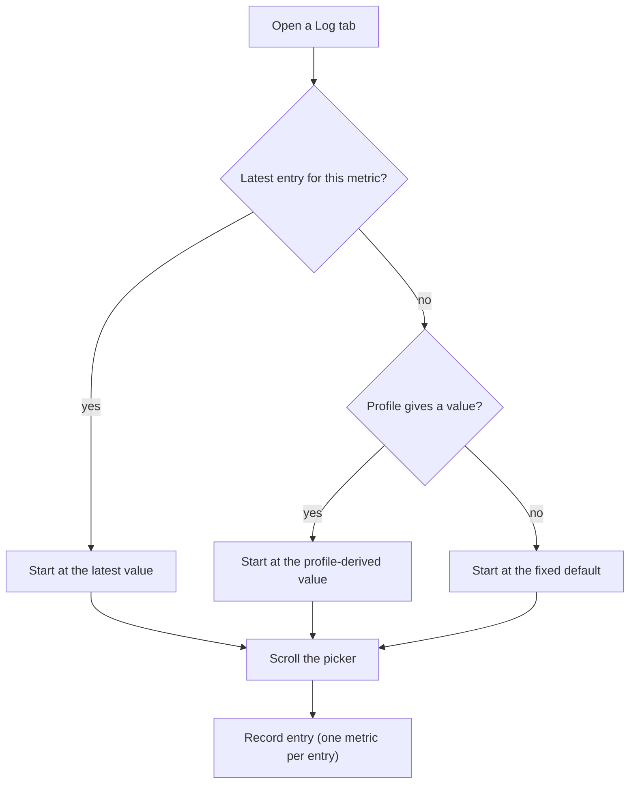

# 18. Smart Input Pickers, Pulse and Standalone Waist

- **Date:** 2026-10-06
- **Status:** Accepted
- **Deciders:** Architecture Team, AI Coding Assistant

## Context

Typing numbers on the Log screen was slow and error-prone. Blood pressure also lacked a pulse, and waist circumference could be entered on its own tab and as an optional extra on the weight entry. The extra field made every weight entry longer and meant one tap saved two different measurements.

## Decision

- **Pickers:** weight and waist use `HorizontalRulerPicker` (tape style, 0.1 steps, whole-number labels). Blood pressure and pulse use `StackedBpPulsePicker`, three scrolling rows. Both ruler pickers use the same tape height (75 dp); only the colour differs (yellow for weight, teal for waist).
- **Starting value:** a fallback chain: the latest entry, else a value derived from the profile (weight from height, waist from sex), else a fixed default (weight 75.0 kg, blood pressure 120/80, pulse 70 bpm, waist 90 cm).
- **Pulse:** `BloodPressureReading.pulse` is optional, 30 to 250 bpm, stored in a nullable `pulse` column (`MIGRATION_3_4`). CSV export writes `pulse_bpm`; import still accepts files without it.
- **Waist is its own entry:** waist is recorded only on the Waist tab. A weight entry saves only weight. Waist keeps its own history, edit, delete and CSV type.
- **Labels:** waist labels follow the Dutch authority wording (see [ADR 0005](0005-dutch-nhg-guidelines.md)); the neutral wording rule does not apply to them.

## Consequences

- Positive: fewer typing errors, shorter forms, and each save records exactly one kind of measurement.
- Negative: someone who measured weight and waist together enters them in two steps.
- Weight and waist entries no longer share a timestamp unless the user records them at the same moment.
