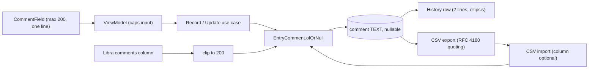

# 19. Optional Comment on Every Entry

- **Date:** 2026-10-06
- **Status:** Accepted
- **Deciders:** Architecture Team, AI Coding Assistant

## Context

Users want to add context to a reading ("after a walk", "felt dizzy") and see it later in History. This must work for all five entry types, live in the same database, stay fast, and survive CSV export and import, including comments that contain commas, quotes or line breaks.

## Decision

- **Value object:** `EntryComment` in `:domain`. It is trimmed, single line (line breaks become one space), never blank and at most 200 characters. `EntryComment.ofOrNull` returns `null` for blank input and throws when over the limit. Every entry model has a `comment: EntryComment?`.
- **Storage:** a nullable `comment TEXT` column on each of the five entry tables, added by `MIGRATION_4_5` (database version 5). Old rows get `NULL`; nothing is lost.
- **UI:** one shared `CommentField` (counter `n/200`, single line) on the Log screen and in the edit dialogs. The ViewModels cap the input; History shows the comment under the entry, two lines at most, then an ellipsis. Comments are only shown in History, not in charts.
- **CSV:** a trailing `comment` column on every export. Cells are quoted per RFC 4180 when they contain a comma, quote or line break (`CsvQuoting`). Import accepts files without the column. The standard import skips a row whose comment is over 200 characters; the Libra import reads its `comments` column and clips a longer comment to its first 200 characters instead of skipping the row.

## Consequences

- Positive: one small, bounded text field keeps rows compact and queries fast; the existing data is untouched; CSV files stay readable by older tools that ignore the extra column.
- Positive: the limit and normalisation live in one place, so UI, import and use cases agree.
- Negative: CSV parsing is now quote-aware, so every import goes through `CsvQuoting.split`. It is covered by tests with and without quotes.
- Negative: the database moves to version 5; downgrading to an older app is not supported. The planned medication change moves to version 6 (`MIGRATION_5_6`).
