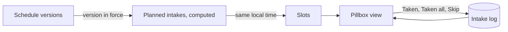

# 20. Medication Model and Pillbox

- **Date:** 2026-10-06
- **Status:** Accepted
- **Deciders:** Architecture Team, AI Coding Assistant

## Context

Users want to keep a list of their medication, see what is due today and record what they took. The model must handle tablets, liquids, sprays and injectables alike, group intakes that happen at the same moment, and keep history trustworthy when a schedule is edited. It must also fit the existing layers and add no dependency (ADR 0003).

## Decision

- **Model (`:domain`):** `Medication` with a `Dosage` (optional strength, amount per intake, dose unit), an optional `PillAppearance` (colour and shape), an optional `EntryComment`, and `archivedFrom`. Form and dose unit are independent enums. Units are stored as entered and never converted.
- **Schedule versions:** a schedule is a list of `ScheduleVersion(effectiveFrom, schedule)`. The latest version with `effectiveFrom <= date` applies. An edit creates a new version from a chosen date (default today), so past days keep the version that was in force. Choosing an earlier date is the one deliberate way to correct what was planned.
- **Planned intakes are computed, not stored.** Only outcomes (`Intake`, with status Taken or Skipped) are stored. Pending and Missed are derived when the pillbox is built; an intake with no outcome two hours after its planned time is shown as Missed.
- **Slots:** all planned intakes at the same local time form a slot. "Taken all" acts on one slot. Nearby times are never merged.
- **Time:** planned times are local wall-clock `LocalDateTime`; the actual time taken is an `Instant`.
- **Storage:** four tables (`medications`, `medication_schedules`, `medication_times`, `intakes`) added by `MIGRATION_5_6` (database version 6). It only creates tables. It was run on a real version 5 database on 2026-10-06: data counts were identical afterwards and the integrity and foreign-key checks were clean. See [database](../dev/database.md).
- **CSV:** medications, schedule versions and intakes are exported and imported by the existing adapters, with enum names that do not depend on the language.
- **UI:** a pill button in the top bar opens a full-screen pillbox with Today and Medications views. There is no fourth bottom tab, because the bar is already tight at large font sizes in Dutch. Messages use `UiText` (ADR 0015) and all text exists in English and Dutch.
- **Appearance:** the user picks a colour and a shape; no drug database and no photos. Colour is never the only cue.

## Dutch term check

Checked against apotheek.nl and Thuisarts on 2026-10-06. Confirmed: IE, microgram, tabletten, capsules, druppels, "keer aanbrengen" and eenheden. Differs: those sources use "dosis" and "inhalaties" for inhalers, and "pufjes" is informal spoken Dutch; the app still shows "pufjes". Decision 2026-10-07: keep "pufje / pufjes". It is short and familiar to users, and the unit label is only a counter next to an amount the user typed; the app makes no statement about how to use an inhaler. Revisit if a Dutch reviewer or the sources make "inhalaties" the clear norm. The Dutch wording for colours, shapes, messages and the notice is a first proposal and still needs review by a Dutch speaker before release (task 4.3).

## Consequences

- Positive: history does not move when a schedule changes, the table stays small, and reminders and adherence can reuse the same pure schedule function.
- Positive: no new dependency, and the model is not tied to tablets.
- Negative: an early effective-from date changes past planned intakes. This is stated in the form and is the user's choice.
- Negative: the database moves to version 6; downgrading is not supported.
- Known limitation: the edit form keeps its draft in `remember`, so it is lost on rotation or a language change.
- Compliance and privacy: see [ADR 0021](0021-medication-compliance-and-privacy.md).
