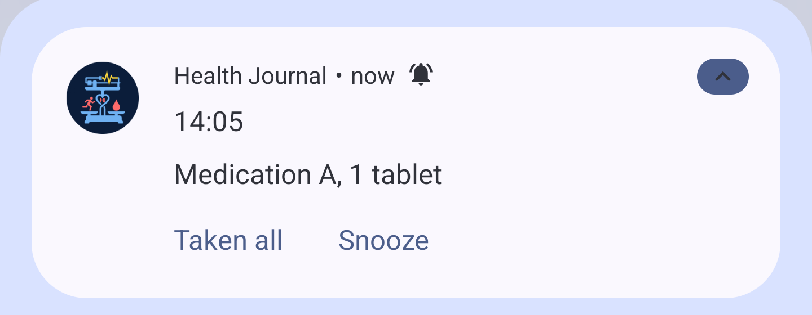
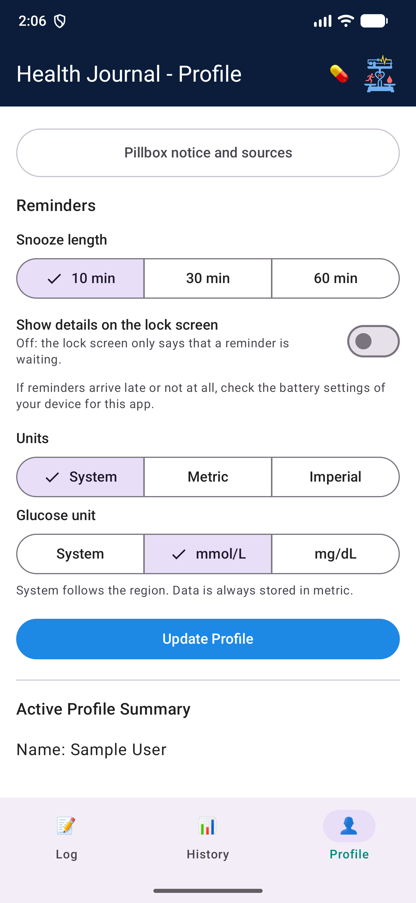

# 22. Medication Reminders

- **Date:** 2026-10-07
- **Status:** Accepted
- **Deciders:** Architecture Team, AI Coding Assistant

## Context

The pillbox ([ADR 0020](0020-medication-model-and-pillbox.md)) derives planned intakes from schedule versions and groups them into slots (same local time). Reminders are an Android mechanism on top of that model. They must work without a network, follow schedule changes, and stay inside the no-advice rule of [ADR 0021](0021-medication-compliance-and-privacy.md).

## Decision

- **One reminder per slot, not per medication.** Three medications at 07:30 give one alarm and one notification. The notification id is derived from the slot's local date-time, so a re-arm never creates a second notification for the same moment.
- **Domain owns the rule, app owns the mechanism.** `NextSlot` (the next planned time after "now"), `RearmRemindersUseCase`, `TakeAllForSlotUseCase` and `ReminderSchedulerPort` live in `:domain`. `AlarmManager`, notifications and receivers live in `:app`. No `:data` change and no new dependency ([ADR 0003](0003-dependency-minimization.md)).
- **`AlarmManager`, only the next alarm.** The alarm is re-armed after it fires, after boot, app update, clock or time-zone change, and after any save, archive, delete or outcome. WorkManager is rejected (deferred, inexact) and so is `setRepeating` (drifts, cannot follow schedule versions).
- **Exact alarms when allowed.** `setExactAndAllowWhileIdle` when `SCHEDULE_EXACT_ALARM` is granted, otherwise `setAndAllowWhileIdle`, with a hint in Profile. The feature works either way.
- **The receiver rebuilds the slot from current data.** Nothing is posted if no item is open, so a medication archived or already taken is never listed. Receivers use `goAsync()`.
- **Two actions, neither opens the app.** Taken all records the open items of the slot through the same use case as the pillbox and never overwrites an existing outcome. One Snooze action (10, 30 or 60 minutes, set in Profile) posts the notification again through a separate one-shot alarm without changing the planned time.
- **Lock-screen privacy.** By default the lock screen shows only "Medication reminder". A Profile setting shows the details.
- **Locale.** Texts are built from a context wrapped with the app locale, because receivers run without the Activity ([ADR 0013](0013-activity-base-context-for-app-language.md)).
- **Permission.** `POST_NOTIFICATIONS` is requested once, after an explanation, when the pillbox is open and a medication exists. A denied permission shows a hint in Profile.
- **No advice wording.** Notification text is the time and "name, dose" lines. No instruction, no encouragement, nothing about missed doses.
- **No logging.** Failures in receivers are swallowed, not logged, because logs could leak names and doses (enforced by `PrivacyChecksTest`).

## Screenshots

| Notification (neutral text, two actions) | Reminder settings in Profile |
|------------------------------------------|------------------------------|
|  |  |

The screenshots use synthetic data ("Medication A").

## Consequences

- Positive: few notifications, one alarm at a time, behaviour that follows the data, and a pure domain rule that is unit tested.
- Negative: reliability differs per manufacturer because of battery management. Mitigation: re-arm on boot, update and clock change, and a battery hint in Profile.
- Negative: Taken all can record a dose that was not taken. The pillbox can correct any outcome.
- Follow-up: tapping the notification opens the pillbox on Today and does not yet scroll to the slot. A pillbox that is already open does not refresh when Taken all is used from the notification; it shows the new state after it is opened again. With the app lock (`add-database-encryption-and-lock`) the lock text is owned by that change.
