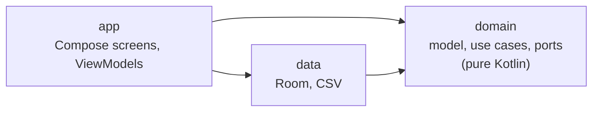

# Architecture

Health Journal uses **hexagonal architecture** (also called ports and adapters). The decision and its trade-offs are in [ADR 0002](../adr/0002-hexagonal-architecture.md). This page is the practical tour.

## The idea in one paragraph

The rules of the app (what a valid blood pressure is, which band a reading falls in, what a use case does) live in a core that knows nothing about Android, databases or screens. The core defines **ports**: Kotlin interfaces for the things it needs from the outside, such as "save a blood pressure entry". Outside code provides **adapters** that implement those ports (Room, CSV) or call into the core (the UI). Because the core has no framework dependencies, its tests run in milliseconds on the JVM.

## The three modules

**The dependency rule:** `app` and `data` depend on `domain`. `domain` depends on nothing. `app` depends on `data` only in one place: `HealthJournalApp` builds the `DataModule` and wires everything together. Screens and ViewModels use the domain's interfaces, not Room classes.

If you ever want to import `androidx.*` or `android.*` into `domain`, stop: the logic belongs in `domain` precisely because it does not need them.

### `domain`

Located at `domain/src/main/kotlin/nl/healthjournal/domain/`.

- `model/metrics/` holds value objects and entries: `BloodPressureReading` (validates ranges in its `init` block), `GlucoseLevel`, `WeightKg`, `WaistCircumferenceCm`, and entries such as `BloodPressureEntry`.
- `model/nhg/` holds the classifiers that map a value to a range, for example `NhgBloodPressureCategory.classify`.
- `model/profile/` holds `Profile`, the aggregate root (height, birth date, optional sex, BMI calculation).
- `usecase/` holds one class per action: `RecordBloodPressureUseCase`, `UpdateBloodPressureUseCase`, `DeleteBloodPressureUseCase`, and so on.
- `port/secondary/` holds the interfaces the core needs: `HealthLogRepositoryPort`, `ProfileRepositoryPort`, `DataExportPort`, `DataImportPort`.

A **use case** is a small class with one `operator fun invoke`. It builds and validates the model, applies the rules, and calls a port. It is the only place that decides *what happens* when a user records something.

### `data`

Located at `data/src/main/java/nl/healthjournal/data/`.

- `local/` has the Room `HealthJournalDatabase`, one `*Entity` and one `*Dao` per table, and `mapper/` which converts between entities and domain objects.
- `repository/` has `RoomHealthLogRepository` and `RoomProfileRepository`, the adapters that implement the ports.
- `csv/` has `CsvDataExportAdapter` and `CsvDataImportAdapter`.
- `DataModule.kt` creates the database and exposes the ports as ready-made objects.

Entities are deliberately separate from domain objects. Storage details (a `Long` timestamp, an enum stored as a `String`) never leak into the core. The price is mapping code; see the trade-off in ADR 0002.

### `app`

Located at `app/src/main/java/nl/healthjournal/app/`.

- `HealthJournalApp.kt` is the **composition root**: it creates `DataModule` and every use case once. There is no dependency injection framework on purpose ([ADR 0003](../adr/0003-dependency-minimization.md)).
- `ui/` has one package per screen area (`logging`, `history`, `profile`), each with a `*Screen` (Compose) and a `*ViewModel`. Shared pieces are in `ui/common`, `ui/theme` and `ui/nhg` (range labels and colours).
- `settings/` holds display preferences: language and region, and display units. See [ADR 0014](../adr/0014-units-presentation.md).
- `res/values/strings.xml` and `res/values-nl/strings.xml` hold all user-facing text.

A ViewModel exposes a `StateFlow` of a UI state class. The screen renders that state and sends events back as function calls. ViewModels never hold Android `Context` or resolved strings; they hold a `UiText` that the screen resolves ([ADR 0015](../adr/0015-localized-viewmodel-messages.md)).

## Ideas that shape the code

- **Metric-only storage.** Everything is stored in metric units (kg, cm, mmol/L, metres). The unit a user sees is a display choice, converted at the edge ([ADR 0014](../adr/0014-units-presentation.md)).
- **Offline first.** There is no network code. Data lives in a local Room database and can be exported as CSV.
- **Ranges, not verdicts.** Labels read "name · range" and never name a condition. Details in [ADR 0005](../adr/0005-dutch-nhg-guidelines.md) and the [range-labels spec](../../openspec/specs/health-metrics/range-labels/spec.md).
- **Few dependencies.** Only first-party Android, Jetpack and Kotlin libraries ([ADR 0003](../adr/0003-dependency-minimization.md)).

## Where to go next

- [Life of an entry](life-of-an-entry.md) walks through all of this with real code.
- All decisions are in `docs/adr/`.
