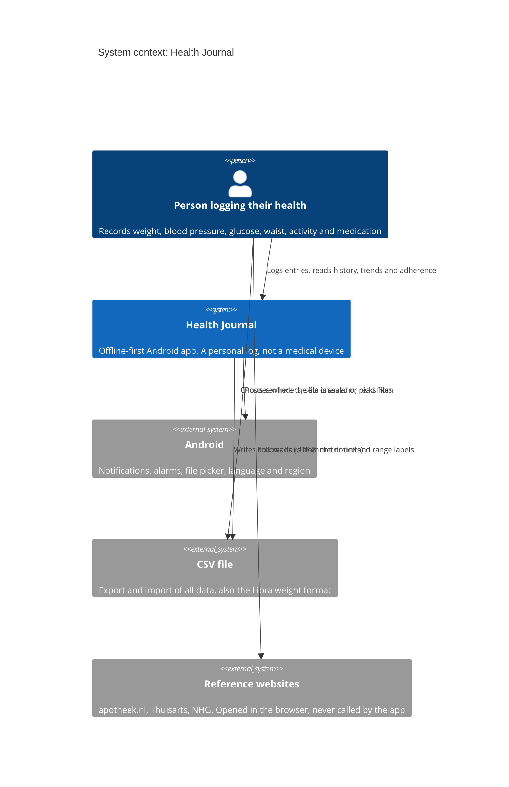
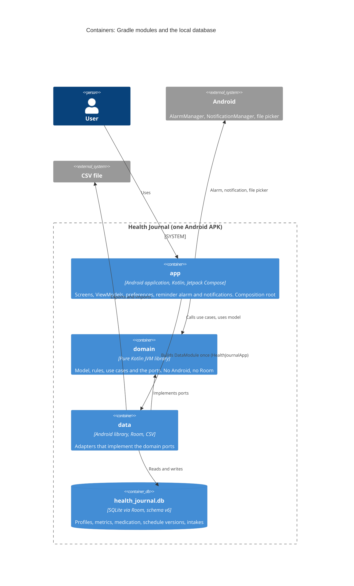
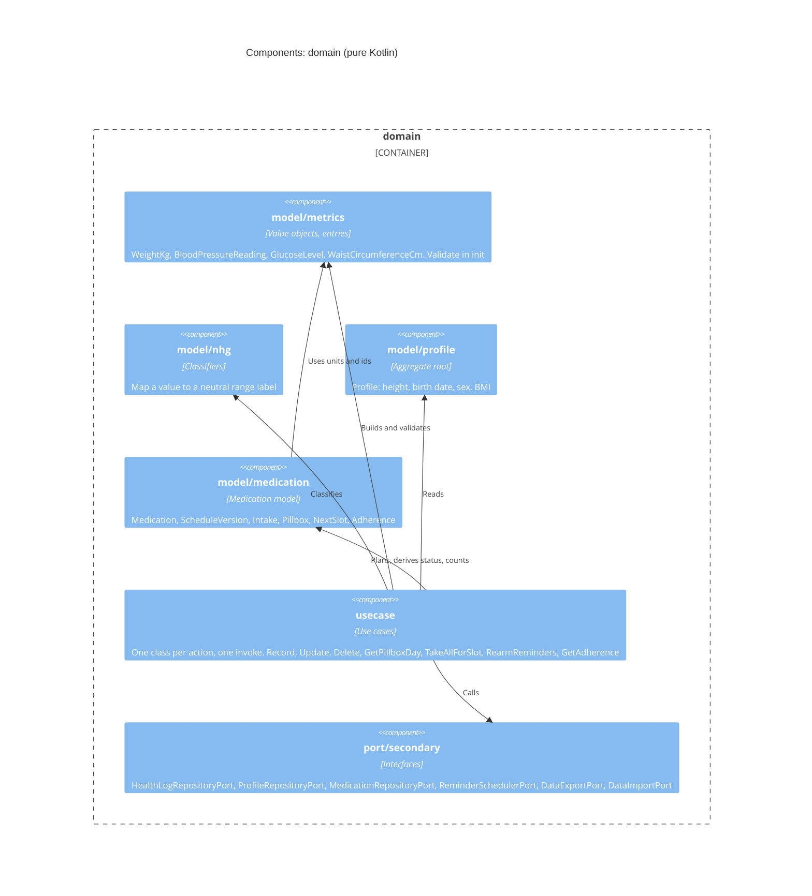
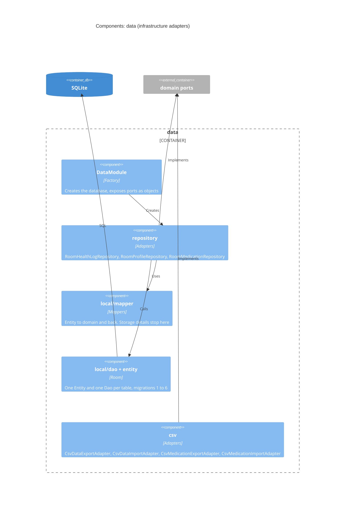
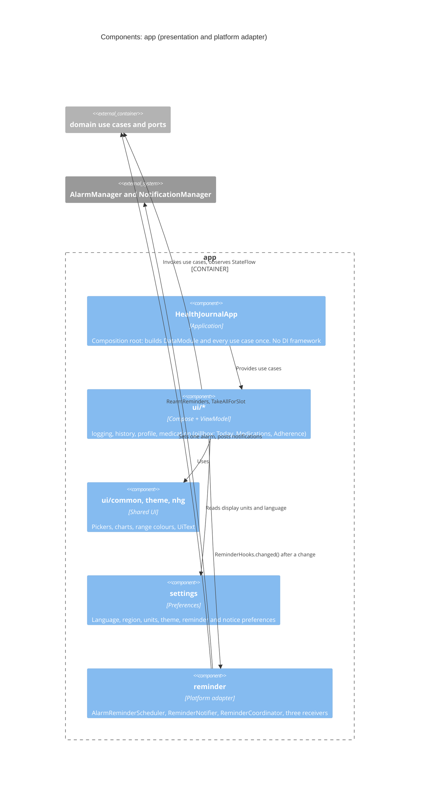
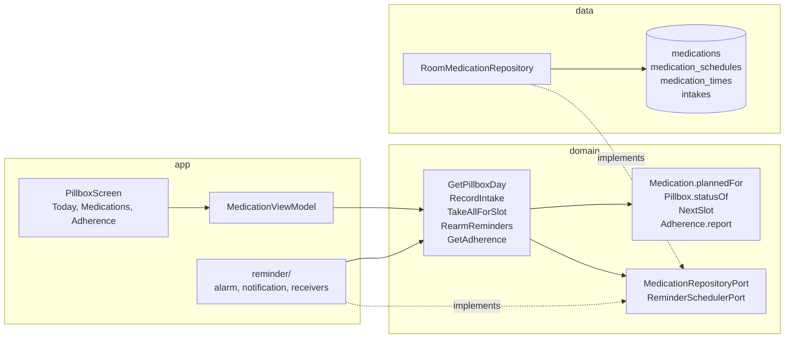
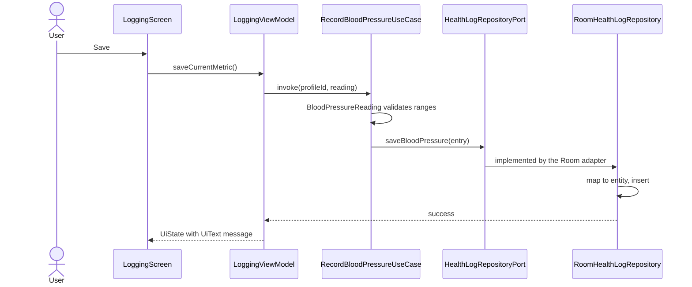
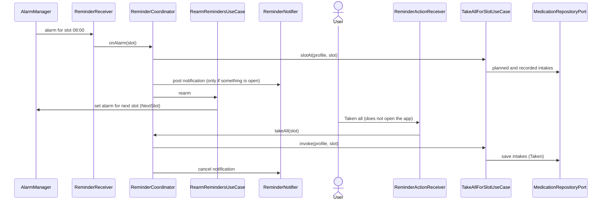
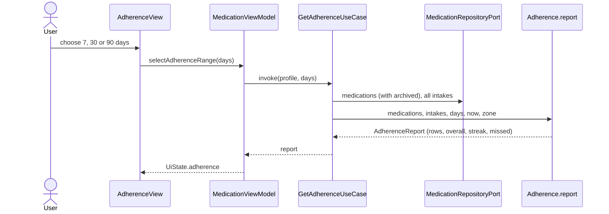
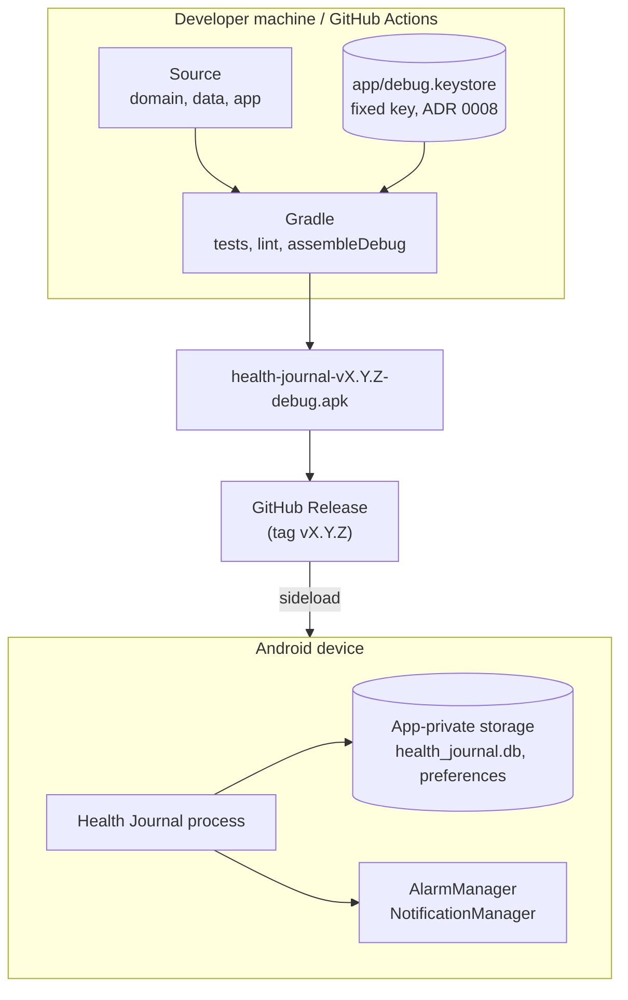

# C4 architecture diagrams

This page describes Health Journal with the [C4 model](https://c4model.com/): four zoom levels, from the system in its surroundings down to the components inside a module. The diagrams are Mermaid, so they render on GitHub and live next to the code. For the reasoning behind the shape see [ADR 0002](../adr/0002-hexagonal-architecture.md); for a code-level tour see [Architecture](architecture.md).

| Level | Question it answers | Section |
|---|---|---|
| 1. System context | Who uses the app and what does it touch? | [Context](#level-1-system-context) |
| 2. Containers | What are the deployable and buildable parts? | [Containers](#level-2-containers) |
| 3. Components | What is inside each module? | [Components](#level-3-components) |
| Dynamic | How do the parts talk during one scenario? | [Scenarios](#dynamic-views) |
| Deployment | Where does it run and what does it need? | [Deployment](#deployment) |

## Level 1: System context

There is no server. The person using the app, the Android system and a file are the only things around it. Nothing leaves the device unless the user exports a CSV file themselves.

What the context excludes on purpose: no account, no cloud, no analytics, no `INTERNET` permission, no logging ([privacy spec](../../openspec/specs/privacy/spec.md)).

## Level 2: Containers

In C4 a container is a separately buildable or runnable unit. Here the three Gradle modules are the containers, plus the SQLite file they share at runtime.

Dependency rule: `app` and `data` point at `domain`; `domain` points at nothing. `app` reaches `data` in exactly one place, `HealthJournalApp`, which wires the adapters to the ports.

## Level 3: Components

### Inside `domain`

### Inside `data`

### Inside `app`

### The medication slice across the modules

The same feature seen across all three containers shows how the ports keep the planning rules in one place.

## Dynamic views

### Recording a blood pressure reading

The full walk-through with code is in [Life of an entry](life-of-an-entry.md).

### A reminder fires and the user taps Taken all

One alarm exists at any time. After a restart, an update, a clock or time-zone change the `RescheduleReceiver` calls `rearm()`. See [ADR 0022](../adr/0022-medication-reminders.md).

### Opening the adherence view

## Deployment

| Concern | Decision |
|---|---|
| Distribution | debug-signed APK on GitHub Releases, same key every time so updates install in place |
| Network | none: no `INTERNET` permission |
| Permissions | `POST_NOTIFICATIONS`, `SCHEDULE_EXACT_ALARM` (optional, falls back to inexact), `RECEIVE_BOOT_COMPLETED` |
| Storage | one private SQLite database and `SharedPreferences`; the database is not encrypted yet (proposed in `add-database-encryption-and-lock`) |
| Entry points | `MainActivity`, `ReminderReceiver`, `ReminderActionReceiver` (not exported), `RescheduleReceiver` (system broadcasts only) |

## Keeping these diagrams true

- A new port, module or receiver changes level 2 or 3: update the matching diagram in the same change.
- Mermaid C4 is still marked experimental. If GitHub stops rendering a `C4*` block, switch that block to a `flowchart` with subgraphs; the content stays the same.
- Names in the diagrams are the real class and package names, so a search finds them.
