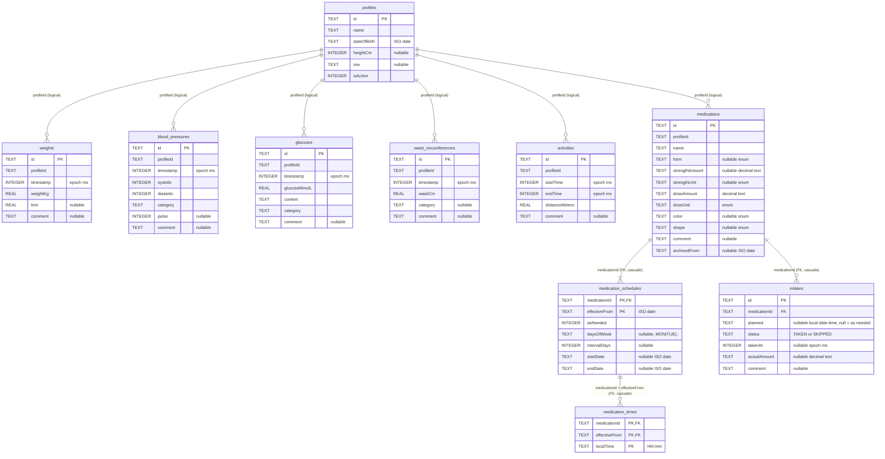

# Database

Health Journal keeps everything in one local Room (SQLite) database, `health_journal.db`, defined in `data/src/main/java/nl/healthjournal/data/local/HealthJournalDatabase.kt`. Nothing leaves the device. This page is the map of the tables; [Change the database](how-to/change-the-database.md) explains how to alter it safely.

Current version: **6**. Schema export is off, so this page and the entity classes in `data/src/main/java/nl/healthjournal/data/local/entity/` are the source of truth.

## Entity-relationship diagram

## Reading the diagram

- **Logical links to `profiles`.** The metric and medication tables hold a `profileId` column and an index on it, but no foreign key. The app always filters by the active profile.
- **Real foreign keys (medication only).** Deleting a medication cascades to its schedule versions, their times and its intake log. Room turns foreign keys on, so this is enforced by the database.
- **Schedule versions.** One `medication_schedules` row per version; the version in force on a date is the latest `effectiveFrom` on or before it. A recurring version has one `medication_times` row per daily time; an as-needed version has none.
- **Planned and missed are never stored.** `intakes` only holds recorded outcomes. Planned intakes are computed from the schedule, and pending or missed is derived from the clock (see the [medication design](../../openspec/changes/archive/2026-10-07-add-medication-management/design.md)).
- **Intake uniqueness.** A unique index on (`medicationId`, `planned`) keeps one outcome per planned intake. As-needed doses have a null `planned`, which SQLite treats as distinct, so several can exist on one day. A second index on (`medicationId`, `takenAt`) serves the as-needed lookups.
- **Amounts as text.** Strength, dose and actual amount are stored as plain decimal text, so 2.5 stays 2.5. Units are stored as entered and never converted.
- **Time.** Instants are epoch milliseconds. Planned times are local wall-clock text without a zone, so an 08:00 planned intake stays 08:00 when travelling.

## Version history

| Version | Change |
|---------|--------|
| 1 to 2 | `profiles.sex` added |
| 2 to 3 | `waist_circumferences` table added |
| 3 to 4 | `blood_pressures.pulse` added |
| 4 to 5 | `comment` column added to the five entry tables |
| 5 to 6 | medication tables added: `medications`, `medication_schedules`, `medication_times`, `intakes` |

Every migration is hand-written in `HealthJournalDatabase.kt`. Update this page, the diagram included, whenever an entity changes.
