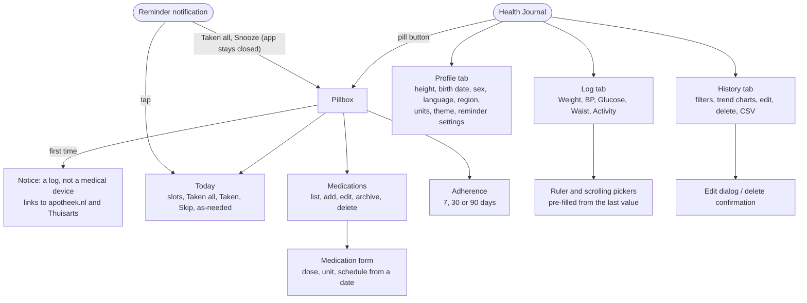
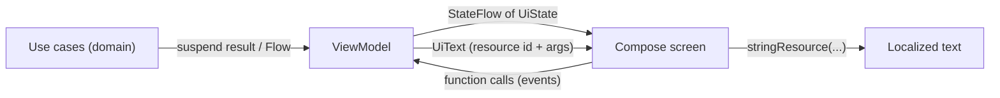
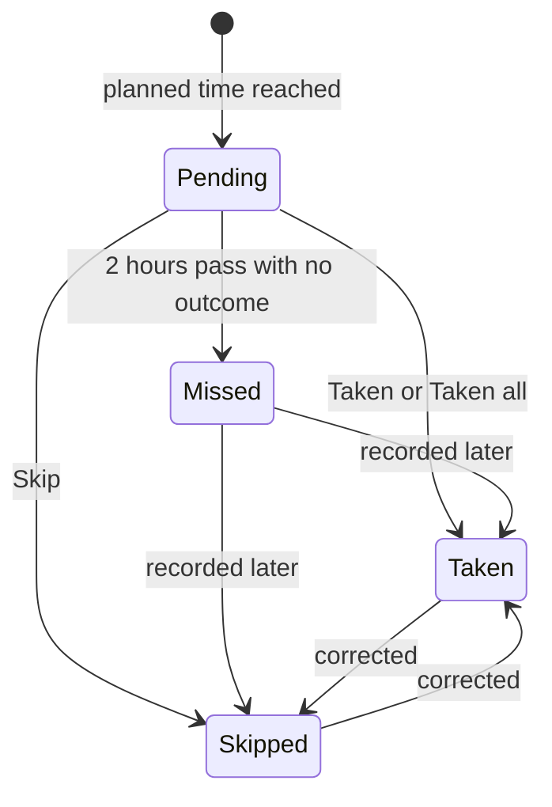

# Design

This page collects the design of Health Journal in one place: the principles, the quality goals, how the screens fit together, how state flows and which decision lives where. The structure (modules, ports) is in [Architecture](architecture.md) and the [C4 diagrams](c4.md). The reasons are in the [ADRs](../adr/0001-record-architecture-decisions.md).

## Principles

| Principle | What it means in practice | Where it is decided |
|---|---|---|
| Local only | no network code, no account, no `INTERNET` permission | [ADR 0004](../adr/0004-room-for-offline-first-persistence.md), [privacy spec](../../openspec/specs/privacy/spec.md) |
| Information, not advice | labels read "name · range", never a condition. No targets, no good or bad colours, no dose checks | [ADR 0005](../adr/0005-dutch-nhg-guidelines.md), [ADR 0021](../adr/0021-medication-compliance-and-privacy.md) |
| Pure core | rules live in `domain`, testable on the JVM in milliseconds | [ADR 0002](../adr/0002-hexagonal-architecture.md) |
| Store metric, show what the user prefers | conversion happens at the edge only | [ADR 0014](../adr/0014-units-presentation.md) |
| Derive, do not store | planned and missed doses and adherence are computed from schedule versions and recorded outcomes | [ADR 0020](../adr/0020-medication-model-and-pillbox.md) |
| Few dependencies | first-party Android, Jetpack and Kotlin libraries only | [ADR 0003](../adr/0003-dependency-minimization.md) |
| Dutch first, English too | layouts are checked in Dutch, with large fonts | [ADR 0010](../adr/0010-responsive-dutch-ui-layout.md) |

## Quality goals

| Goal | How the design supports it | How it is checked |
|---|---|---|
| Privacy | no network, no logging, private storage | `PrivacyChecksTest` fails the build on logging or the `INTERNET` permission |
| Correctness of rules | one source for ranges, one source for the plan of a day | boundary tests for every classifier, `AdherenceTest`, `PillboxTest` |
| Accessibility | 48 dp targets, text and icon besides colour, merged TalkBack descriptions, no gestures that are required | layout checks at font scale 1.3 and 2.0, Dutch and English |
| Readability | brand-navy bar, neutral range colours, light and dark | [ADR 0017](../adr/0017-in-app-theme-choice.md) |
| Updatability | one fixed signing key, additive migrations | [ADR 0008](../adr/0008-fixed-debug-signing-key.md), migration test |
| Maintainability | small use cases, a convention page, specs that name behaviour | [Conventions](conventions.md), [OpenSpec](../../openspec/specs/README.md) |

## Screen map

The bottom bar has three tabs. The pill button in the top bar opens the pillbox, which replaces the tab content (it is not a fourth tab).

## State flow in a screen

Every screen follows the same loop, so a new screen needs no new idea.

- The ViewModel holds data and `UiText`, never a `Context` or translated text ([ADR 0015](../adr/0015-localized-viewmodel-messages.md)).
- The screen is stateless apart from what is purely visual (focus, a dialog being open).
- Display units come from `LocalDisplayUnits`; the ViewModel always works in metric.

## Layout rules

| Situation | Rule |
|---|---|
| Equal-width choices (segmented rows) | short labels on one line. At a large font scale (1.3 for the pillbox switch, 1.5 for the range chooser) the row becomes a column of full-width buttons (`ChoiceRow`) so words never break |
| Tab rows | scrollable, one line per label |
| Lists | each row at least 48 dp tall, the actions are icon buttons with a localized description |
| Status | text and icon, never colour alone |
| Colour for ranges | one neutral blue-grey ramp; a darker step is a higher band, not a warning |
| Adherence | one neutral colour for the bar, counts as text |

## Medication design in one view

Missed is never stored: it is Pending plus the clock. Correcting a past outcome changes the pillbox and the adherence figures the next time they are read. A schedule edit creates a new version from a chosen date, so earlier days keep their plan.

| Concern | Rule |
|---|---|
| Plan of a day | `Medication.plannedFor(date)`, the single source for pillbox, reminders and adherence |
| Grace period | `Pillbox.GRACE_PERIOD` is 2 hours |
| Reminders | one alarm at a time for the next slot, set again after restart, update and clock change |
| Adherence | taken / due, half up, with skipped and missed shown apart. No percentage for as-needed |
| Wording | "Medication A" in docs and tests, no medicine names built in |

## Data design

Entities are separate from domain objects. All tables and relations are in the [database page](database.md). Rules that matter for design:

- every stored value is metric,
- only recorded outcomes are stored for medication,
- foreign keys exist inside the medication tables (cascade delete), the profile link is logical,
- CSV is the portability contract: UTF-8, metric, a trailing `comment` column, medication in its own sections.

## Where to record a new design decision

| You are changing | Write down |
|---|---|
| What the app must do | an OpenSpec change with delta specs (`openspec/changes/`) |
| Why a structure or library was chosen | a new ADR in `docs/adr/` |
| Module or port layout | update [Architecture](architecture.md) and the matching [C4 level](c4.md) |
| A screen or flow | update the screen map above and the feature page (for example [Pillbox](pillbox.md)) |
