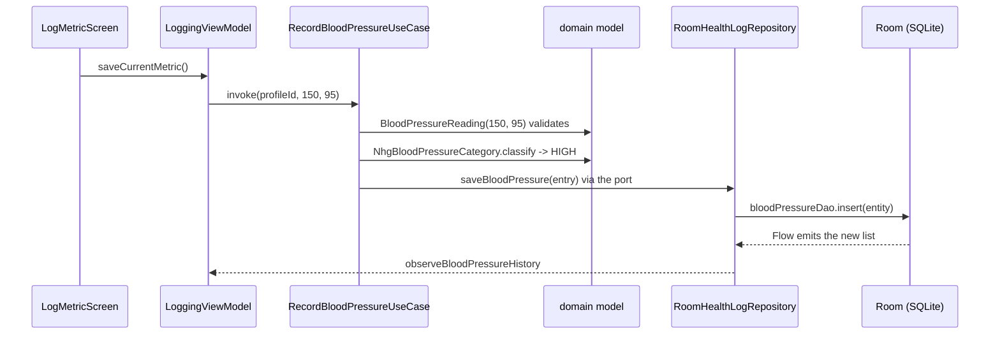

# Life of an entry

This page follows one blood pressure reading, 150 over 95, from the moment a user taps **Save** until it is stored, shown in the history and exported to CSV. Every other metric follows the same path, so if you understand this page you understand most of the app.

Read [Architecture](architecture.md) first if the words *port*, *use case* or *adapter* are new.



## 1. The screen collects input

File: `app/src/main/java/nl/healthjournal/app/ui/logging/LogMetricScreen.kt`

The screen is a Compose function. It renders a `LoggingUiState` and calls ViewModel functions as the user types: `onSystolicChanged`, `onDiastolicChanged`, and finally `saveCurrentMetric`. It holds no logic of its own.

While the user types, the ViewModel shows a live preview. `updateBpPreview` in `LoggingViewModel.kt` builds a `BloodPressureReading`, asks the domain to classify it, and stores the result in `previewBpCategory`. The screen turns that category into text with `label()` and a colour with `getBpColor()`, both in `ui/nhg/`.

## 2. The ViewModel calls a use case

File: `app/src/main/java/nl/healthjournal/app/ui/logging/LoggingViewModel.kt`

`saveCurrentMetric` launches a coroutine in `viewModelScope`, reads the typed numbers and calls the use case:

```kotlin
recordBloodPressureUseCase(profile.id, sys, dia)
```

If the text is not a number, it throws a `UiTextException` carrying a `UiText.Res(R.string.log_err_systolic)`. The ViewModel never builds a user-facing string itself; the screen resolves the resource id in the current language ([ADR 0015](../adr/0015-localized-viewmodel-messages.md)).

Where does `recordBloodPressureUseCase` come from? It is passed into the ViewModel's constructor. The object itself is created once in `HealthJournalApp.onCreate`:

```kotlin
recordBloodPressureUseCase = RecordBloodPressureUseCase(healthLogRepository)
```

That line is the whole "dependency injection": a plain constructor call in the composition root.

## 3. The use case applies the rules

File: `domain/src/main/kotlin/nl/healthjournal/domain/usecase/RecordBloodPressureUseCase.kt`

The use case does three things, in this order:

1. Creates a `BloodPressureReading(systolic, diastolic, pulse)`. Its `init` block rejects impossible values (systolic must be 40 to 300, diastolic 20 to 200, systolic above diastolic, an optional pulse 30 to 250) by throwing `IllegalArgumentException`. An invalid reading can never exist.
2. Calls `NhgBloodPressureCategory.classify(reading)`. For 150/95 the answer is `HIGH` (from 140/90).
3. Builds a `BloodPressureEntry` (id, profile, timestamp, reading, category) and hands it to `healthLogRepository.saveBloodPressure(entry)`.

`healthLogRepository` has the type `HealthLogRepositoryPort`, an interface in `domain/src/main/kotlin/nl/healthjournal/domain/port/secondary/HealthLogRepositoryPort.kt`. The use case does not know that Room exists. That is the whole point of the architecture.

The category is **computed once and stored** with the entry, and recomputed when the entry is updated (`UpdateBloodPressureUseCase`).

## 4. The adapter stores it

Files:
- `data/src/main/java/nl/healthjournal/data/repository/RoomHealthLogRepository.kt`
- `data/src/main/java/nl/healthjournal/data/local/mapper/HealthLogMapper.kt`
- `data/src/main/java/nl/healthjournal/data/local/entity/BloodPressureEntity.kt`
- `data/src/main/java/nl/healthjournal/data/local/dao/BloodPressureDao.kt`

`RoomHealthLogRepository` implements the port. For a save it converts the domain entry to a Room entity and inserts it:

```kotlin
override suspend fun saveBloodPressure(entry: BloodPressureEntry) {
    bloodPressureDao.insert(HealthLogMapper.toEntity(entry))
}
```

The entity (`blood_pressures` table) stores plain types: the id as a `String`, the timestamp as a `Long`, the category as its name. Going back, `HealthLogMapper.toDomain` rebuilds the `BloodPressureReading` (validating again) and reads the category with `NhgBloodPressureCategory.fromStoredName`, which also understands the names written by older app versions. This is why a rename of a stored value needs a read mapping, as described in [Change the database](how-to/change-the-database.md).

## 5. The history updates by itself

File: `app/src/main/java/nl/healthjournal/app/ui/history/HistoryViewModel.kt`

The DAO exposes `observeByProfileId`, a Room query that returns a Kotlin `Flow`. The repository maps it to domain entries (`observeBloodPressureHistory`). Whenever a row is inserted, updated or deleted, the flow emits a new list, the ViewModel updates its state, and the History screen recomposes. No one tells the screen to refresh.

The same state feeds the trend charts in `ui/history/charts/`. For blood pressure, `BloodPressureTrendSection.kt` groups entries by band and shows averages (rounded to whole mmHg).

## 6. Editing and deleting

The History screen can edit or delete an entry. That goes through `EntryUseCases` (created in `HealthJournalApp`): `UpdateBloodPressureUseCase` and `DeleteBloodPressureUseCase`. The port returns `false` when the id is unknown, so a stale screen cannot silently change nothing ([ADR 0012](../adr/0012-edit-and-delete-entries.md)).

## 7. Export and import

File: `data/src/main/java/nl/healthjournal/data/csv/CsvDataExportAdapter.kt`

Export reads the history through the same port and writes one CSV line per entry:

```text
timestamp,systolic_mmhg,diastolic_mmhg,pulse_bpm,classification
2026-09-09T08:30:00Z,150,95,70,HIGH
```

Import (`CsvDataImportAdapter.kt`) does not trust the `classification` column: it recomputes the category from the values, so a file with an old or wrong name still imports with the right band. A file from before the pulse existed (no `pulse_bpm` column) imports too.

## What to remember

| Layer | Knows about | Does not know about |
|-------|-------------|---------------------|
| Screen | UI state, resources | Room, rules |
| ViewModel | UI state, use cases | Android `Context`, SQL |
| Use case | Model, rules, ports | Compose, Room |
| Repository | Room, mapper | Compose, UI |

Next: try a change. [Add a metric](how-to/add-a-metric.md) uses exactly the files named on this page.
