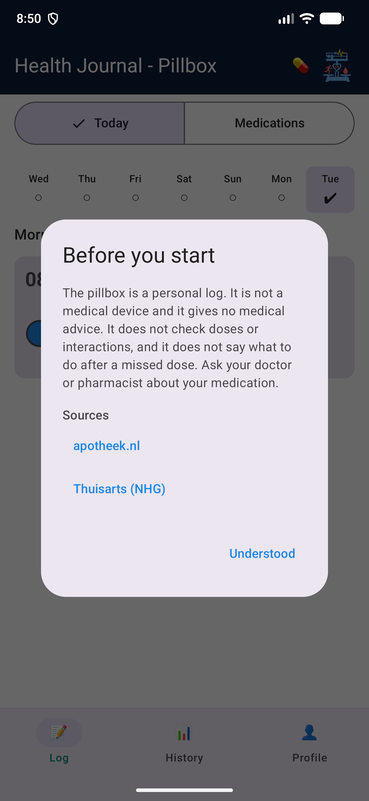
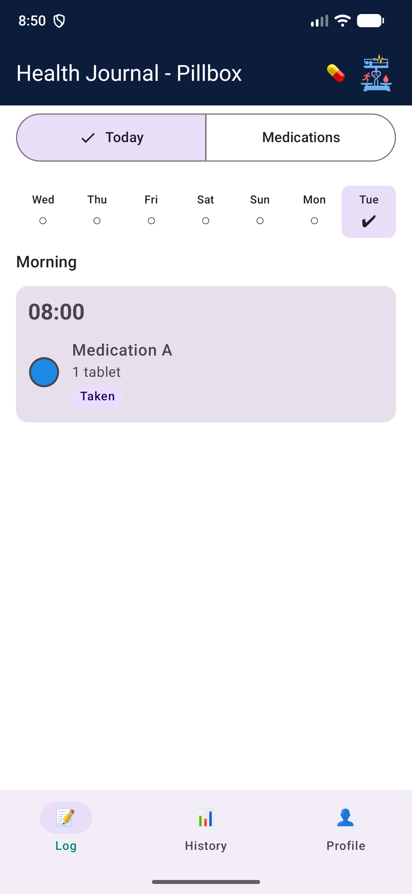
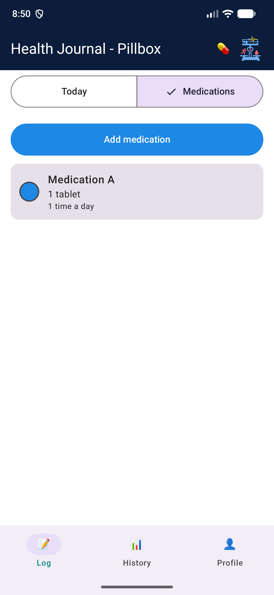
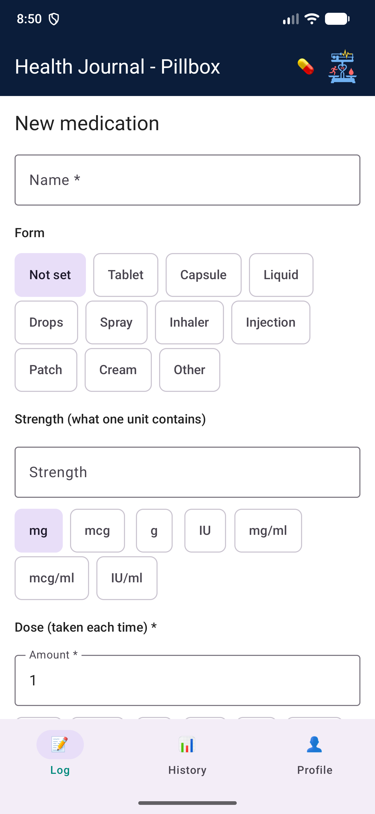
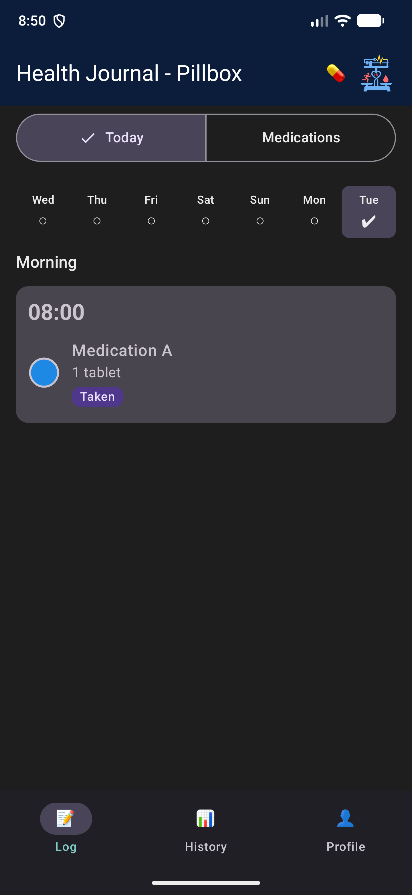
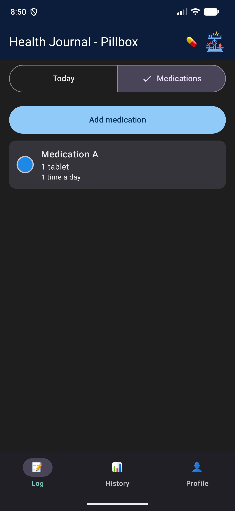
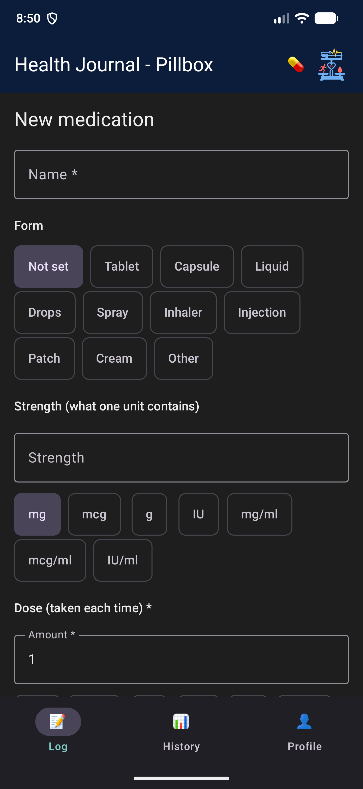

# Pillbox

The pillbox is a personal log of medication and intakes. It is not a medical device: it gives no advice, checks no doses or interactions, and a missed intake only shows the status "Missed". The screens below are the English UI, shown in both themes.

## Where it lives

| Layer | Path |
|-------|------|
| Domain (model, pillbox derivation, use cases) | `domain/src/main/kotlin/nl/healthjournal/domain` |
| Data (Room tables, CSV, migration 5 to 6) | `data/src/main/java/nl/healthjournal/data` |
| UI (screens, view model, labels) | `app/src/main/java/nl/healthjournal/app/ui/medication` |
| Notice preference | `app/src/main/java/nl/healthjournal/app/settings/MedicationNoticePreference.kt` |

The tables are in the [database page](database.md). The requirements are in `openspec/changes/add-medication-management`.

## Screens

The pill button in the top bar opens the pillbox. The first time, a notice explains what the pillbox is not, with links to apotheek.nl and Thuisarts. It can be opened again from the Profile tab.

| Notice | Today | Medications | New medication |
|--------|-------|-------------|----------------|
|  |  |  |  |
| |  |  |  |

## Rules to keep

- View models hold `UiText`, never translated text.
- Statuses are shown with text and an icon, never colour alone.
- Touch targets are at least 48 dp. The layout was checked at font scale 1.3 and in Dutch.
- Use "Medication A" style placeholders in docs, tests and screenshots, never real medicine names.
