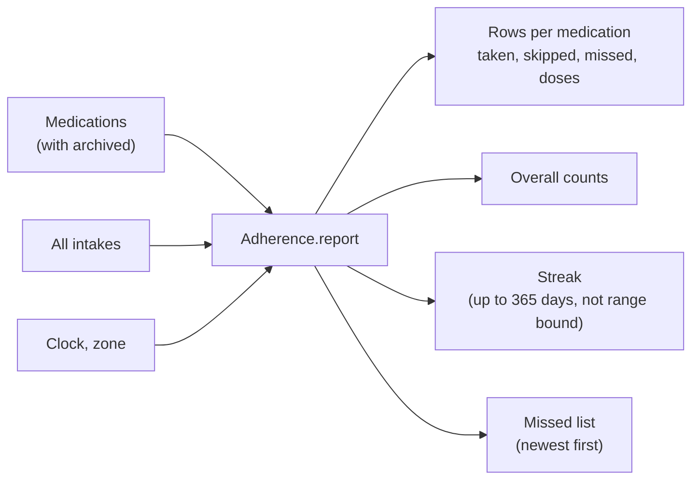

# Pillbox

The pillbox is a personal log of medication and intakes. It is not a medical device: it gives no advice, checks no doses or interactions, and a missed intake only shows the status "Missed". The three views are Today, Medications and Adherence. The screens below are the English UI, shown in both themes.

## Where it lives

| Layer | Path |
|-------|------|
| Domain (model, pillbox derivation, use cases) | `domain/src/main/kotlin/nl/healthjournal/domain` |
| Data (Room tables, CSV, migration 5 to 6) | `data/src/main/java/nl/healthjournal/data` |
| UI (screens, view model, labels) | `app/src/main/java/nl/healthjournal/app/ui/medication` |
| Reminders (alarm, notification, receivers) | `app/src/main/java/nl/healthjournal/app/reminder` |
| Notice preference | `app/src/main/java/nl/healthjournal/app/settings/MedicationNoticePreference.kt` |

The tables are in the [database page](database.md). The requirements are in `openspec/specs/medication/spec.md`.

## Screens

The pill button in the top bar opens the pillbox. The first time, a notice explains what the pillbox is not, with links to apotheek.nl and Thuisarts. It can be opened again from the Profile tab.

| Notice | Today | Medications | New medication |
|--------|-------|-------------|----------------|
|  |  |  |  |
| |  |  |  |

## Reminders

One notification per time slot, posted at the planned time. Taken all records the open items of the slot, Snooze posts it again after the length chosen in Profile. Neither button opens the app. The Profile tab holds the snooze length and the lock-screen setting. See [ADR 0022](../adr/0022-medication-reminders.md).

| Notification | Profile settings |
|--------------|------------------|
|  |  |

## Rules to keep

- View models hold `UiText`, never translated text.
- Statuses are shown with text and an icon, never colour alone.
- Touch targets are at least 48 dp. The layout was checked at font scale 1.3 and in Dutch.
- Use "Medication A" style placeholders in docs, tests and screenshots, never real medicine names.

## Adherence

The third view of the pillbox screen, next to Today and Medications. It shows taken against planned intakes for the last 7, 30 or 90 days, overall and per medication. It is a count, not a grade: one neutral colour, no targets, no advice.

`Adherence.report` (domain) walks the days of the range and takes the planned times from `Medication.plannedFor`, the same source as the pillbox and the reminders, so a schedule edit from today leaves earlier days unchanged. `GetAdherenceUseCase` loads the medications (archived ones too) and all intakes and calls it. The view model keeps the chosen range (default 30 days) and refreshes on every change.

### Rules

| Rule | Behaviour |
|---|---|
| Due | taken + skipped + missed. A pending intake inside the 2 hour grace period is not counted yet |
| Percentage | taken / due, rounded half up (26 of 28 is 93). Absent when nothing was due |
| Skipped | counts as due and not taken, and is shown apart from missed |
| As needed | only a dose count for the range, never a percentage |
| Outcome without a plan | ignored (the schedule no longer produces that time) |
| Start, end and archive dates | days before the start or from the end or archive date are not due |
| Streak | days in a row back from today where something was planned and all of it was taken. A skipped or missed intake ends it. Days with nothing planned, or still pending, neither extend nor break it |
| Range | changes the figures and the missed list, never the streak |

Large font scales stack the range choices and the three-way pillbox switch vertically (`ChoiceRow`) instead of breaking words. Each card has merged TalkBack semantics. Strings are in `strings.xml` and `values-nl/strings.xml` under "Medication: adherence overview".

Tests: `AdherenceTest` (calculation), `MedicationViewModelTest` (range, no profile) in the unit test suites.
