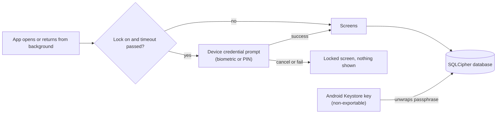

# Design: Database Encryption and App Lock

## Context
Two separate protections, because they stop different threats. The lock stops a person who holds the unlocked phone. Encryption stops anyone who obtains the database file without the phone's keys (a copied or extracted file, a rooted or forensic read). Layers follow ADR 0002: the lock state and port are `:domain`, key handling and the migration are `:data`, the prompt and overlay are `:app`.

## App lock (opt-in, off by default)
- A Profile setting "Lock the app". When on, the app asks the user to authenticate when it opens and after it has been in the background for a chosen time (immediately, 1 minute, 5 minutes).
- Authentication is the **device's own credential**: fingerprint or face (strong biometrics) with the device PIN, pattern or password as fallback, through the system `BiometricPrompt` with `DEVICE_CREDENTIAL` allowed. The app stores **no PIN or secret of its own**, so there is nothing to leak, nothing to reset and no recovery flow.
- On Android 8 and 9 (minSdk 26) the prompt falls back to the confirm-device-credential screen. If the device has no screen lock, the setting is disabled with an explanation, and it is never silently accepted.
- While locked, no health data is composed on screen. The lock overlay is the only content.
- With reminders (separate change): tapping a reminder asks for authentication before opening Today. The Taken all action is allowed without unlocking, because it only writes an outcome and shows nothing. The setting text states this.
- The lock is a convenience barrier for privacy and is not a security claim beyond what the Android authenticator provides.

## Secure screen
An opt-in setting sets `FLAG_SECURE`, which hides content in the recent-apps list and blocks screenshots. Default off, since it also blocks the user's own screenshots.

## Database encryption at rest
- The Room database is encrypted with SQLCipher (AES-256) through a `SupportOpenHelperFactory`. It is the widely used, audited answer for an encrypted SQLite database on Android.
- The passphrase is a random 256-bit value generated on the device. It is stored only **wrapped** (AES-GCM) by a non-exportable **Android Keystore** key, hardware-backed (TEE or StrongBox) when the device has it. The wrapped value lives in no-backup storage. The key does not require user authentication, so changing a fingerprint or the screen lock never makes the data unreadable.
- **One-time migration** of existing users: create the encrypted database from the plain one (`sqlcipher_export`), verify the row counts per table match, keep the plain file until verification passes, then remove the plain file and its journal files. The app never deletes the plain copy before verification, and on any failure it keeps the plain database, shows a localized message and retries on the next start.
- Because the key lives in the Keystore, the database cannot be moved to another phone or restored from a backup. CSV export is the way to move data, and the privacy notice says so.
- Honest limits (stated in ADR 0023): encryption does not protect data while the app is unlocked and running, or against malware with the user's access, and the Keystore key is lost on factory reset or app data clearing, which also removes the data.

## Backup interplay (needs owner confirmation)
`allowBackup` stays `true`. If the encrypted file were backed up and restored on a device without the Keystore key, the app would find a database it cannot open. Proposed: data extraction rules exclude the database files and the wrapped key from cloud backup and device transfer, while preferences stay as they are today. Rejected alternative: leaving the database in backup, because it makes a restore end in silent data loss.

## Dependencies (exception to ADR 0003)
Two are needed and both are recorded in ADR 0023: `net.zetetic:sqlcipher-android` and `androidx.biometric` (handles API 26 to 29 differences). Both are checked for licence, size (the native library adds a few MB per ABI), 16 KB page size support and absence of network code. If either fails review the fallback is documented in the ADR (the `BiometricPrompt` framework API on API 28+ and `createConfirmDeviceCredentialIntent` below, and for encryption a field-level AES-GCM envelope on selected tables only).

## Alternatives considered
- **App-specific PIN instead of the device credential:** rejected, it needs a stored hash, lockout rules and a recovery flow, and is weaker than the system authenticator.
- **Field-level AES-GCM only for some tables:** kept as the documented fallback, because it leaves other data unencrypted.
- **Relying on Android file-based encryption alone:** rejected, it does not protect a copied or extracted database file.
- **Encrypting in the same step as a schema change:** rejected, the file migration is kept independent of the schema version so each can be tested and rolled back alone.

## Risks
- Encrypting the existing database is a one-way change for current users. Mitigation: verify row counts before removing the plain file, keep the plain file on any failure, test on seeded and interrupted migrations, and ship this change on its own.
- The Keystore key is lost on factory reset or clearing app data, so the data is lost with it. Mitigation: no authentication binding on the key, CSV export, and a clear notice.
- SQLCipher adds a few MB per ABI and a native library. Mitigation: size and 16 KB page size check in ADR 0023, with the fallback.
- A user without a screen lock cannot enable the lock. Mitigation: a clear explanation, never a silent accept.
