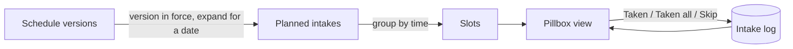
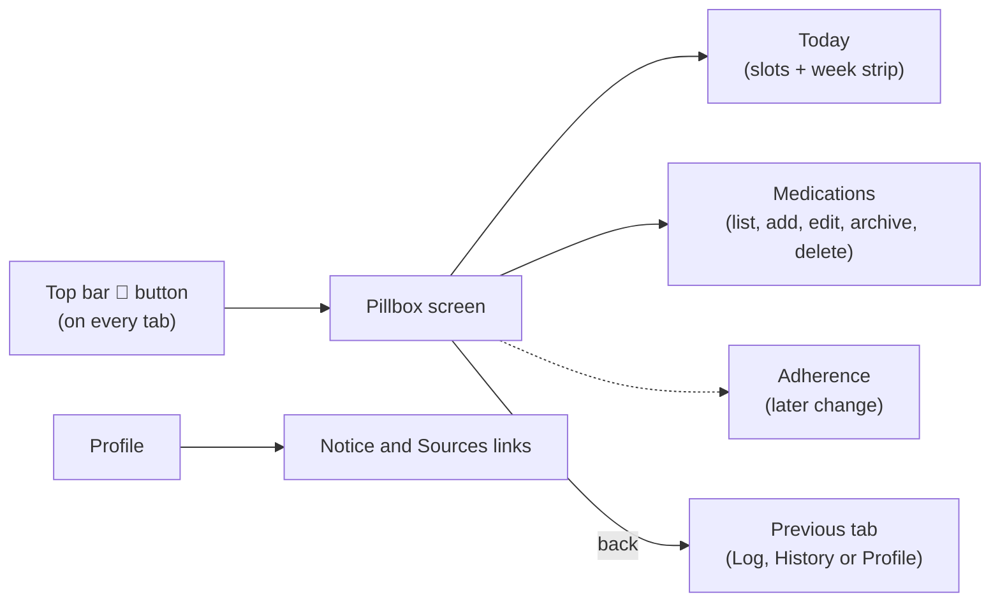

# Design: Medication Management (pillbox, phase 1)

This is the first of four changes that together deliver medication support. It is useful on its own and ships no alarms, no adherence figures and no encryption.

| Change | Delivers | Depends on |
|---|---|---|
| `add-medication-management` (this one) | Medications, schedule versions, intake log, pillbox screen, CSV, compliance and localization rules | none |
| `add-medication-reminders` | Grouped notifications with Taken and Snooze, permission flow, lock-screen details | this change |
| `add-medication-adherence` | Adherence figures, streak, missed list, adherence screen | this change |
| `add-database-encryption-and-lock` | Encrypted database, app lock, secure screen, backup rules | none (touches all data) |

## Context
The app follows hexagonal layering: `domain` (pure Kotlin), `data` (Room, CSV), `app` (Compose). Storage is metric and locale-independent, ViewModels never hold translated text (ADR 0015), and the database is Room version 5 (migrations `MIGRATION_1_2` to `MIGRATION_4_5` exist, the last one added the nullable `comment` columns for ADR 0019). Medication adds a new aggregate with time-based behaviour (schedules), which the existing metrics do not have.

## Fit with the existing architecture
The change follows the structure already in the repository instead of introducing new patterns.

| Layer | Existing convention | What medication adds |
|---|---|---|
| `domain/model` | One package per area (`metrics`, `nhg`, `profile`, `common`), value objects with `require` validation, `ProfileId` and id value classes, `EntryComment` | New package `model/medication`, ids as value classes next to `MeasurementId`, validation in value objects, `EntryComment` reused for comments |
| `domain/port/secondary` | One port per aggregate (`HealthLogRepositoryPort`, `ProfileRepositoryPort`, `DataExportPort`) | `MedicationRepositoryPort` (separate, so the metrics port is not bloated) |
| `domain/usecase` | One class per action (`Record*`, `Update*`, `Delete*`) | `SaveMedication`, `ChangeSchedule`, `ArchiveMedication`, `DeleteMedication`, `RecordIntake`, `GetPillbox` in the same style |
| `data/local` | `entity`, `dao`, `mapper`, one `HealthJournalDatabase`, manual `Migration` objects, `exportSchema = false` | `MedicationEntity`, `MedicationScheduleEntity`, `MedicationTimeEntity`, `IntakeEntity`, their DAOs and mapper, and `MIGRATION_5_6` written by hand like the existing ones |
| `data/repository` | `RoomHealthLogRepository`, `RoomProfileRepository` | `RoomMedicationRepository` |
| `data/csv` | `CsvDataExportAdapter` and `CsvDataImportAdapter`, `CsvQuoting`, metric and locale-independent | Medication, schedule and intake rows added to the same adapters, with the same physical line numbers in import errors |
| `app` | Manual wiring in `HealthJournalApp`, `ViewModel.Factory`, three `NavigationBarItem`s and a top bar in `MainActivity`, `UiText` messages, English and Dutch strings | A pill button in the top bar, a pillbox screen with its own `MedicationViewModel` and factory, `UiText` for every message |

Other points of fit:
- **Dependencies (ADR 0003):** no new library. The pill icon uses Compose `Canvas` and time handling uses `java.time`.
- **Profiles:** medications belong to a `ProfileId`, like every entry, and follow the active profile (ADR 0016).
- **Timestamps:** existing entries use `Instant`. Intake outcomes use `Instant` for the actual time. Only the planned time is a `LocalDateTime`, on purpose, because "08:00" means local wall-clock time.
- **Backup:** `allowBackup` stays as it is today (`true`). Whether and how backup is restricted is decided in `add-database-encryption-and-lock`, because it only matters once the database is encrypted.
- **Theming and Dutch UI:** colours come from the Material theme (light and dark). The pill swatches are fixed colours with a contrasting outline. Layouts follow ADR 0010 (long Dutch strings) and the units rules (the dose unit is a medication unit, not part of metric/imperial display).
- **Tests:** domain tests as in `domain/src/test`, CSV tests next to `CsvAdaptersTest`, ViewModel tests as in `ViewModelsTest`, and the DAO/repository tests that are still missing for edit and delete (`feature-edit-delete-entries` task 2.3) get a shared in-memory test setup so both changes use it.
- **ADR numbers:** 0017, 0018 and 0019 are taken. This change uses 0020 (model and pillbox) and 0021 (compliance and privacy). The reminders change uses 0022 and the encryption and lock change uses 0023.

## Concepts (the pillbox model)
| Concept | Meaning | Example |
|---|---|---|
| Medication | What you take | "Medication A, 500 mg tablet" |
| Dosage | Strength and amount per intake | strength 500 mg, dose 1 tablet |
| Schedule version | When it is due, from a date onward | 08:00 and 20:00, every day, from 2026-10-01 |
| Planned intake | One occurrence derived from the schedule version in force | 2026-10-04 08:00 |
| Slot | All planned intakes at the same local time | 07:30: three medications |
| Intake | The recorded outcome for a planned intake, or an as-needed dose | Taken at 08:12 |
| Pillbox | The day and week view of slots and outcomes | Morning row: 07:30 slot, 3 pills, 2 taken |

A **planned intake is computed, not stored**: it is derived from the schedule version in force on a date. Only outcomes (`Intake`) are stored. This keeps the table small.



## Schedule edits and history (a deliberate exception)
The general rule of this app is that history is never rewritten: an entry keeps what was recorded. A schedule is different in one respect, and this design states it openly instead of hiding it.

- **What stays fixed:** recorded outcomes (`Intake`) are never changed by a schedule edit.
- **What is derived:** "planned" and later "due" are computed from the schedule, so they depend on which schedule applies to a date.
- **The logical fix:** a schedule is stored as **versions with an effective-from date**. Editing creates a new version applying from a chosen date (default today). Dates before that keep the version that was in force, so past planned intakes, and later adherence for them, do not move. Only the future follows the new schedule.
- **The exception:** the user MAY choose an earlier effective-from date to correct a mistake in the schedule. That is the one place where derived planned intakes of the past change, and it is allowed on purpose because the user is correcting the record of what was planned, not what was taken. The same applies to correcting the outcome of a past intake and to deleting a medication, which removes its log after confirmation. These are the documented exceptions to "history is never rewritten" for medication.
- **Orphans:** an outcome whose planned time is no longer produced by the version in force (for example after moving a time) is kept and shown in the day view as a logged intake, and is not counted as planned. It is never deleted by an edit.
- **No gaps or overlaps:** versions of one medication are ordered by effective-from date, the latest one with `effectiveFrom <= date` applies, and a new version on an existing date replaces that version.

## Domain model
```kotlin
data class Medication(
    val id: MedicationId, val profileId: ProfileId, val name: MedicationName,
    val form: MedicationForm?, val dosage: Dosage, val appearance: PillAppearance?,
    val schedules: List<ScheduleVersion>,   // at least one, ordered by effectiveFrom
    val comment: EntryComment?, val archivedFrom: LocalDate?
)
data class Dosage(val strength: Strength?, val amountPerIntake: BigDecimal, val doseUnit: DoseUnit)
data class Strength(val amount: BigDecimal, val unit: StrengthUnit)
enum class StrengthUnit { MG, MCG, G, IU, MG_PER_ML, MCG_PER_ML, IU_PER_ML }
enum class DoseUnit { MG, MCG, G, ML, IU, UNITS, DROPS, PUFFS, TABLETS, CAPSULES, PATCHES, APPLICATIONS, OTHER }
enum class MedicationForm { TABLET, CAPSULE, LIQUID, DROPS, SPRAY, INHALER, INJECTION, PATCH, CREAM, OTHER }
data class PillAppearance(val color: PillColor, val shape: PillShape)
data class ScheduleVersion(val effectiveFrom: LocalDate, val schedule: Schedule)
sealed interface Schedule {
    data object AsNeeded : Schedule
    data class Recurring(
        val times: List<LocalTime>, val days: DayPattern,
        val start: LocalDate, val end: LocalDate?
    ) : Schedule
}
enum class IntakeStatus { TAKEN, SKIPPED }   // Pending and Missed are derived, not stored
data class Intake(
    val id: IntakeId,                          // own identity, so as-needed doses need no planned time
    val medicationId: MedicationId,
    val planned: LocalDateTime?,               // null for an as-needed dose
    val status: IntakeStatus, val takenAt: Instant?,   // takenAt required when planned is null
    val actualAmount: BigDecimal? = null,      // set when it differs from the planned dose
    val comment: EntryComment? = null          // for example an injection site
)
data class Slot(val time: LocalDateTime, val items: List<PlannedItem>)   // derived, never stored
```
- `Schedule.plannedFor(date)` is a pure function and the single source for the pillbox, reminders and adherence. A medication's `plannedFor(date)` first picks the schedule version in force.
- **Intake identity:** every intake has its own id. A planned intake is unique by (medication id, planned time) through a unique index, so two as-needed doses on one day never collide (their planned time is null, and SQLite treats nulls as distinct in a unique index). Import deduplicates planned doses by (medication, planned time) and as-needed doses by (medication, `takenAt`).
- `Slot` grouping is a pure function over planned intakes: same local date-time means same slot. It is the unit that reminders (next change) will notify and that "Taken all" acts on.
- Validation lives in value objects (name 1 to 80 characters, amount greater than 0 and at most 1000, at most 8 times a day), consistent with `WeightKg` and the other metric value objects. Comments reuse `EntryComment` (ADR 0019): single line, at most 200 characters.
- **Time zones:** planned times are local wall-clock times (`LocalDateTime`), so a 08:00 pill stays at 08:00 when travelling. The actual time taken is an `Instant`. On a daylight-saving change the planned time is resolved in the current zone.
- **Missed:** an intake with no outcome after the grace period (2 hours, fixed) is shown as missed. This is computed from the log when the pillbox is built, not by a background job, so it also works after the phone was switched off.
- **Archive:** archiving sets `archivedFrom` to today. Planned intakes from that date are not generated, and earlier dates stay as they were.

## Grouped intakes
People often take several medications together at one moment, for example three at 07:30 or four at 19:30. The pillbox therefore shows **slots**, not a flat list.
- A slot is every planned intake at the same local time for the active profile. The slot card shows the time, one row per medication (icon, name, dose, status) and a **Taken all** action. Each row can still be marked Taken or Skipped on its own, so one skipped tablet does not force the others.
- Two medications scheduled at 07:30 and 07:45 are two slots. The app does not merge nearby times or invent "moments" automatically.
- Slots are a view over the data, so nothing extra is stored and editing a time simply regroups.
- The reminders change uses the same slots, so one moment gives one notification.

## Appearance instead of a pill database
Identification is done by the user, not by lookup: colour (about ten swatches) and shape (round, oval, capsule, oblong, square, other) are chosen when the medication is added and drawn as a vector icon (`Canvas`). Colour is never the only cue: the name and dose are always shown next to the icon, and the shapes are distinct for colour-blind users. A built-in database was rejected because it would need maintenance, would carry the risk of being wrong, and conflicts with the offline, no-claims stance.

## Liquids, sprays and injectables
The model is not tablet-specific. A medication has a **form** and a **dose unit**, and the two are independent so any combination is possible.

| Form | Typical dose units | Example |
|---|---|---|
| Tablet, capsule | tablets, capsules (strength in mg) | 1 tablet of 500 mg |
| Liquid | ml (strength in mg per ml) | 5 ml |
| Drops | drops, ml | 3 drops |
| Spray, inhaler | puffs, sprays, mcg | 2 puffs |
| Injection, pen | units (IU), mg, mcg, ml | 20 units, or 0.5 mg weekly |
| Patch | patches | 1 patch every 3 days |
| Cream, other | free unit, applications | 1 application |

- `DoseUnit` is extended: `MG, MCG, G, ML, IU, UNITS, DROPS, PUFFS, TABLETS, CAPSULES, PATCHES, APPLICATIONS, OTHER`. The unit is stored as entered and **never converted** (no mg to ml, no unit to mg), because conversions would be clinical logic.
- **Weekly and other long intervals** use the existing schedule patterns (selected weekdays, every N days), so a weekly injection is "every 7 days" or "Sundays" and a patch is "every 3 days".
- **Doses that vary:** an intake can store an **actual amount** that differs from the planned amount (for example 18 units instead of 20). The planned amount is a default shown in the form, and the user types what was actually taken. The app records it and does not comment on it.
- **Several injections a day** are normal (for example an injection with each meal). They are supported as several scheduled times, or as an as-needed medication logged each time.
- **Injection site** may be added as a free-text note on an intake, which the user fills in. The app does not suggest or rotate sites.
- **Icons follow the form** (pill, bottle, pen, spray or inhaler, patch) in addition to colour and shape.
- **No calculation of doses.** The app does not calculate, suggest, round or adjust any dose, does not estimate a dose from glucose or food, and does not connect the glucose log to medication. Injectable medicines are treated exactly like any other medication: a name, a user-defined dose and a schedule. This is what keeps these medications on the right side of the medical device line (see `compliance`).

## Units and terms follow the Dutch standard
One naming scheme is used everywhere: `StrengthUnit` for what a unit of the medicine contains (strength) and `DoseUnit` for how much is taken per intake (dose). They are independent, so "500 mg tablet, dose 1 tablet" and "100 IU per ml pen, dose 20 units" both fit. Stored values are the enum names and are never converted. Only the displayed label depends on the language.

Dutch labels follow the wording of the Dutch pharmacy and patient sources (apotheek.nl and the KNMP, Thuisarts), which is what a Dutch user sees on a leaflet or at the pharmacy:

| Enum | English (1 / many) | Dutch (1 / many) | Note |
|---|---|---|---|
| `MG`, `G`, `ML` | mg, g, ml | mg, g, ml | Same symbols in both languages |
| `MCG` | mcg | microgram | Written in full in Dutch (confirmed on apotheek.nl, 2026-10-06) |
| `IU` | IU | IE | Internationale eenheid; "IE" confirmed on apotheek.nl, 2026-10-06 |
| `UNITS` | unit / units | eenheid / eenheden | Pen-type injectables. NOT yet verified (task 4.3) |
| `DROPS` | drop / drops | druppel / druppels | |
| `PUFFS` | puff / puffs | pufje / pufjes | Inhaler and spray. NOT yet verified: apotheek.nl uses "dosis" and "inhalatie-apparaat" (task 4.3) |
| `TABLETS` | tablet / tablets | tablet / tabletten | |
| `CAPSULES` | capsule / capsules | capsule / capsules | |
| `PATCHES` | patch / patches | pleister / pleisters | |
| `APPLICATIONS` | application / applications | keer aanbrengen / keer aanbrengen | Cream, ointment. "Aanbrengen" is the verb apotheek.nl uses for applying; "smeren" only appears for spreading on a dressing (checked 2026-10-06) |
| `OTHER` | free text label | vrije tekst | |
| `MG_PER_ML`, `MCG_PER_ML`, `IU_PER_ML` | mg/ml, mcg/ml, IU/ml | mg/ml, microgram/ml, IE/ml | Strength only |

| `MedicationForm` | English | Dutch |
|---|---|---|
| `TABLET` | Tablet | Tablet |
| `CAPSULE` | Capsule | Capsule |
| `LIQUID` | Liquid | Vloeistof |
| `DROPS` | Drops | Druppels |
| `SPRAY` | Spray | Spray |
| `INHALER` | Inhaler | Inhalator |
| `INJECTION` | Injection | Injectie |
| `PATCH` | Patch | Pleister |
| `CREAM` | Cream | Creme |
| `OTHER` | Other | Overig |

| Other term | English | Dutch |
|---|---|---|
| Statuses | Taken, Skipped, Missed, Pending | Ingenomen, Overgeslagen, Gemist, Gepland |
| Time of day | Morning, Afternoon, Evening, Night | Ochtend, Middag, Avond, Nacht |
| Frequency | once a day, twice a day, every 3 days, once a week | 1 keer per dag, 2 keer per dag, elke 3 dagen, 1 keer per week |
| Slot action | Taken all | Alles ingenomen |
| Top bar button (description) | Pillbox | Pillendoos |

Notes:
- The terms above are a first proposal from memory. They are **checked against apotheek.nl and Thuisarts in a browser before release** (task 1.6e), the same way the NHG limits were verified, and corrected here when the sources differ. Nothing is shipped as "Dutch standard" until that check is recorded in ADR 0020.
- The unit label is a display choice only: the stored value is the enum, so IU and IE are always the same unit, and "units" is a label that is never converted to or from IU or ml.
- Numbers use the region (Dutch decimal comma, US decimal point) and times use the region's short time style. Weekday names come from `java.time` with the active locale.

## Localization (English and Dutch)
All medication text exists in English and Dutch, follows the in-app language and region (ADR 0013) and is produced as `UiText` (ADR 0015), so a language change re-translates what is on screen. User input (names, comments) is never translated, and stored values stay unconverted and locale-independent. Counted units use Android `<plurals>`, since English and Dutch both distinguish one from many. A missing translation is a failing test (matching key sets in `values` and `values-nl`), not a runtime fallback. Dutch strings can be 30 to 50 percent longer, so layouts follow ADR 0010 (wrap, no fixed widths on chips and buttons) and are checked at large font sizes.

## Persistence
Room version 6 (the database is at version 5 today, after `add-entry-comments`) with four tables: `medication`, `medication_schedule` (one row per schedule version), `medication_time` (one row per time per schedule version) and `intake`. `MIGRATION_5_6` only creates tables (hand-written like `MIGRATION_2_3`, which added the waist table). Read-mapping instead of a migration was considered and rejected because new tables cannot be derived from old rows. Deleting a medication cascades to its schedule versions, times and, after confirmation, its intake log. **Archive** is the default way to stop a medication, because it keeps history intact. `intake` has a unique index on (medication id, planned time) and an index on (medication id, taken-at) for as-needed doses.

## UI structure
The bottom bar keeps its three tabs (Log, History, Profile). Medication does not get a fourth tab: the app is already tight at large font sizes (the Activity tab label is clipped at 1.3x), and medication is a daily-use tool with its own screens, so it opens on top of the tabs.

- **Entry point:** a pill button (💊) in the top bar, left of the logo, visible on every tab. It opens the **pillbox screen** full screen with a back arrow. Back returns to the tab the user came from.
- **Inside the pillbox screen:** a segmented switch for its views. Phase 1 has **Today** and **Medications**. The adherence change adds **Adherence** as a third view. More views can be added later without touching the bottom bar.
- **Disclaimer and notice:** shown the first time the pillbox opens, and always reachable from Profile together with the Sources list.



| Place | Content |
|---|---|
| Pillbox > Today | Day view grouped morning (before 12:00), afternoon (12:00 to 18:00), evening (18:00 to 22:00) and night. Each slot card shows the time, a row per medication (icon, name, dose, status chip) and **Taken all**. Tapping a row offers Taken and Skip. Past intakes can be corrected. A button logs an as-needed dose. A week strip shows complete, partial, missed or empty days. |
| Pillbox > Medications | The list with a + button. Add and edit: name, form, strength, dose and unit, schedule (with "apply from" date when editing), appearance, comment. Archive and delete (with confirmation). |
| Log | Unchanged. Medication doses are not logged here. |
| History | Unchanged. |
| Profile | The not-a-medical-device notice and the Sources links. |

Layout checks: the top bar already holds a title and the logo, so the pill button must fit at 2.0x font in Dutch (task 1.6d).

## Alternatives considered
- **Fourth bottom tab:** rejected, it crowds the bar at large font sizes and Dutch labels, and it forces every medication view into one tab. A separate screen scales to more views.
- **Mutable single schedule (no versions):** rejected, an edit would silently change which past days count as planned, which breaks adherence for past days (see "Schedule edits and history").
- **Store planned intakes as rows** (one per due time): rejected, it needs a generator job, enlarges the table, and makes schedule edits rewrite stored rows.
- **User-defined "moments" (named groups such as "Breakfast") instead of grouping by time:** deferred, grouping by identical time covers the stated need (07:30, 19:30) with no extra concept to maintain.
- **Drug database lookup:** rejected, see above.
- **Photo identification:** rejected, it needs camera permission and image storage, with little gain over colour and shape.
- **A separate free-text note type for medication:** rejected, `EntryComment` already has the single-line, 200-character, CSV-safe rules.

## Risks
- Medication is health-adjacent. Mitigation: the disclaimer, no advice, no interaction checks, and the compliance spec.
- A schedule edit with an early effective-from date changes past planned intakes. Mitigation: the default is today, an earlier date is a deliberate choice, and recorded outcomes are never touched.
- Dutch unit wording is unverified until task 1.6e. Mitigation: it is a release gate in the tasks.
- Legal interpretation (MDR intended purpose, AVG for a distributed app) is not verified by a lawyer. Mitigation: keep claims minimal, and revisit before publishing beyond personal use (recorded as an open item in ADR 0021, not part of this change).

## Authorities, law and regulation
Dutch sources are the reference wherever a feature touches clinical content or the law, in line with ADR 0005 (NHG and Voedingscentrum for thresholds).

| Topic | Authority | Effect on this change |
|---|---|---|
| Clinical guidance and patient information | [NHG](https://www.nhg.org/) (guidelines, [Thuisarts](https://www.thuisarts.nl/)) | The app gives **no** clinical content. Where a screen needs guidance it links to Thuisarts or the NHG instead of paraphrasing it. |
| Medicine information (what to do about a missed dose, interactions, side effects) | [apotheek.nl](https://www.apotheek.nl/) (KNMP) and the patient leaflet (bijsluiter) | The app gives **no advice at all**, and says nothing about what to do after a missed dose: a missed intake only shows the status "Missed". apotheek.nl and Thuisarts appear only as a neutral "Sources" list on the information screen, with no summary and no recommendation. This keeps the app out of dose-advice territory. |
| Software as a medical device | EU MDR 2017/745, supervised in the Netherlands by the IGJ (Inspectie Gezondheidszorg en Jeugd) | Whether software is a medical device depends on the **intended purpose the manufacturer states**. This app is stated as a personal log and reminder tool. It must therefore not claim to diagnose, predict, advise on doses, check interactions or support treatment decisions. The "not medical advice" requirement, the missing drug database and the missing interaction check are deliberate for this reason. A change of intended purpose would need a fresh regulatory assessment (CE marking, notified body). |
| Personal data | AVG (GDPR) and UAVG, supervised by the Autoriteit Persoonsgegevens | Health data is a special category of personal data. The design avoids processing it outside the device (no network, no analytics; platform backup is under the user's control and is disclosed in the privacy notice), which keeps the developer from collecting any health data. Whether the household exemption or other AVG rules apply to a distributed app is a legal question that should be checked before wider distribution (see risks). |
| Medicines and pharmacy law | Geneesmiddelenwet, KNMP and pharmacist practice | The app offers no medicine sale, prescription handling or pharmacist contact, so no pharmacy law applies. Prescription or pharmacy integration (for example the medication overview from the pharmacy) is out of scope and would need its own change. |
| Health data exchange | Dutch healthcare standards for exchange (for example the medicatieoverzicht in the national infrastructure) | Out of scope. Export is CSV only, under the user's control. |

**Decision (owner):** the app is purely a reminder and logging tool for personal use and must never become a medical device. This is a hard constraint on every feature, written as the `compliance` capability (`specs/compliance/spec.md`), with a review gate: any function that diagnoses, advises, alerts on health values, transmits data or serves care providers is blocked until a regulatory assessment ADR exists. The existing range labels for BMI, blood pressure and glucose are the closest current feature to the line, so they were reworded as neutral, sourced ranges by the shipped change `reword-range-labels`.

Where this table and a feature disagree, the feature gives way: if a later change adds drug information, interaction checks or dose advice, it must first record a regulatory assessment in an ADR.

## Porting guide (iPhone or another platform)

The neutral specs (everything except `platform-*`) hold all business rules: they say what must happen, never which API does it. A port writes its own `platform-<name>` spec and reuses the rest unchanged. Where a neutral requirement needs a platform mechanism, this table shows where the mechanism lives for Android and what to choose on iOS.

| Neutral requirement | Android (`platform-android`) | iOS (suggested for a port) |
|---|---|---|
| Offline local storage, metric, migrations | Room (SQLite), hand-written migrations | SwiftData or Core Data, or SQLite with GRDB, explicit migrations |
| Encrypted database at rest | SQLCipher, key wrapped by Android Keystore | SQLCipher or data protection class `complete`, key in Keychain (`ThisDeviceOnly`) |
| Optional app lock, no own secret | `BiometricPrompt` with device credential | `LocalAuthentication` with `deviceOwnerAuthentication` |
| No network | no `INTERNET` permission, build check | no networking code or entitlement, App Transport Security left strict, build check |
| Encrypted database and its key excluded from backup | data extraction rules (`allowBackup` unchanged) | mark the files `isExcludedFromBackup`, no iCloud container |
| Time-based local reminders with Taken and Snooze | `AlarmManager`, `BroadcastReceiver`, boot receiver | `UNUserNotificationCenter` with notification actions, scheduled requests (64 pending limit: schedule the next ones only) |
| Hide details on a locked device | notification visibility private, public version | notification content previews, generic text in the notification |
| App switcher and screenshot protection | `FLAG_SECURE` | blur or cover view when the scene becomes inactive |
| Preferences (language, region, units) | `SharedPreferences` | `UserDefaults` |
| In-app language | `attachBaseContext` with locale | per-app language setting or a locale override in the bundle |
| Localized messages without stored text | `UiText` over string resources | message key plus arguments over `Localizable.strings` and `.stringsdict` for plurals |
| Charts, icons, theming | Vico, Compose `Canvas`, Material 3 | Swift Charts, SwiftUI `Canvas` or SF Symbols, system colours |
| Distribution | debug-signed APK on GitHub Releases | TestFlight or App Store, with its health-app review and privacy label rules |

Rules for keeping specs portable:
- Neutral specs name **behaviour and data**, not classes, permissions or APIs. Platform words (manifest, permission names, Room, Keystore, Compose) belong in `platform-<name>`.
- Domain rules are pure and portable: schedules, adherence, units, ranges, CSV contract. A port reimplements them against the same scenarios, which can be reused as test cases.
- Data contracts are shared: the CSV format (including enum names that are language-independent) and the rule that stored values are never converted.
- Store and legal rules (Google Play, App Store review, MDR, AVG) are per distribution channel and are recorded in the compliance ADR, with a section per store.
