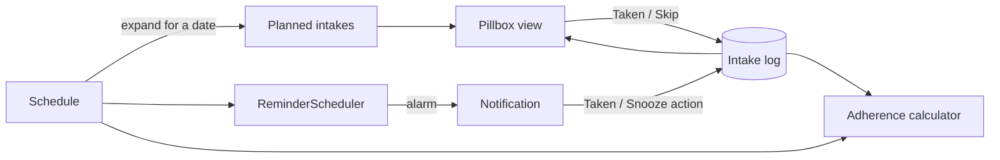
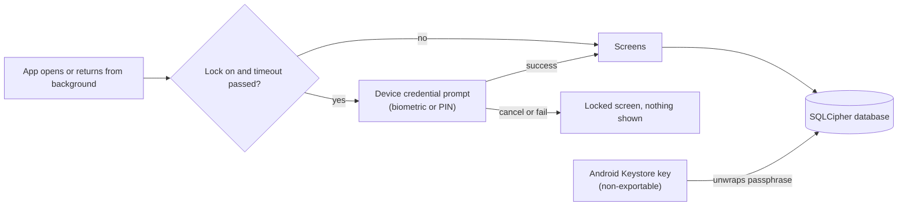
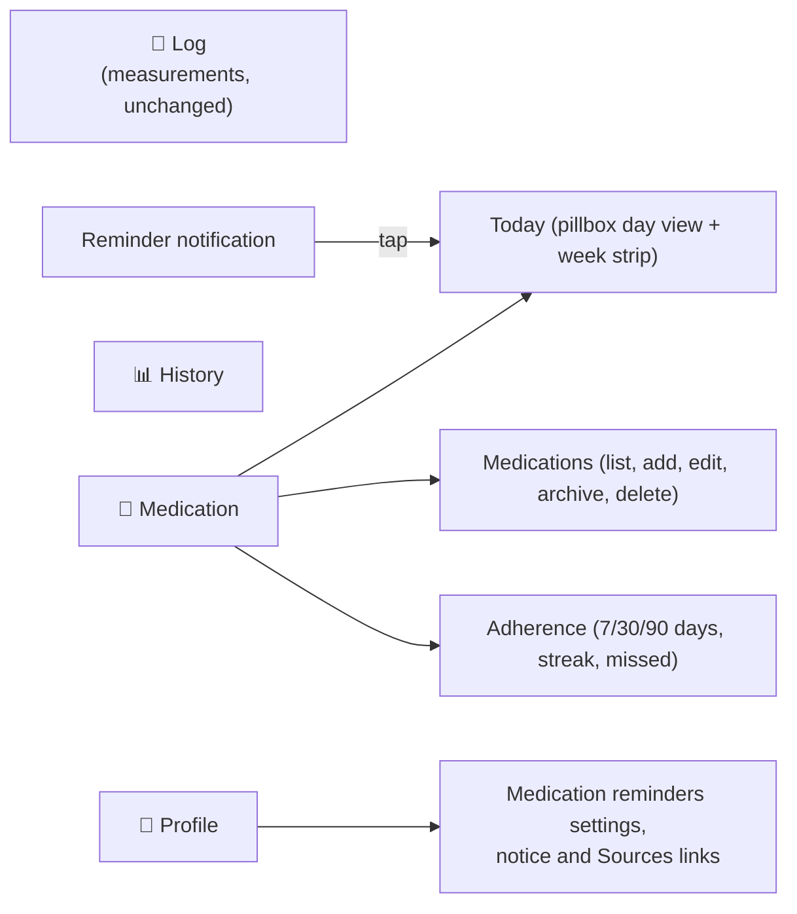

# Design: Medication Management

## Context
The app follows hexagonal layering: `domain` (pure Kotlin), `data` (Room, CSV), `app` (Compose). Storage is metric and locale-independent, ViewModels never hold translated text (ADR 0015), and the database is Room version 2. Medication adds a new aggregate with time-based behaviour (schedules and reminders), which the existing metrics do not have.

## Fit with the existing architecture
The change follows the structure already in the repository instead of introducing new patterns.

| Layer | Existing convention | What medication adds |
|---|---|---|
| `domain/model` | One package per area (`metrics`, `nhg`, `profile`, `common`), value objects with `require` validation, `ProfileId` and id value classes | New package `model/medication`, ids as value classes next to `MeasurementId`, validation in value objects |
| `domain/port/secondary` | One port per aggregate (`HealthLogRepositoryPort`, `ProfileRepositoryPort`, `DataExportPort`) | `MedicationRepositoryPort` (separate, so the metrics port is not bloated) and `ReminderSchedulerPort` |
| `domain/usecase` | One class per action (`Record*`, `Update*`, `Delete*`) | `SaveMedication`, `ArchiveMedication`, `DeleteMedication`, `RecordIntake`, `GetPillbox`, `GetAdherence` use cases in the same style |
| `data/local` | `entity`, `dao`, `mapper`, one `HealthJournalDatabase`, manual `Migration` objects (`MIGRATION_1_2`, `MIGRATION_2_3` and `MIGRATION_3_4` exist), `exportSchema = false` | `MedicationEntity`, `MedicationTimeEntity`, `IntakeEntity`, their DAOs and mapper, and `MIGRATION_4_5` written by hand like the existing ones |
| `data/repository` | `RoomHealthLogRepository`, `RoomProfileRepository` | `RoomMedicationRepository` |
| `data/csv` | `CsvDataExportAdapter` and `CsvDataImportAdapter`, metric and locale-independent | Medication, schedule and intake rows added to the same adapters, with the same physical line numbers in import errors |
| `app` | Manual wiring in `HealthJournalApp`, `ViewModel.Factory`, three `NavigationBarItem`s in `MainActivity`, `UiText` messages, `LocalDisplayUnits`, English and Dutch strings | A fourth `NavigationBarItem`, a `MedicationViewModel` with a factory, `UiText` for every message, the same message-clearing on tab change, Android adapters for the scheduler and receivers |

Other points of fit:
- **Dependencies (ADR 0003):** no new library. Reminders use `AlarmManager` and `NotificationManager`, the pill icon uses Compose `Canvas`, and time handling uses `java.time`.
- **Profiles:** medications belong to a `ProfileId`, like every entry, and follow the active profile (ADR 0016).
- **Timestamps:** existing entries use `Instant`. Intake outcomes use `Instant` for the actual time. Only the planned time is a `LocalDateTime`, on purpose, because "08:00" means local wall-clock time.
- **Current state that this change modifies:** the manifest has `allowBackup="true"` today, so the database is currently included in Android backups, and the app already has no `INTERNET` permission. The privacy requirements therefore turn the existing absence of network access into a checked rule and **change** the backup setting.
- **Theming and Dutch UI:** colours come from the Material theme (light and dark). The pill swatches are fixed colours with a contrasting outline. Layouts follow ADR 0010 (long Dutch strings) and the units rules (the dose unit is a medication unit, not part of metric/imperial display).
- **Tests:** domain tests as in `domain/src/test`, CSV tests next to `CsvAdaptersTest`, ViewModel tests as in `ViewModelsTest`, and the DAO/repository tests that are still missing for edit and delete (`feature-edit-delete-entries` task 2.3) get a shared in-memory test setup so both changes use it.

## Concepts (the pillbox model)
| Concept | Meaning | Example |
|---|---|---|
| Medication | What you take | "Medication A, 500 mg tablet" |
| Dosage | Strength and amount per intake | strength 500 mg, dose 1 tablet |
| Schedule | When it is due | 08:00 and 20:00, every day |
| Planned intake | One occurrence derived from the schedule | 2026-10-04 08:00 |
| Intake | The recorded outcome for a planned intake | Taken at 08:12 |
| Pillbox | The day and week view of planned intakes and outcomes | Morning row: 2 pills, 1 taken |
| Adherence | Taken divided by due over a period | 26 of 28 = 93% |

A **planned intake is computed, not stored**: it is derived from the schedule for a given date. Only outcomes (`Intake`) are stored. This keeps the table small, and editing a schedule never rewrites history. An outcome is keyed by (medication id, planned local date-time).



## Domain model
```kotlin
data class Medication(
    val id: MedicationId, val profileId: ProfileId, val name: MedicationName,
    val form: MedicationForm?, val dosage: Dosage, val appearance: PillAppearance?,
    val schedule: Schedule, val note: String?, val archived: Boolean
)
data class Dosage(val strength: Strength?, val amountPerIntake: BigDecimal, val amountUnit: AmountUnit)
enum class DoseUnit { MG, MCG, G, ML, IU, UNITS, DROPS, PUFFS, TABLETS, CAPSULES, PATCHES, APPLICATIONS, OTHER }
enum class MedicationForm { TABLET, CAPSULE, LIQUID, DROPS, SPRAY, INHALER, INJECTION, PATCH, CREAM, OTHER }
data class PillAppearance(val color: PillColor, val shape: PillShape)
sealed interface Schedule {
    data object AsNeeded : Schedule
    data class Recurring(
        val times: List<LocalTime>, val days: DayPattern,
        val start: LocalDate, val end: LocalDate?
    ) : Schedule
}
enum class IntakeStatus { TAKEN, SKIPPED }   // Pending and Missed are derived, not stored
data class Intake(
    val medicationId: MedicationId, val planned: LocalDateTime?,
    val status: IntakeStatus, val takenAt: Instant?,
    val actualAmount: BigDecimal? = null,   // set when it differs from the planned dose
    val note: String? = null                // free text from the user, for example an injection site
)
```
- `Schedule.plannedFor(date)` is a pure function and the single source for the pillbox, reminders and adherence.
- Validation lives in value objects (name 1 to 80 characters, amount greater than 0 and at most 1000, at most 8 times a day), consistent with `WeightKg` and the other metric value objects.
- **Time zones:** planned times are local wall-clock times (`LocalDateTime`), so a 08:00 pill stays at 08:00 when travelling. The actual time taken is an `Instant`. On a daylight-saving change the planned time is resolved in the current zone.
- **Missed:** an intake with no outcome after the grace period (2 hours, fixed in this change) is shown as missed. This is computed from the log when the pillbox or adherence is built, not by a background job, so it also works after the phone was switched off.

## Reminders (Android)
- `ReminderSchedulerPort` (domain) is implemented in `app` on `AlarmManager`. The scheduler only sets the **next** alarm per medication and re-arms after it fires, after boot, after an app update, after a time-zone or clock change, and after any schedule edit.
- **Exact alarms decision:** reminders are time-critical, but `SCHEDULE_EXACT_ALARM` is denied by default on Android 14 and later. Proposed approach: use exact scheduling when the permission is granted, otherwise fall back to `setAndAllowWhileIdle` (may be minutes late) and show a hint in settings with a link to grant exact alarms. The feature then works without the permission. This is recorded in the ADR and can be revisited.
- Notification channel "Medication reminders" with high importance, a `Taken` action and a `Snooze` action. The actions go to a `BroadcastReceiver` that writes to the log through the same use cases as the UI, then updates or cancels the notification. They do not start an Activity.
- Snooze posts the notification again after the chosen delay without changing the planned time, so adherence still compares against the original time. Snoozing past the grace period leaves the intake missed unless it is marked taken.
- Notification text contains the medication name and dose. A **hide details on lock screen** setting (default on) shows only "Medication reminder" and uses public visibility with generic text, because a lock screen can be read by others.
- `POST_NOTIFICATIONS` is requested when the first schedule is saved, not at app start. If it is denied, the pillbox still works and shows a banner explaining that reminders are off.

## Appearance instead of a pill database
Identification is done by the user, not by lookup: colour (about ten swatches) and shape (round, oval, capsule, oblong, square, other) are chosen when the medication is added and drawn as a vector icon (`Canvas`). Colour is never the only cue: the name and dose are always shown next to the icon, and the shapes are distinct for colour-blind users. A built-in database was rejected because it would need maintenance, would carry the risk of being wrong, and conflicts with the offline, no-claims stance.

## Liquids, sprays and injectables
The model is not tablet-specific. A medication has a **form** and a **dose unit**, and the two are independent so any combination is possible.

| Form | Typical dose units | Example |
|---|---|---|
| Tablet, capsule | tablets, capsules (strength in mg) | 1 tablet of 500 mg |
| Liquid | ml (strength in mg per ml) | 5 ml |
| Drops | drops, ml | 3 drops |
| Spray, inhaler | puffs, sprays, mcg | 2 puffs |
| Injection, pen | units (IU), mg, mcg, ml | 20 units, or 0.5 mg weekly |
| Patch | patches | 1 patch every 3 days |
| Cream, other | free unit, applications | 1 application |

- `DoseUnit` is extended: `MG, MCG, G, ML, IU, UNITS, DROPS, PUFFS, TABLETS, CAPSULES, PATCHES, APPLICATIONS, OTHER`. The unit is stored as entered and **never converted** (no mg to ml, no unit to mg), because conversions would be clinical logic.
- **Weekly and other long intervals** use the existing schedule patterns (selected weekdays, every N days), so a weekly injection is "every 7 days" or "Sundays" and a patch is "every 3 days".
- **Doses that vary:** an intake can store an **actual amount** that differs from the planned amount (for example 18 units instead of 20). The planned amount is a default shown in the form, and the user types what was actually taken. The app records it and does not comment on it.
- **Several injections a day** are normal (for example an injection with each meal). They are supported as several scheduled times, or as an as-needed medication logged each time.
- **Injection site** may be added as a free-text note on an intake, which the user fills in. The app does not suggest or rotate sites.
- **Icons follow the form** (pill, bottle, pen, spray or inhaler, patch) in addition to colour and shape.
- **No calculation of doses.** The app does not calculate, suggest, round or adjust any dose, does not estimate a dose from glucose or food, and does not connect the glucose log to medication. Injectable medicines are treated exactly like any other medication: a name, a user-defined dose and a schedule. This is what keeps these medications on the right side of the medical device line (see `compliance`).
- **Adherence** works the same for all forms: taken divided by due. The actual amount does not change the percentage, and the app does not judge whether an amount is right.

## Porting guide (iPhone or another platform)

The neutral specs (everything except `platform-*`) hold all business rules: they say what must happen, never which API does it. A port writes its own `platform-<name>` spec and reuses the rest unchanged. Where a neutral requirement needs a platform mechanism, this table shows where the mechanism lives for Android and what to choose on iOS.

| Neutral requirement | Android (`platform-android`) | iOS (suggested for a port) |
|---|---|---|
| Offline local storage, metric, migrations | Room (SQLite), hand-written migrations | SwiftData or Core Data, or SQLite with GRDB, explicit migrations |
| Encrypted database at rest | SQLCipher, key wrapped by Android Keystore | SQLCipher or data protection class `complete`, key in Keychain (`ThisDeviceOnly`) |
| Optional app lock, no own secret | `BiometricPrompt` with device credential | `LocalAuthentication` with `deviceOwnerAuthentication` |
| No network | no `INTERNET` permission, build check | no networking code or entitlement, App Transport Security left strict, build check |
| No backup of the database | `allowBackup=false`, data extraction rules | mark the files `isExcludedFromBackup`, no iCloud container |
| Time-based local reminders with Taken and Snooze | `AlarmManager`, `BroadcastReceiver`, boot receiver | `UNUserNotificationCenter` with notification actions, scheduled requests (64 pending limit: schedule the next ones only) |
| Hide details on a locked device | notification visibility private, public version | notification content previews, generic text in the notification |
| App switcher and screenshot protection | `FLAG_SECURE` | blur or cover view when the scene becomes inactive |
| Preferences (language, region, units) | `SharedPreferences` | `UserDefaults` |
| In-app language | `attachBaseContext` with locale | per-app language setting or a locale override in the bundle |
| Localized messages without stored text | `UiText` over string resources | message key plus arguments over `Localizable.strings` and `.stringsdict` for plurals |
| Charts, icons, theming | Vico, Compose `Canvas`, Material 3 | Swift Charts, SwiftUI `Canvas` or SF Symbols, system colours |
| Distribution | debug-signed APK on GitHub Releases | TestFlight or App Store, with its health-app review and privacy label rules |

Rules for keeping specs portable:
- Neutral specs name **behaviour and data**, not classes, permissions or APIs. Platform words (manifest, permission names, Room, Keystore, Compose) belong in `platform-<name>`.
- Domain rules are pure and portable: schedules, adherence, units, ranges, CSV contract. A port reimplements them against the same scenarios, which can be reused as test cases.
- Data contracts are shared: the CSV format (including enum names that are language-independent) and the rule that stored values are never converted.
- Store and legal rules (Google Play, App Store review, MDR, AVG) are per distribution channel and are recorded in the compliance ADR, with a section per store.

## Localization (English and Dutch)

All medication text exists in English and Dutch, follows the in-app language and region (ADR 0013) and is produced as `UiText` (ADR 0015), so a language change re-translates what is on screen. Notification text is built from a context wrapped with the app locale (`withAppLocale`), not the device language, because receivers run without the Activity. User input (names, notes) is never translated, and stored values stay unconverted and locale-independent. Counted units use Android `<plurals>`, since English and Dutch both distinguish one from many.

| Enum | English (1 / many) | Dutch (1 / many) |
|---|---|---|
| `MG`, `MCG`, `G`, `ML` | mg, mcg, g, ml | mg, mcg, g, ml |
| `IU` | IU | IE |
| `UNITS` | unit / units | eenheid / eenheden |
| `DROPS` | drop / drops | druppel / druppels |
| `PUFFS` | puff / puffs | pufje / pufjes |
| `TABLETS` | tablet / tablets | tablet / tabletten |
| `CAPSULES` | capsule / capsules | capsule / capsules |
| `PATCHES` | patch / patches | pleister / pleisters |
| `APPLICATIONS` | application / applications | applicatie / applicaties |
| `OTHER` | free text label | vrije tekst |

| `MedicationForm` | English | Dutch |
|---|---|---|
| `TABLET` | Tablet | Tablet |
| `CAPSULE` | Capsule | Capsule |
| `LIQUID` | Liquid | Vloeistof |
| `DROPS` | Drops | Druppels |
| `SPRAY` | Spray | Spray |
| `INHALER` | Inhaler | Inhalator |
| `INJECTION` | Injection | Injectie |
| `PATCH` | Patch | Pleister |
| `CREAM` | Cream | Creme |
| `OTHER` | Other | Overig |

| Other term | English | Dutch |
|---|---|---|
| Statuses | Taken, Skipped, Missed, Pending | Ingenomen, Overgeslagen, Gemist, Gepland |
| Time of day | Morning, Afternoon, Evening, Night | Ochtend, Middag, Avond, Nacht |
| Tab | Medication | Medicatie |
| Notification actions | Taken, Snooze | Ingenomen, Uitstellen |

Notes:
- Symbols mg, mcg, g and ml are the same in both languages. The international unit is IU in English and IE (internationale eenheid) in Dutch. The label is a display choice only: the stored value is the enum, so both are always the same unit. The Dutch wording is checked against the usage on apotheek.nl and Thuisarts before release.
- "Units" for pen-type injectables is "eenheden" in Dutch. It is a label only and is never converted to or from IE or ml.
- Numbers use the region (Dutch decimal comma, US decimal point) and times use the region's short time style. Weekday names come from `java.time` with the active locale.
- A missing translation is a failing test (matching key sets in `values` and `values-nl`), not a runtime fallback.
- Dutch strings can be 30 to 50 percent longer, so layouts follow ADR 0010 (wrap, no fixed widths on chips and buttons).

## Persistence
Room version 5 (the database is at version 4 today) with three tables: `medication`, `medication_time` (one row per time per medication) and `intake`. `MIGRATION_4_5` only creates tables (hand-written like `MIGRATION_2_3`, which added the waist table). The move to an encrypted file (phase 4c) is a separate, one-time file migration that is independent of the schema version. Deleting a medication cascades to its times and, after confirmation, to its intake log. **Archive** is the default way to stop a medication, because it keeps history and adherence intact.

## Adherence
`AdherenceCalculator(medications, intakes, range, now)` returns `taken`, `due`, `skipped`, `missed`, `percentage` and `streak`.
- Due counts planned intakes in the range that are in the past, and ignores days before the medication's start date.
- Skipped counts as due and not taken (it lowers adherence), but is shown separately because skipping on a doctor's advice differs from forgetting.
- As-needed medications have no percentage, only a count.
- Percentages are rounded to whole percent (half up), like the blood pressure averages.

## Privacy first
This is a set of requirements, not only a statement (see `specs/privacy/spec.md`):
- **No network:** the app declares no `INTERNET` permission. A check fails the build if it appears in the manifest.
- **No analytics or crash-reporting libraries**, and no third-party SDKs that collect data.
- **No cloud backup or device transfer of the health database:** `android:allowBackup="false"` plus `dataExtractionRules` excluding the database. Users move data through CSV export, which they control.
- **Export is explicit:** a file leaves the app only through the user's save or share action. No automatic uploads.
- **Lock screen:** details hidden by default (above).
- **App switcher:** an opt-in `FLAG_SECURE` setting hides content in recents and blocks screenshots (default off, since it also blocks the user's own screenshots).
- **At rest:** the database is encrypted with SQLCipher and a Keystore-wrapped key, and an opt-in app lock uses the device credential. See "App lock and database encryption".
- **Logs:** no medication names or doses are written to logcat in release builds.

## App lock and database encryption

Two separate protections, because they stop different threats. The lock stops a person who holds the unlocked phone. Encryption stops anyone who obtains the database file without the phone's keys (a copied or extracted file, a rooted or forensic read).

**App lock (opt-in, off by default)**
- A Profile setting "Lock the app". When on, the app asks the user to authenticate when it opens and after it has been in the background for a chosen time (immediately, 1 minute, 5 minutes).
- Authentication is the **device's own credential**: fingerprint or face (class 3 biometrics) with the device PIN, pattern or password as fallback, through the system `BiometricPrompt` with `DEVICE_CREDENTIAL` allowed. The app stores **no PIN or secret of its own**, so there is nothing to leak, nothing to reset and no recovery flow.
- On Android 8 and 9 (minSdk 26) the prompt falls back to the confirm-device-credential screen. If the device has no screen lock, the setting is disabled with an explanation, and it is never silently accepted.
- While locked, no health data is composed on screen. Notifications still hide medication details on the lock screen by default, and tapping a reminder asks for authentication before opening Today.
- The Taken action on a notification is allowed without unlocking the app, because it only writes an outcome and shows nothing. This is documented in the setting description.
- The lock is a convenience barrier for privacy and is not a security claim beyond what the Android authenticator provides.

**Database encryption at rest (opt-out not offered, applies to all data)**
- The Room database is encrypted with SQLCipher (AES-256). It is the one widely used, audited answer for an encrypted SQLite database on Android, and Room supports it through a `SupportOpenHelperFactory`.
- The database passphrase is a random 256-bit value generated on the device. It is stored only **wrapped** (AES-GCM) by a non-exportable **Android Keystore** key, hardware-backed (TEE or StrongBox) when the device has it. The wrapped value lives in no-backup storage. The key does not require user authentication, so changing a fingerprint or the screen lock never makes the data unreadable.
- **One-time migration** of existing users: create the encrypted database from the plain one (`sqlcipher_export`), verify the row counts per table match, keep the plain file until verification passes, then remove the plain file and its journal files. The app never deletes the plain copy before verification, and on any failure it keeps the plain database and shows a localized message.
- Because the key lives in the Keystore, the database cannot be moved to another phone or restored from a backup. Backup is already disabled, so CSV export remains the only way to move data, and the app says so in the privacy notice.
- Honest limits (stated in ADR 0020): encryption does not protect data while the app is unlocked and running, or against malware with the user's access, and the Keystore key is lost on factory reset or app data clearing, which also removes the data.

**Dependencies (exception to ADR 0003).** Two are needed and both are recorded in ADR 0020: `net.zetetic:sqlcipher-android` (community SQLCipher, BSD-style licence, runs offline, no data collection) and `androidx.biometric` (Google AndroidX, handles API 26 to 29 differences). Both are checked for licence, size (the native library adds a few MB per ABI), 16 KB page size support and absence of network code. If either fails review the fallback is documented in the ADR (`BiometricPrompt` framework API on API 28+ and `createConfirmDeviceCredentialIntent` below, and for encryption a field-level AES-GCM envelope on the medication tables only).



## Authorities, law and regulation
Dutch sources are the reference wherever a feature touches clinical content or the law, in line with ADR 0005 (NHG and Voedingscentrum for thresholds).

| Topic | Authority | Effect on this change |
|---|---|---|
| Clinical guidance and patient information | [NHG](https://www.nhg.org/) (guidelines, [Thuisarts](https://www.thuisarts.nl/)) | The app gives **no** clinical content. Where a screen needs guidance it links to Thuisarts or the NHG instead of paraphrasing it. |
| Medicine information (what to do about a missed dose, interactions, side effects) | [apotheek.nl](https://www.apotheek.nl/) (KNMP) and the patient leaflet (bijsluiter) | The app gives **no advice at all**, and says nothing about what to do after a missed dose: a missed intake only shows the status "Missed". apotheek.nl and Thuisarts appear only as a neutral "Sources" list on the information screen, with no summary and no recommendation. This keeps the app out of dose-advice territory. |
| Software as a medical device | EU MDR 2017/745, supervised in the Netherlands by the IGJ (Inspectie Gezondheidszorg en Jeugd) | Whether software is a medical device depends on the **intended purpose the manufacturer states**. This app is stated as a personal log and reminder tool. It must therefore not claim to diagnose, predict, advise on doses, check interactions or support treatment decisions. The "not medical advice" requirement, the missing drug database and the missing interaction check are deliberate for this reason. A change of intended purpose would need a fresh regulatory assessment (CE marking, notified body). |
| Personal data | AVG (GDPR) and UAVG, supervised by the Autoriteit Persoonsgegevens | Health data is a special category of personal data. The design avoids processing it outside the device (no network, no backup, no analytics), which keeps the developer from collecting any health data. Whether the household exemption or other AVG rules apply to a distributed app is a legal question that should be checked before wider distribution (see risks). |
| Medicines and pharmacy law | Geneesmiddelenwet, KNMP and pharmacist practice | The app offers no medicine sale, prescription handling or pharmacist contact, so no pharmacy law applies. Prescription or pharmacy integration (for example the medication overview from the pharmacy) is out of scope and would need its own change. |
| Health data exchange | Dutch healthcare standards for exchange (for example the medicatieoverzicht in the national infrastructure) | Out of scope. Export is CSV only, under the user's control. |

**Decision (owner):** the app is purely a reminder and logging tool for personal use and must never become a medical device. This is a hard constraint on every feature, written as the `compliance` capability (`specs/compliance/spec.md`), with a review gate: any function that diagnoses, advises, alerts on health values, transmits data or serves care providers is blocked until a regulatory assessment ADR exists. The existing range labels for BMI, blood pressure and glucose are the closest current feature to the line, so they are reviewed in this change (task 4b.3) and reworded as neutral, sourced ranges instead of diagnostic labels.

Where this table and a feature disagree, the feature gives way: if a later change adds drug information, interaction checks or dose advice, it must first record a regulatory assessment in an ADR.

## UI structure
Approved placement: a fourth bottom tab, **💊 Medication** (Dutch: Medicatie), second in the bar: Log, Medication, History, Profile. The emoji icon matches the existing tab icons. The tab is named Medication, not Pillbox, because it covers liquids, sprays and injections; the pillbox is the Today view inside it.



| Place | Content |
|---|---|
| Medication > Today | Day view grouped morning (before 12:00), afternoon (12:00 to 18:00), evening (18:00 to 22:00) and night. Each slot shows the icon, name, dose, planned time and a status chip. Tapping a pending slot offers Taken and Skip. Past intakes can be corrected. A button logs an as-needed dose. |
| Medication > Medications | The list with a + button. Add and edit: name, form, dose and unit, schedule, appearance, note. Archive and delete (with confirmation). |
| Medication > Adherence | Per-medication and overall adherence, streak, skipped and missed counts. |
| Log | Unchanged. Medication doses are not logged here. |
| History | Unchanged in this change. The adherence overlay on trend charts is a later phase. |
| Profile | A "Medication reminders" section: notification permission status, lock-screen detail setting, secure-screen option, the not-a-medical-device notice and the Sources links. |
| Notifications | Tapping opens Medication > Today. |

## Alternatives considered
- **Store planned intakes as rows** (one per due time): rejected, it needs a generator job, enlarges the table, and makes schedule edits rewrite history.
- **WorkManager for reminders:** rejected, its timing is deferred and inexact, which is wrong for dose reminders.
- **Drug database lookup:** rejected, see above.
- **Photo identification:** rejected, it needs camera permission and image storage, with little gain over colour and shape.
- **App-specific PIN instead of the device credential:** rejected, it needs a stored hash, lockout rules and a recovery flow, and is weaker than the system authenticator.
- **Encryption only for the medication tables (field-level AES-GCM):** kept as the documented fallback in ADR 0020 if SQLCipher fails review, because it leaves measurements unencrypted.
- **Relying on Android file-based encryption alone:** rejected, it does not protect a copied or extracted database file.

## Risks
- Reminder reliability differs per manufacturer because of battery management. Mitigation: re-arm on boot, update and clock change, a settings hint about battery optimisation, and a visible notice when exact alarms are not granted.
- Medication is health-adjacent. Mitigation: the disclaimer, no advice, no interaction checks.
- The change is large. Mitigation: the phases in `tasks.md`.
- Encrypting the existing database is a one-way change for current users. Mitigation: verify row counts before removing the plain file, keep the plain file on any failure, test on seeded and interrupted migrations, and ship phase 4c as its own release.
- The Keystore key is lost on factory reset or clearing app data, so the data is lost with it, and the database cannot be restored from backup. Mitigation: no authentication binding on the key, CSV export, and a clear notice in the privacy text.
- SQLCipher adds a few MB per ABI and a native library. Mitigation: size and 16 KB page size check in ADR 0020, with the field-level fallback.
- Legal interpretation (MDR intended purpose, AVG for a distributed app) is not verified by a lawyer. Mitigation: keep claims minimal as above, and get a short legal or privacy review before publishing beyond personal use.
