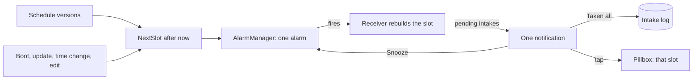

# Design: Medication Reminders

## Context
`add-medication-management` derives planned intakes from schedule versions and groups them into slots (same local time, ADR 0020). Reminders are an Android mechanism on top of that pure model. Layers: the next-slot rule is `:domain`, the alarm and notification code is `:app`, no `:data` change. Dependencies stay unchanged (ADR 0003).

## Grouping rule
- The unit of a reminder is a **slot**, not a medication. The scheduler asks the domain for the next slot after "now" for the active profile and sets one alarm for it, so three medications at 07:30 give one alarm and one notification.
- The notification id is derived from the slot's local date-time, so a re-arm or an edit never creates a second notification for the same moment.
- When the alarm fires the receiver rebuilds the slot from the current data (not from extras), so a medication archived or already marked taken a minute ago is not listed. If nothing is pending in the slot, no notification is posted.
- **Taken all** writes TAKEN with the current time for every still-pending intake in the slot through the same use case as the pillbox. It never overwrites an outcome that already exists (for example a Skipped one).
- The receiver rebuilds the slot with the existing `GetPillboxDayUseCase` and `Slot.openItems` (pending and missed items without an outcome, ADR 0020) and records them with the existing `RecordSlotIntakesUseCase`; "never overwrite" comes from only passing `openItems`.
- Recording an outcome in the pillbox updates or cancels the notification of that slot, so a notification never lists a medication that is already done.
- Receivers run outside the Activity: they use `goAsync()` and the application container for the use cases, and finish within the broadcast time limit.
- Individual choices (skip one, take another) are made in the pillbox. The notification does not offer per-medication buttons, because notification actions are limited and tiny at large font sizes.

## Scheduling
- `ReminderSchedulerPort` (domain) is implemented in `app` on `AlarmManager`. Only the **next** alarm is set, and it is re-armed after it fires, after boot, after an app update, after a time-zone or clock change, and after any schedule, archive, delete or profile switch.
- **Exact alarms (approved):** use `setExactAndAllowWhileIdle` when `SCHEDULE_EXACT_ALARM` is granted, otherwise `setAndAllowWhileIdle` (may be minutes late) and show a hint in Profile with a link to the system setting. The feature works without the permission.
- Reminders belong to the active profile only. Switching profile cancels the old alarm and arms the new one.
- **One Snooze action (approved 2026-10-07):** a notification cannot show a picker, so there is a single Snooze button and its length (10, 30 or 60 minutes, default 10) is set in Profile. The action never opens the app.
- Snooze posts the same slot notification again after the chosen delay as a separate one-shot alarm, without changing the planned time, so later adherence still compares with the original time. A slot snoozed past the grace period shows as missed unless marked taken.

## Notification content
- Channel "Medication reminders", high importance.
- Details shown: title is the time ("07:30"), body is an inbox style list "Medication A, 1 tablet" per line. Details hidden (default): public version and lock-screen text is only "Medication reminder".
- No instruction wording ("take now", "do not miss"), no advice, no encouragement (spec `compliance`).
- Texts are built from a context wrapped with the app locale (`withAppLocale`), because receivers run without the Activity (ADR 0013).
- Tapping opens the pillbox on Today and scrolls to the slot.

## Permission flow
`POST_NOTIFICATIONS` (Android 13+) is requested when the first schedule is saved, after a short explanation. If the user denies, nothing else changes except a banner in the pillbox. If the user later grants it in system settings the banner disappears on return and reminders are armed. No prompt on Android 12 and lower.

## Alternatives considered
- **One notification per medication:** rejected, several medications at the same time would produce a burst of notifications.
- **Per-medication buttons in the notification:** rejected, the system limits actions and they are hard to hit at large font sizes. Individual handling is in the pillbox.
- **User-defined named moments:** deferred, grouping by identical time covers the need.
- **WorkManager:** rejected, timing is deferred and inexact, which is wrong for dose reminders.
- **Repeating alarms with `setRepeating`:** rejected, they drift and cannot follow schedule versions.

## Risks
- Reminder reliability differs per manufacturer because of battery management. Mitigation: re-arm on boot, update and clock change, a hint about battery optimisation, and a visible notice when exact alarms are not granted.
- Taken all marks a whole slot taken in one tap, which could record a dose that was not taken. Mitigation: the pillbox can correct any outcome, and the setting text says what the action does.
- With the app lock on (`add-database-encryption-and-lock`), Taken all still works without unlocking while tapping the notification asks for authentication. That change owns the lock text.
