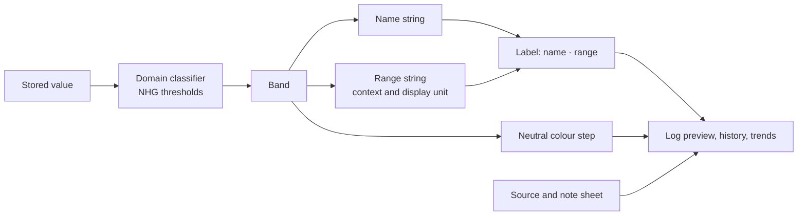

## Context
Labels are produced in `app/ui/nhg/NhgLabels.kt` from the domain categories and shown in the log preview, history cards, the blood pressure and weight trend summaries and the blood pressure distribution bar. Thresholds live in `domain/model/nhg`. This change keeps the thresholds and the stored measurement values, and changes what is shown, how bands are named, and the three blood pressure bands.

## Rules for every label
1. **Band plus range plus source.** A label is "name · range". The source is shown once per screen, not per label.
2. **No condition names.** Not diabetes, prediabetes, hypertension, impaired, "gestoord", hypoglycaemia or obesity-as-diagnosis. BMI keeps Underweight, Normal, Overweight and Obese, because the user asked for them and they are NHG's BMI class names, but they are always shown with the range and are never described as a condition.
3. **NHG leads.** A threshold is only changed to match NHG. Wording from Diabetes Fonds, DVN and Hartstichting is used where NHG has no plain-language term.
4. **No advice, no alarm.** No wording about what to do, no warning icons, no red.
5. **Source claims are exact.** The source line only credits NHG for what NHG states (see the source column below).

## Bands and wording
### BMI (thresholds unchanged)
| Band | Range | English | Dutch |
|---|---|---|---|
| UNDERWEIGHT | below 18.5 | Underweight · BMI below 18.5 | Ondergewicht · BMI onder 18,5 |
| NORMAL | 18.5 to below 25 | Normal · BMI 18.5 to 24.9 | Normaal · BMI 18,5 tot 24,9 |
| OVERWEIGHT | 25 to below 30 | Overweight · BMI 25.0 to 29.9 | Overgewicht · BMI 25,0 tot 29,9 |
| OBESE | 30 and above | Obese · BMI 30 and above | Obesitas · BMI 30 en hoger |

Source: NHG.

### Blood pressure (three bands)
| Band | Rule | English | Dutch | Source |
|---|---|---|---|---|
| NORMAL | systolic below 140 and diastolic below 90 | Normal blood pressure · below 140/90 | Normale bloeddruk · onder 140/90 | NHG limit 140, Hartstichting wording |
| HIGH | systolic 140 to 179, or diastolic 90 to 109 | High blood pressure · from 140/90 | Hoge bloeddruk · vanaf 140/90 | NHG limit 140, Hartstichting wording |
| SERIOUSLY_RAISED | systolic 180 or more, or diastolic 110 or more | Seriously raised blood pressure · from 180/110 | Ernstig verhoogde bloeddruk · vanaf 180/110 | NHG limit 180 systolic, Hartstichting wording; the diastolic 110 limit is carried over from the existing rule and checked in task 5.1 |

The existing rule ordering (top-down, higher band wins) stays. Equivalence with the old six bands, so old rows need no recompute:

| Old stored name | New band |
|---|---|
| OPTIMAL, NORMAL, HIGH_NORMAL | NORMAL |
| HYPERTENSION_GRADE_1, HYPERTENSION_GRADE_2 | HIGH |
| HYPERTENSION_GRADE_3 | SERIOUSLY_RAISED |

The old and new rules classify every reading to the same band after the mapping (tested over a grid of readings). A trend average is classified from the averaged reading, as today.

### Glucose (thresholds unchanged, wording from Diabetes Fonds)
The stored values (HYPOGLYCAEMIA, NORMAL, IMPAIRED_FASTING, IMPAIRED_GLUCOSE_TOLERANCE, DIABETES_RANGE) stay as internal identifiers and are never shown. IMPAIRED_FASTING and IMPAIRED_GLUCOSE_TOLERANCE show the same name, because the context already tells which range applies.

| Band | Fasting range | After a meal range | English | Dutch |
|---|---|---|---|---|
| HYPOGLYCAEMIA | below 3.5 | below 3.5 | Low blood glucose · below 3.5 mmol/L | Lage bloedsuiker · onder 3,5 mmol/L |
| NORMAL | 3.5 to 6.0 | 3.5 to below 7.8 | Normal blood glucose · fasting 3.5 to 6.0 mmol/L | Normale bloedsuiker · nuchter 3,5 tot 6,0 mmol/L |
| IMPAIRED_* | above 6.0 to 6.9 | 7.8 to 11.0 | Slightly raised blood glucose · fasting above 6.0 to 6.9 mmol/L | Iets hogere bloedsuiker · nuchter boven 6,0 tot 6,9 mmol/L |
| DIABETES_RANGE | above 6.9 | above 11.0 | High blood glucose · fasting above 6.9 mmol/L | Hoge bloedsuiker · nuchter boven 6,9 mmol/L |

After-a-meal entries show "after a meal" (Dutch "na een maaltijd") with their own range. In mg/dL the range is converted for display with the existing factor and rounded to a whole number (for example 6.0 becomes 108). The comparison always uses the stored mmol/L value. The low limit stays 3.5 because no NHG text was found for another value. DVN's 3.9 is not used for that reason, and is a question for task 5.1.

### Neutral colours
One sequential ramp replaces the traffic-light palette. Lowest band is the lightest step, highest band the darkest, so the order is readable without hue and without alarm.

| Step | Light | Dark | Used for |
|---|---|---|---|
| 0 | 546E7A | B0BEC5 | Low glucose, Underweight |
| 1 | 1E6FB5 | 64B5F6 | Normal (all metrics) |
| 2 | 3949AB | 7986CB | Overweight, Slightly raised glucose |
| 3 | 283593 | 9FA8DA | High blood pressure, Obese, High glucose |
| 4 | 1A237E | C5CAE9 | Seriously raised blood pressure |

Contrast of the label text colour against the card background must be at least 4.5:1 in both themes (checked in task 3.5); a step may be adjusted slightly to pass, the order stays. Colour is never the only signal, because the label text is always present.

## Source block
A small "About these ranges" text is reachable from every screen that shows a label (an info icon next to the label opens a sheet). It states, in neutral text:
- the ranges follow published guidelines, mainly NHG, with wording also used by Diabetes Fonds, DVN and Hartstichting
- the app is not a medical device, a label is not a diagnosis, and a single value says little
- questions go to the doctor or pharmacist, with links to Thuisarts, the NHG guideline pages, Diabetes Fonds, DVN and Hartstichting

No endorsement is claimed and no logos are used.

## Persistence and migration
- BMI and glucose: enum names and stored columns unchanged.
- Blood pressure: `NhgBloodPressureCategory` has three values. `fromStoredName` maps the six legacy names and the three new names, so old rows read correctly and no SQL migration or rewrite is needed. New and edited rows write the new names. An unknown name throws, as `valueOf` does today.
- CSV export writes the new names. Import ignores the column and recomputes (unchanged), so old files import.
- Downgrading to an older build is not supported (the old build cannot read the new names), and the release notes say so.

## Alternatives considered
- **Keep six stored bands, show three labels:** rejected, the distribution bar and averages would need a second grouping and the dead names would stay in the domain.
- **Rewrite stored rows to the new names:** rejected, the read mapping gives the same result without touching data.
- **Show the NHG clinical term as a second line:** rejected, it reintroduces diagnostic names.
- **Add a low blood pressure band (Hartstichting: below 90 or below 60):** not added, NHG gives no such band and the app does not interpret health values.
- **Keep traffic-light colours:** rejected, they read as warnings (compliance: no alarm styling).

## Risks
- The wording is not verified against the full NHG text (task 5.1).
- Ranges are longer, so labels wrap on small screens and in Dutch. Mitigation: labels may use two lines, tested at large font scale (ADR 0010).
- A user who knew the old names may look for them. Mitigation: the release notes list the mapping.
