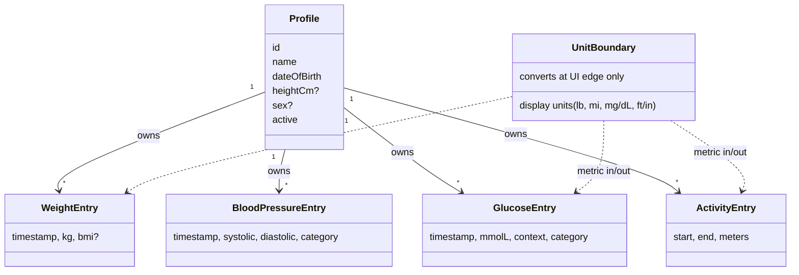

# Health Journal Specifications

These specs are the platform-neutral source of truth for every business rule. A team should be able to rebuild the app (for example on iPhone) from them. Platform decisions live in `docs/adr/`.

## Index

| Spec | Scope |
| --- | --- |
| [profile](profile/spec.md) | Profile attributes, validation, active profile, update |
| [health-metrics/weight](health-metrics/weight/spec.md) | Weight range, BMI, NHG BMI categories |
| [health-metrics/blood-pressure](health-metrics/blood-pressure/spec.md) | Ranges, NHG classification |
| [health-metrics/glucose](health-metrics/glucose/spec.md) | mmol/L canonical, mg/dL conversion, NHG classification |
| [health-metrics/activity](health-metrics/activity/spec.md) | Sessions, duration, manual logging |
| [entry-management](entry-management/spec.md) | History list, edit, delete |
| [units-presentation](units-presentation/spec.md) | Display units, conversions, defaults per region |
| [health-trends](health-trends/spec.md) | Range, axes, zoom, colors (shared) |
| [health-trends/weight](health-trends/weight/spec.md) | Weight stats, moving average |
| [health-trends/blood-pressure](health-trends/blood-pressure/spec.md) | Averages, gauges, distribution |
| [health-trends/glucose](health-trends/glucose/spec.md) | In-range bars, chips |
| [data-export](data-export/spec.md) | CSV export and import, Libra |
| [localization](localization/spec.md) | Languages, region, message resolution |
| [theming](theming/spec.md) | Light/dark palette, top bar |
| [app-identity](app-identity/spec.md) | Icon palette |
| [architecture-governance](architecture-governance/spec.md) | Layers, ADRs, README |
| [platform-android](platform-android/spec.md) | **Android-only** decisions (SDK levels, Room, SharedPreferences, Compose, signing). Not business rules; replace on other platforms |

## Glossary

- **Metric storage / canonical units**: all stored and exchanged values are metric: kg, cm, mmol/L, meters, mmHg. Display units are a UI concern only.
- **NHG**: Nederlands Huisartsen Genootschap, the Dutch GP guideline whose thresholds define the BMI, blood pressure and glucose categories.
- **Active profile**: the one profile currently used for logging and history.
- **Range anchor**: trend ranges count back from the newest entry, not the clock.

## Domain diagram

## Porting guide

Reimplement exactly (domain rules): value ranges and boundaries, BMI formula and rounding, the three NHG classifiers, glucose conversion factor 0.0555, activity rules, profile validation and active-profile semantics, update/delete semantics, trend range filter, statistics and moving average, unit conversions and regional defaults.

Reimplement as a contract (data): the storage shape (tables and columns in each health-metrics spec, epoch-millisecond timestamps, enum names as text, ISO date for birth date) and the CSV format in data-export, so files and backups are interchangeable.

Platform choice (free): UI toolkit, persistence engine, navigation, chart rendering, locale APIs, date pickers, launcher icon packaging, build tooling. Keep behavior in the specs; record platform choices in ADRs.

## Traceability

| Spec | ADR | Primary code area |
| --- | --- | --- |
| profile | 0016 | domain `model/profile`, `CreateProfileUseCase`, app `ui/profile` |
| health-metrics/* | 0005 | domain `model/metrics`, `model/nhg`, `usecase` |
| entry-management | 0012 | domain update/delete use cases, app `ui/history/EntryDialogs` |
| units-presentation | 0014 | app `settings/UnitPreference`, `ui/common/UnitFormat`, domain `model/common/UnitConversion` |
| health-trends/* | 0006 | app `ui/history/charts` |
| data-export | 0004 | data `csv` adapters |
| localization | 0009, 0010, 0013, 0015 | app `settings/LanguagePreference`, `ui/common/UiText` |
| theming | 0010 | app `ui/theme` |
| app-identity | 0011 | app `res` launcher assets |
| architecture-governance | 0001, 0002, 0003 | module layout, `docs/adr` |

## Discrepancies and open questions

- Waist circumference is planned (change `add-waist-circumference-tracking`) but not implemented; there is no spec for it.
- The weight moving-average label says "N-day avg" but counts entries.
- The date picker allows today as birth date but the domain rejects it.
- A non-numeric height silently clears the height.
- Blood pressure averages are truncated, not rounded.
- Imported BMI and categories from files are trusted, not recomputed.
- Libra units other than "lbs" are treated as kilograms.
- Blank lines shift reported import line numbers.
- The glucose edit dialog validates only value > 0 before the domain range check.
- Activity export and import have no UI entry point.
- Older installs may contain an extra profile row created by the bug fixed in ADR 0016.
- Profile.reconstruct does not trim the name (the UI does).
- Activity tests and Dutch string content were not exhaustively verified against these specs.
