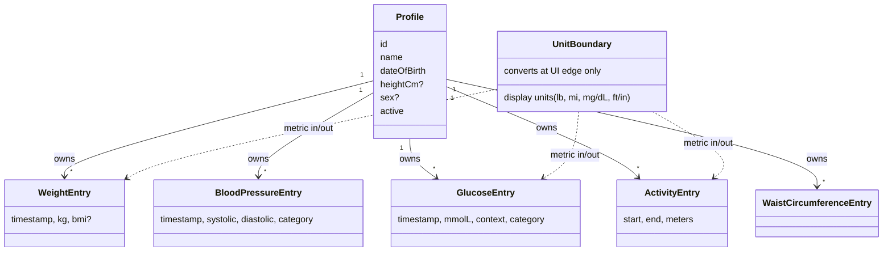

# Health Journal Specifications

These specs are the platform-neutral source of truth for every business rule. A team should be able to rebuild the app (for example on iPhone) from them. Platform decisions live in `docs/adr/`.

## Index

| Spec | Scope |
| --- | --- |
| [profile](profile/spec.md) | Profile attributes, validation, active profile, update |
| [health-metrics/weight](health-metrics/weight/spec.md) | Weight range, BMI, NHG BMI categories |
| [health-metrics/blood-pressure](health-metrics/blood-pressure/spec.md) | Ranges, NHG classification |
| [health-metrics/glucose](health-metrics/glucose/spec.md) | mmol/L canonical, mg/dL conversion, NHG classification |
| [health-metrics/activity](health-metrics/activity/spec.md) | Sessions, duration, manual logging |
| [entry-management](entry-management/spec.md) | History list, edit, delete |
| [units-presentation](units-presentation/spec.md) | Display units, conversions, defaults per region |
| [health-trends](health-trends/spec.md) | Range, axes, zoom, colors (shared) |
| [health-trends/weight](health-trends/weight/spec.md) | Weight stats, moving average |
| [health-trends/blood-pressure](health-trends/blood-pressure/spec.md) | Averages, gauges, distribution |
| [health-trends/glucose](health-trends/glucose/spec.md) | In-range bars, chips |
| health-metrics/range-labels (added when `reword-range-labels` is archived) | Neutral "name · range" labels, three blood pressure bands, source order, neutral colours |
| [medication](medication/spec.md) | Medications, schedules, intake outcomes, pillbox view |
| [privacy](privacy/spec.md) | No transmission, controlled export, no sensitive logging |
| [compliance](compliance/spec.md) | Intended purpose, no advice, wording rules, review gate |
| [data-export](data-export/spec.md) | CSV export and import, Libra |
| [localization](localization/spec.md) | Languages, region, message resolution |
| [theming](theming/spec.md) | Light/dark palette, top bar |
| [app-identity](app-identity/spec.md) | Icon palette |
| [architecture-governance](architecture-governance/spec.md) | Layers, ADRs, README |
| [platform-android](platform-android/spec.md) | **Android-only** decisions (SDK levels, Room, SharedPreferences, Compose, signing). Not business rules; replace on other platforms |

## Porting guide (iPhone or another platform)

The neutral specs (everything except `platform-*`) hold all business rules: they say what must happen, never which API does it. A port writes its own `platform-<name>` spec and reuses the rest unchanged. Where a neutral requirement needs a platform mechanism, this table shows where the mechanism lives for Android and what to choose on iOS.

| Neutral requirement | Android (`platform-android`) | iOS (suggested for a port) |
|---|---|---|
| Offline local storage, metric, migrations | Room (SQLite), hand-written migrations | SwiftData or Core Data, or SQLite with GRDB, explicit migrations |
| Encrypted database at rest | SQLCipher, key wrapped by Android Keystore | SQLCipher or data protection class `complete`, key in Keychain (`ThisDeviceOnly`) |
| Optional app lock, no own secret | `BiometricPrompt` with device credential | `LocalAuthentication` with `deviceOwnerAuthentication` |
| No network | no `INTERNET` permission, build check | no networking code or entitlement, App Transport Security left strict, build check |
| Encrypted database and its key excluded from backup | data extraction rules (`allowBackup` unchanged) | mark the files `isExcludedFromBackup`, no iCloud container |
| Time-based local reminders with Taken and Snooze | `AlarmManager`, `BroadcastReceiver`, boot receiver | `UNUserNotificationCenter` with notification actions, scheduled requests (64 pending limit: schedule the next ones only) |
| Hide details on a locked device | notification visibility private, public version | notification content previews, generic text in the notification |
| App switcher and screenshot protection | `FLAG_SECURE` | blur or cover view when the scene becomes inactive |
| Preferences (language, region, units) | `SharedPreferences` | `UserDefaults` |
| In-app language | `attachBaseContext` with locale | per-app language setting or a locale override in the bundle |
| Localized messages without stored text | `UiText` over string resources | message key plus arguments over `Localizable.strings` and `.stringsdict` for plurals |
| Charts, icons, theming | Vico, Compose `Canvas`, Material 3 | Swift Charts, SwiftUI `Canvas` or SF Symbols, system colours |
| Distribution | debug-signed APK on GitHub Releases | TestFlight or App Store, with its health-app review and privacy label rules |

Rules for keeping specs portable:
- Neutral specs name **behaviour and data**, not classes, permissions or APIs. Platform words (manifest, permission names, Room, Keystore, Compose) belong in `platform-<name>`.
- Domain rules are pure and portable: schedules, adherence, units, ranges, CSV contract. A port reimplements them against the same scenarios, which can be reused as test cases.
- Data contracts are shared: the CSV format (including enum names that are language-independent) and the rule that stored values are never converted.
- Store and legal rules (Google Play, App Store review, MDR, AVG) are per distribution channel and are recorded in the compliance ADR, with a section per store.

## Glossary

- **Metric storage / canonical units**: all stored and exchanged values are metric: kg, cm, mmol/L, meters, mmHg. Display units are a UI concern only.
- **NHG**: Nederlands Huisartsen Genootschap, the Dutch GP guideline whose thresholds define the BMI, blood pressure and glucose categories.
- **Range label**: the neutral "name · range" text shown for a BMI, blood pressure or glucose value. It never names a condition.
- **Blood pressure bands**: Normal (below 140/90), High (from 140/90), Seriously raised (from 180/110). Old six-band names are mapped on read.
- **Source order**: NHG leads; Thuisarts, Diabetes Fonds, DVN and Hartstichting inform the wording. Waist circumference follows Voedingscentrum wording and is linked from the same sheet.
- **Active profile**: the one profile currently used for logging and history.
- **Range anchor**: trend ranges count back from the newest entry, not the clock.

## Domain diagram

## Porting guide

Reimplement exactly (domain rules): value ranges and boundaries, BMI formula and rounding, the four NHG classifiers (blood pressure, glucose, BMI, waist circumference), glucose conversion factor 0.0555, activity rules, profile validation and active-profile semantics, update/delete semantics, trend range filter, statistics and moving average, unit conversions and regional defaults.

Reimplement as a contract (data): the storage shape (tables and columns in each health-metrics spec, epoch-millisecond timestamps, enum names as text, ISO date for birth date) and the CSV format in data-export, so files and backups are interchangeable.

Platform choice (free): UI toolkit, persistence engine, navigation, chart rendering, locale APIs, date pickers, launcher icon packaging, build tooling. Keep behavior in the specs; record platform choices in ADRs.

## Traceability

| Spec | ADR | Primary code area |
| --- | --- | --- |
| profile | 0016 | domain `model/profile`, `CreateProfileUseCase`, app `ui/profile` |
| health-metrics/* | 0005 | domain `model/metrics`, `model/nhg`, `usecase` |
| entry-management | 0012 | domain update/delete use cases, app `ui/history/EntryDialogs` |
| units-presentation | 0014 | app `settings/UnitPreference`, `ui/common/UnitFormat`, domain `model/common/UnitConversion` |
| health-trends/* | 0006 | app `ui/history/charts` |
| data-export | 0004 | data `csv` adapters |
| localization | 0009, 0010, 0013, 0015 | app `settings/LanguagePreference`, `ui/common/UiText` |
| theming | 0010 | app `ui/theme` |
| app-identity | 0011 | app `res` launcher assets |
| architecture-governance | 0001, 0002, 0003 | module layout, `docs/adr` |

## Discrepancies and open questions

- Waist circumference is planned (change `add-waist-circumference-tracking`) but not implemented; there is no spec for it.
- Activity export and import have no UI entry point.
- Older installs may contain an extra profile row created by the bug fixed in ADR 0016.
- Activity tests and Dutch string content were not exhaustively verified against these specs.
